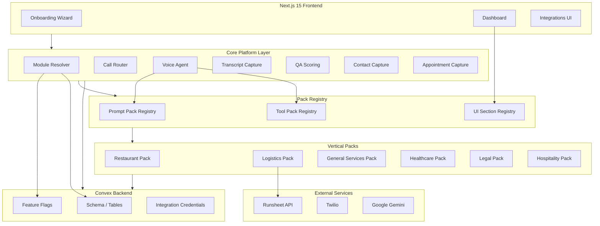
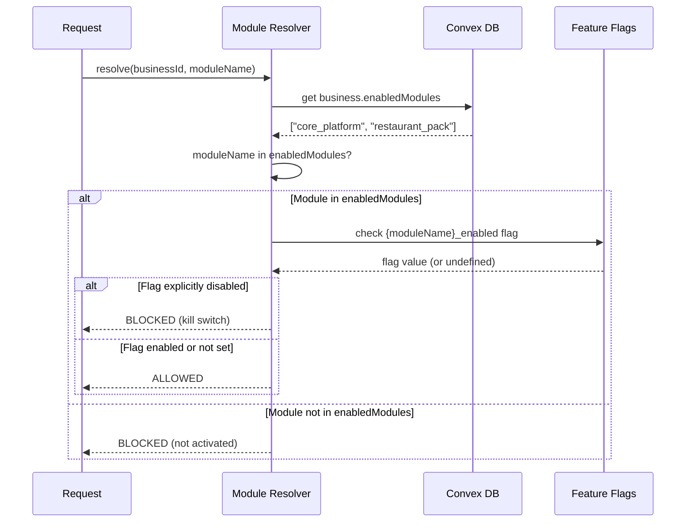
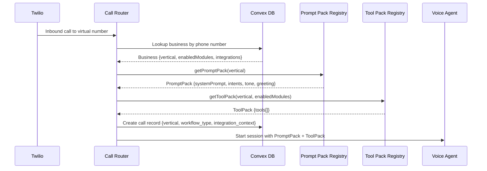
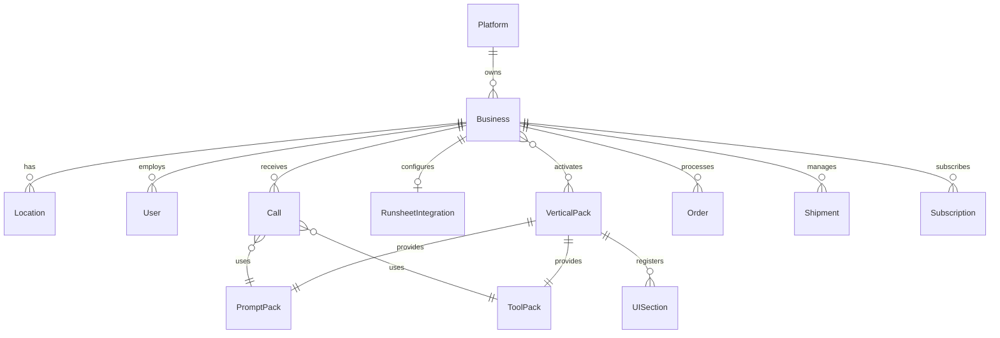
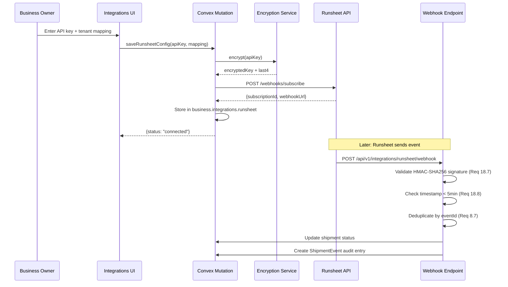
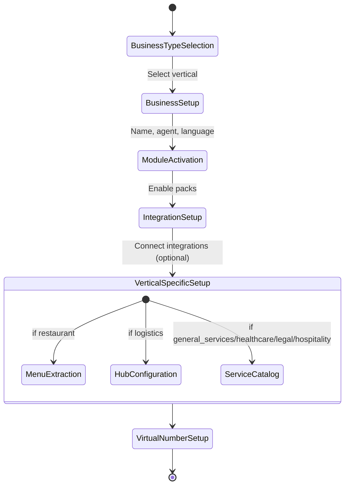

# Design Document: AI Reception OS Pivot

## Overview

This design transforms Dinee from a restaurant-only call management app into a multi-vertical "AI Reception OS" platform. The pivot introduces a vertical-aware tenant model on the existing Convex backend, separates core platform capabilities from vertical-specific module packs, and adds a Runsheet Connect integration for logistics dispatch. The existing `restaurants` table is extended in-place (not replaced) with `vertical`, `enabledModules`, and `integrations` fields. Vertical Packs (restaurant, logistics, healthcare, legal, hospitality, general_services) plug into the Core Platform through a module boundary interface that provides hooks for custom intents, tools, UI sections, and analytics. Feature flags act as kill switches over the `enabledModules` tenant configuration. The voice agent loads vertical-specific Prompt Packs and Tool Packs at call initiation time based on the Business's vertical. The onboarding wizard gains a business-type selection step, and the dashboard conditionally renders navigation and content sections based on `enabledModules`. All existing restaurant API routes, schemas, and voice agent tools are preserved behind the `restaurant_pack` module with full backward compatibility during a 6-month dual-support period.

## Architecture

### High-Level System Architecture



### Module Resolution Flow



### Call Initiation Flow



## Components and Interfaces

### 1. Module Boundary Interface

Every Vertical Pack implements this interface to plug into the Core Platform:

```typescript
// src/lib/modules/types.ts

export interface VerticalPack {
  /** Unique module identifier, e.g. "restaurant_pack" */
  moduleId: string;
  /** Which vertical this pack serves */
  vertical: Vertical;
  /** Prompt Pack for the voice agent */
  promptPack: PromptPack;
  /** Tool Pack for the voice agent */
  toolPack: ToolDefinition[];
  /** Dashboard UI section descriptors */
  uiSections: UISectionDescriptor[];
  /** Custom analytics query definitions */
  analyticsQueries: AnalyticsQueryDescriptor[];
  /** Custom intents handled by this pack */
  intents: IntentDefinition[];
  /** Integration hooks (optional) */
  integrationHooks?: IntegrationHook[];
}

export interface PromptPack {
  systemPrompt: string;
  intents: IntentDefinition[];
  toneGuidance: string;
  greetingTemplate: string;
}

export interface IntentDefinition {
  name: string;
  description: string;
  requiredSlots: string[];
  handler: string; // Reference to the Convex function or API route
}

export interface ToolDefinition {
  name: string;
  description: string;
  parameters: Record<string, ToolParameter>;
  handler: string; // Convex function path
  requiresIntegration?: string; // e.g. "runsheet_connect"
}

export interface ToolParameter {
  type: string;
  description: string;
  required: boolean;
}

export interface UISectionDescriptor {
  id: string;
  label: string;
  icon: string;
  tabId: string;
  component: string; // Component path for dynamic import
  requiredModule: string;
}

export interface AnalyticsQueryDescriptor {
  metricName: string;
  query: string; // Convex query function path
  vertical: Vertical;
}

export interface IntegrationHook {
  integrationId: string; // e.g. "runsheet_connect"
  onEvent: string; // Event type
  handler: string; // Convex function path
}
```

### 2. Module Resolver

```typescript
// src/lib/modules/moduleResolver.ts

export type ModuleResolution = "allowed" | "blocked_not_activated" | "blocked_kill_switch";

export interface ModuleResolverResult {
  resolution: ModuleResolution;
  moduleName: string;
}

/**
 * Resolves whether a module is active for a given business.
 * 
 * Precedence rule (Req 6.9):
 * - enabledModules determines activation
 * - UNLESS the corresponding feature flag is explicitly set to disabled,
 *   in which case the flag acts as a kill switch
 */
export async function resolveModule(
  businessEnabledModules: string[],
  moduleName: string,
  featureFlags: Record<string, boolean | undefined>
): Promise<ModuleResolverResult> {
  // Step 1: Check enabledModules (tenant config source of truth)
  if (!businessEnabledModules.includes(moduleName)) {
    return { resolution: "blocked_not_activated", moduleName };
  }

  // Step 2: Check feature flag kill switch
  const flagName = `${moduleName}_enabled`;
  const flagValue = featureFlags[flagName];

  // Flag explicitly set to false = kill switch
  if (flagValue === false) {
    return { resolution: "blocked_kill_switch", moduleName };
  }

  // Flag is true or undefined (not set) = allowed
  return { resolution: "allowed", moduleName };
}
```

### 3. Prompt Pack Registry

```typescript
// src/lib/modules/promptPackRegistry.ts

import type { PromptPack, Vertical } from "./types";

const registry: Record<string, PromptPack> = {};

export function registerPromptPack(vertical: string, pack: PromptPack): void {
  registry[vertical] = pack;
}

/**
 * Returns the PromptPack for the given vertical.
 * Falls back to general_services if no dedicated pack exists (Req 9.7).
 */
export function getPromptPack(vertical: string): PromptPack {
  return registry[vertical] ?? registry["general_services"];
}
```

### 4. Tool Pack Registry

```typescript
// src/lib/modules/toolPackRegistry.ts

import type { ToolDefinition } from "./types";

const registry: Record<string, ToolDefinition[]> = {};

export function registerToolPack(vertical: string, tools: ToolDefinition[]): void {
  registry[vertical] = tools;
}

/**
 * Returns tools for the given vertical, filtering out integration-gated tools
 * when the integration is not enabled (Req 10.7).
 */
export function getToolPack(
  vertical: string,
  enabledModules: string[]
): ToolDefinition[] {
  const tools = registry[vertical] ?? registry["general_services"] ?? [];
  return tools.filter((tool) => {
    if (tool.requiresIntegration) {
      return enabledModules.includes(tool.requiresIntegration);
    }
    return true;
  });
}

/**
 * Validates that a tool call is permitted for the active session (Req 10.6).
 */
export function validateToolCall(
  toolName: string,
  vertical: string,
  enabledModules: string[]
): boolean {
  const activePack = getToolPack(vertical, enabledModules);
  return activePack.some((t) => t.name === toolName);
}
```

### 5. Dashboard Section Registry

```typescript
// src/lib/modules/uiSectionRegistry.ts

import type { UISectionDescriptor } from "./types";

const sections: UISectionDescriptor[] = [];

export function registerUISections(descriptors: UISectionDescriptor[]): void {
  sections.push(...descriptors);
}

/**
 * Returns UI sections visible for the given enabledModules (Req 13.1).
 * Core sections are always included.
 */
export function getVisibleSections(enabledModules: string[]): UISectionDescriptor[] {
  return sections.filter(
    (s) => s.requiredModule === "core_platform" || enabledModules.includes(s.requiredModule)
  );
}
```

### 6. Runsheet Connect Client

```typescript
// src/lib/integrations/runsheetClient.ts

export interface RunsheetConfig {
  apiKey: string; // Decrypted at runtime
  tenantMapping: Record<string, string>; // locationId → Runsheet hubId
  webhookUrl: string;
}

export interface RunsheetWebhookEvent {
  eventId: string;
  eventType: "shipment_status" | "rider_assignment";
  timestamp: string; // ISO 8601
  signature: string;
  payload: Record<string, unknown>;
}

export class RunsheetClient {
  constructor(private config: RunsheetConfig) {}

  async registerWebhook(): Promise<{ subscriptionId: string }> { /* ... */ }
  async pushShipmentEvent(shipmentId: string, event: Record<string, unknown>): Promise<void> { /* ... */ }
  async validateWebhookSignature(event: RunsheetWebhookEvent, secret: string): Promise<boolean> { /* ... */ }
}
```


## Data Models

### Schema Changes

All changes are additive to the existing Convex schema. No existing fields or indexes are removed.

#### 1. Extended Vertical Validator (`convex/shared/validators.ts`)

```typescript
// Current: v.union(v.literal("restaurant"), v.literal("logistics"))
// New (Req 1.1):
export const verticalValidator = v.union(
  v.literal("general_services"),
  v.literal("healthcare"),
  v.literal("legal"),
  v.literal("hospitality"),
  v.literal("logistics"),
  v.literal("restaurant")
);
```

#### 2. Extended Conversation Type Validator

```typescript
export const conversationTypeValidator = v.union(
  // Existing restaurant types
  v.literal("restaurant_inbound_order"),
  v.literal("restaurant_followup"),
  v.literal("restaurant_cancellation"),
  // Existing logistics types
  v.literal("logistics_booking"),
  v.literal("logistics_followup"),
  v.literal("logistics_failure_notice"),
  // New general services types (Req 9.4)
  v.literal("general_appointment_booking"),
  v.literal("general_service_inquiry"),
  v.literal("general_callback_request"),
  // New healthcare types
  v.literal("healthcare_appointment"),
  v.literal("healthcare_inquiry"),
  // New legal types
  v.literal("legal_consultation"),
  v.literal("legal_inquiry"),
  // New hospitality types
  v.literal("hospitality_reservation"),
  v.literal("hospitality_inquiry")
);
```

#### 3. Restaurants Table Extensions (Req 1.2, 1.3, 1.4)

New fields added to the existing `restaurants` table definition:

```typescript
restaurants: defineTable({
  // ... all existing fields preserved ...
  
  // NEW: Vertical classification (Req 1.2)
  vertical: v.optional(verticalValidator), // optional for backward compat; defaults "restaurant" in app logic
  
  // NEW: Active module packs (Req 1.3)
  enabledModules: v.optional(v.array(v.string())),
  // Default for new businesses: ["core_platform"]
  // Backfilled for existing: ["core_platform", "restaurant_pack"]
  
  // NEW: Integration configurations (Req 1.4)
  integrations: v.optional(v.object({
    runsheet: v.optional(v.object({
      apiKeyEncrypted: v.string(),       // AES-256 encrypted (Req 18.1)
      apiKeyLast4: v.string(),           // For UI display (Req 18.2)
      tenantMapping: v.string(),         // JSON: {locationId: runsheetHubId}
      webhookUrl: v.string(),            // Auto-generated callback URL
      webhookSecret: v.string(),         // HMAC-SHA256 signing key
      lastSyncAt: v.optional(v.number()),
      status: v.union(
        v.literal("connected"),
        v.literal("disconnected"),
        v.literal("error")
      ),
      failureCount: v.optional(v.number()),
      credentialExpiresAt: v.optional(v.number()),
    })),
  })),
})
  // ... all existing indexes preserved ...
  .index("by_vertical", ["vertical"]) // NEW: for KPI queries
```

#### 4. Users Table Extensions (Req 2.4, 2.5)

```typescript
users: defineTable({
  // ... all existing fields preserved ...
  role: v.union(
    v.literal("platform_admin"),
    v.literal("restaurant_owner"),
    v.literal("business_owner"),    // NEW (Req 2.4)
    v.literal("branch_manager"),
    v.literal("supervisor")
  ),
  tenantType: v.union(
    v.literal("platform"),
    v.literal("restaurant"),
    v.literal("business"),          // NEW (Req 2.5)
    v.literal("branch")
  ),
})
```

#### 5. Calls Table Extensions (Req 11.1, 11.2)

```typescript
calls: defineTable({
  // ... all existing fields preserved ...
  
  // Existing: vertical: v.optional(verticalValidator) — now supports all 6 verticals
  
  // NEW: Active prompt pack identifier (Req 11.1)
  workflow_type: v.optional(v.string()),
  // e.g. "restaurant_prompt_pack", "logistics_prompt_pack", "general_services_prompt_pack"
  
  // NEW: Integration-specific metadata (Req 11.2)
  integration_context: v.optional(v.object({
    runsheetSessionId: v.optional(v.string()),
    externalReferenceIds: v.optional(v.array(v.string())),
  })),
})
```

#### 6. Feature Flags Name Validator Extension (Req 6.1)

```typescript
const featureFlagNameValidator = v.union(
  // ... all existing flags preserved ...
  // NEW: Vertical pack flags
  v.literal("restaurant_pack_enabled"),
  v.literal("logistics_pack_enabled"),
  v.literal("healthcare_pack_enabled"),
  v.literal("legal_pack_enabled"),
  v.literal("hospitality_pack_enabled"),
  v.literal("general_services_pack_enabled"),
  // NEW: Integration flags
  v.literal("runsheet_connect_enabled"),
);
```

The `featureFlags` table scope validator is also extended to support `"business"` alongside `"restaurant"`:

```typescript
const featureFlagScopeValidator = v.union(
  v.literal("global"),
  v.literal("platform"),
  v.literal("restaurant"),
  v.literal("business"),   // NEW alias
  v.literal("branch")
);
```

#### 7. Subscriptions Table Extensions (Req 14.6)

```typescript
subscriptions: defineTable({
  // ... all existing fields preserved ...
  
  // NEW: Vertical classification (Req 14.6)
  vertical: v.optional(verticalValidator),
  
  // NEW: Active paid add-ons (Req 14.6)
  addOns: v.optional(v.array(v.string())),
  // e.g. ["restaurant_pack", "runsheet_connect"]
})
```

#### 8. New Table: KPI Snapshots (Req 15.6)

```typescript
kpiSnapshots: defineTable({
  snapshotId: v.string(),
  metricName: v.string(),
  // e.g. "active_tenant_count", "runsheet_attach_rate", "revenue_per_tenant",
  //      "call_to_outcome_conversion", "churn_rate"
  vertical: verticalValidator,
  periodType: v.union(v.literal("day"), v.literal("week"), v.literal("month")),
  periodStart: v.number(), // UTC epoch ms
  periodEnd: v.number(),   // UTC epoch ms
  value: v.number(),
  metadata: v.optional(v.string()), // JSON for breakdown details
  createdAt: v.number(),
})
  .index("by_snapshot_id", ["snapshotId"])
  .index("by_metric_and_vertical", ["metricName", "vertical"])
  .index("by_period", ["periodType", "periodStart"])
```

#### 9. New Table: Integration Audit Log (Req 18.9)

```typescript
integrationAuditLog: defineTable({
  entryId: v.string(),
  businessId: v.string(),
  integrationName: v.string(), // "runsheet_connect"
  actionType: v.union(
    v.literal("create"),
    v.literal("rotate"),
    v.literal("revoke"),
    v.literal("expire"),
    v.literal("connect"),
    v.literal("disconnect")
  ),
  actorUserId: v.string(),
  actorRole: v.string(),
  details: v.optional(v.string()), // JSON for additional context
  createdAt: v.number(),
})
  .index("by_entry_id", ["entryId"])
  .index("by_business_id", ["businessId"])
  .index("by_integration", ["integrationName"])
```

#### 10. New Table: Webhook Deduplication (Req 8.7)

```typescript
webhookDeduplication: defineTable({
  eventId: v.string(),       // Runsheet event ID
  provider: v.string(),      // "runsheet"
  processedAt: v.number(),
  expiresAt: v.number(),     // TTL for cleanup
})
  .index("by_event_and_provider", ["eventId", "provider"])
  .index("by_expires_at", ["expiresAt"])
```

### Entity Relationship Summary



### Feature Flag + enabledModules Resolution Logic (Req 6.7–6.10)

The precedence rule is:

1. `enabledModules` on the Business record is the **source of truth** for module activation
2. Feature flags (`*_enabled`) are **rollout guardrails / kill switches** only
3. If a module is in `enabledModules` AND the corresponding flag is explicitly `false` → module is **deactivated** (kill switch)
4. If a module is in `enabledModules` AND the flag is `true` or not set → module is **active**
5. If a module is NOT in `enabledModules` → module is **inactive** regardless of flag state

Resolution is evaluated using the existing hierarchical flag resolution: global → platform → business → location. The most specific scope wins.

### Runsheet Connect Integration Architecture



Credential storage uses AES-256-GCM encryption. The encryption key is stored as an environment variable (`INTEGRATION_ENCRYPTION_KEY`), never in the database. The `apiKeyLast4` field enables safe UI display without decryption.

### Onboarding Wizard Flow Changes



The wizard steps:
1. **Business Type Selection** (NEW) — vertical picker with icons and descriptions
2. **Business Setup** — renamed from "Restaurant Setup"; same fields (name, agent name, language, special instructions)
3. **Module Activation** (NEW) — shows available packs for the selected vertical with toggle switches
4. **Integration Setup** (NEW, conditional) — shows Runsheet Connect for logistics vertical
5. **Vertical-Specific Setup** — menu extraction for restaurant, hub/warehouse config for logistics, service catalog for others
6. **Virtual Number Setup** — unchanged

### Dashboard Conditional Rendering Architecture

The `DashboardLayout` component is extended with a `useEnabledModules()` hook that reads the Business's `enabledModules` from the `RestaurantContext` (renamed to `BusinessContext`). Navigation tabs and content sections are filtered through the UI Section Registry.

```typescript
// src/hooks/useEnabledModules.ts
export function useEnabledModules(): {
  enabledModules: string[];
  isModuleActive: (moduleId: string) => boolean;
  visibleSections: UISectionDescriptor[];
} {
  const { business } = useBusiness();
  const enabledModules = business?.enabledModules ?? ["core_platform"];
  
  return {
    enabledModules,
    isModuleActive: (moduleId: string) => 
      moduleId === "core_platform" || enabledModules.includes(moduleId),
    visibleSections: getVisibleSections(enabledModules),
  };
}
```

Core sections (Calls, Transcripts, Contacts, Appointments/Tasks, Settings) always render. Vertical-specific sections render only when the corresponding module is in `enabledModules`:

| Module | Sections Shown |
|--------|---------------|
| `core_platform` | Calls, Transcripts, Contacts, Appointments/Tasks, Settings |
| `restaurant_pack` | Orders, Menu Management, Upsell Prompts, Restaurant Analytics |
| `logistics_pack` | Shipments, Riders, Dispatch, Logistics Analytics |
| `runsheet_connect` | Settings > Integrations > Runsheet |

Direct URL navigation to a disabled module's route returns a 403 via middleware check.

### API Backward Compatibility Layer (Req 17)

#### Dual ID Support

All API endpoints accept both `restaurantId` and `businessId` during the 6-month dual-support period. A middleware function normalizes the identifier:

```typescript
// src/lib/partner-api/dualIdSupport.ts
export function normalizeBusinessId(
  params: Record<string, unknown>
): { businessId: string; usedDeprecatedField: boolean } {
  if (params.businessId) {
    return { businessId: params.businessId as string, usedDeprecatedField: false };
  }
  if (params.restaurantId) {
    return { businessId: params.restaurantId as string, usedDeprecatedField: true };
  }
  throw new Error("Either businessId or restaurantId is required");
}
```

#### Deprecation Headers

When a deprecated field is used, the response includes:
```
Deprecation: restaurantId; sunset=2026-06-01; use=businessId
```

#### Response Enrichment

During the dual-support period, responses include both field names:
```json
{
  "restaurantId": "12345",
  "businessId": "12345",
  "vertical": "restaurant",
  ...
}
```

#### Versioning Strategy

- **v1**: Current API with dual-support. No breaking changes.
- **v2**: Removes deprecated fields (`restaurantId`, `tenantType: "restaurant"`). Gated behind `api_v2_enabled` feature flag. Not released until after the 6-month dual-support period ends.

### Migration Execution Design (Req 16)

Each migration step is implemented as an idempotent Convex mutation with dry-run support:

```typescript
// convex/migrations/step1_addVerticalField.ts
export const execute = mutation({
  args: {
    dryRun: v.boolean(),
    batchSize: v.optional(v.number()),
  },
  handler: async (ctx, args) => {
    const businesses = await ctx.db.query("restaurants").collect();
    const needsMigration = businesses.filter(b => !b.vertical);
    
    if (args.dryRun) {
      return {
        dryRun: true,
        affectedCount: needsMigration.length,
        sample: needsMigration.slice(0, 5).map(b => b.restaurantId),
      };
    }
    
    let successCount = 0;
    let failedRecords: Array<{id: string; error: string}> = [];
    const batch = args.batchSize ?? 100;
    
    for (const business of needsMigration.slice(0, batch)) {
      try {
        await ctx.db.patch(business._id, {
          vertical: "restaurant",
          enabledModules: ["core_platform", "restaurant_pack"],
        });
        successCount++;
      } catch (e) {
        failedRecords.push({
          id: business.restaurantId,
          error: String(e),
        });
      }
    }
    
    return {
      dryRun: false,
      totalTargeted: needsMigration.length,
      successCount,
      failedCount: failedRecords.length,
      failedRecords,
      successRate: needsMigration.length > 0 
        ? (successCount / needsMigration.length * 100).toFixed(2) + "%" 
        : "N/A",
    };
  },
});
```

#### Migration Steps

| Step | Description | Rollback |
|------|-------------|----------|
| 1 | Add `vertical` field, backfill existing to "restaurant" | Remove `vertical` field from backfilled records |
| 2 | Add feature flags for vertical packs (all disabled globally) | Delete the new flag records |
| 3 | Gate restaurant flows behind `restaurant_pack_enabled` flag | Disable the flag (restaurant flows become ungated) |
| 4 | Add Runsheet Connect integration module + credential storage | Remove integration config from affected records |
| 5 | Add logistics prompt pack and intent handlers | Disable `logistics_pack_enabled` flag |
| 6 | Update onboarding wizard (behind feature flag) | Disable `updated_onboarding_enabled` flag |
| 7 | Update documentation and marketing site | N/A (content change) |

Each step validates a 99.9% success SLO before proceeding. Failed records are logged with Business ID, record ID, error message, and step identifier.

### Integration Security Design (Req 18)

#### Encryption at Rest
- All `apiKeyEncrypted` values use AES-256-GCM
- Encryption key stored in `INTEGRATION_ENCRYPTION_KEY` env var
- IV is randomly generated per encryption and prepended to ciphertext
- Decryption happens only at the moment of outbound API call, never cached

#### Key Rotation Flow (Req 18.3)
1. Business owner generates new API key in Runsheet
2. Enters new key in Dinee Integrations UI
3. System encrypts new key, tests connectivity with Runsheet API
4. On success: replaces old encrypted key, updates `apiKeyLast4`, logs audit entry
5. On failure: keeps old key, shows error, does not log rotation

#### RBAC (Req 18.6)
- Connect/disconnect operations restricted to `business_owner` or `platform_admin` roles
- Other roles receive 403 Forbidden
- Checked in the Convex mutation handler before any credential operations

#### Webhook Signature Validation (Req 18.7)
```typescript
function validateRunsheetSignature(
  payload: string,
  signature: string,
  secret: string
): boolean {
  const expected = crypto
    .createHmac("sha256", secret)
    .update(payload)
    .digest("hex");
  return crypto.timingSafeEqual(
    Buffer.from(signature),
    Buffer.from(expected)
  );
}
```

#### Replay Protection (Req 18.8)
- Reject events with timestamp older than 5 minutes from current server time (UTC)
- Deduplicate by `eventId` using the `webhookDeduplication` table

### KPI Computation Design (Req 15)

#### Metric Formulas

| Metric | Formula | Attribution |
|--------|---------|-------------|
| Active Tenant Count | `COUNT(businesses WHERE vertical = V AND hasCompletedOnboarding)` | Per vertical |
| Runsheet Attach Rate | `COUNT(logistics businesses WHERE integrations.runsheet.status = "connected") / COUNT(logistics businesses)` × 100 | Logistics only |
| Revenue Per Tenant | `SUM(invoices.amount WHERE period = P AND vertical = V) / COUNT(active businesses WHERE vertical = V)` | Per vertical, per period |
| Call-to-Outcome Conversion | See below | Per vertical, per period |
| Churn Rate | `COUNT(businesses WHERE vertical = V AND zero_calls_in_trailing_30d) / COUNT(active businesses WHERE vertical = V)` × 100 | Per vertical |

#### Call-to-Outcome Conversion (Req 15.4)

| Vertical | Numerator | Denominator | Attribution Window |
|----------|-----------|-------------|-------------------|
| Restaurant | Calls → order (status ≠ cancelled) within 30 min of call end | Total inbound calls to restaurant businesses | 30 minutes |
| Logistics | Calls → shipment created within 60 min of call end | Total inbound calls to logistics businesses | 60 minutes |
| General Services | Calls → appointment scheduled within 24 hours of call end | Total inbound calls to general services businesses | 24 hours |

#### Inclusion/Exclusion Rules (Req 15.9)
- A call is attributed to the period in which the call **ended**
- Only businesses with at least one completed onboarding step count as "active"
- Businesses created within the current period are excluded from churn calculation for that period
- All period boundaries use UTC timezone

#### Snapshot Storage
KPI snapshots are computed by a scheduled Convex action (cron) and stored in the `kpiSnapshots` table. Snapshots are computed daily, with weekly and monthly rollups. The `metadata` field stores breakdown details (e.g., per-location conversion rates) as JSON.


## Correctness Properties

*A property is a characteristic or behavior that should hold true across all valid executions of a system — essentially, a formal statement about what the system should do. Properties serve as the bridge between human-readable specifications and machine-verifiable correctness guarantees.*

The following properties were derived from the acceptance criteria across all 18 requirements. Each property is universally quantified and designed for property-based testing with a minimum of 100 iterations per test.

### Property 1: Module Resolution Correctness

*For any* Business with any combination of `enabledModules` entries and any set of feature flag values (including undefined), the `resolveModule` function SHALL return `"allowed"` if and only if the module is present in `enabledModules` AND the corresponding `{module}_enabled` feature flag is not explicitly `false`. If the module is not in `enabledModules`, resolution SHALL return `"blocked_not_activated"`. If the module is in `enabledModules` but the flag is explicitly `false`, resolution SHALL return `"blocked_kill_switch"`.

**Validates: Requirements 6.7, 6.8, 6.9**

**Testing approach:** Generate random `enabledModules` arrays (subsets of all known module names), random feature flag maps (each flag is `true`, `false`, or `undefined`), and a random target module name. Call `resolveModule` and assert the result matches the precedence rule. This covers the full truth table of (inModules × flagState) → resolution.

### Property 2: Vertical Isolation

*For any* Business with vertical `X` and `enabledModules` list `M`, the set of accessible UI sections, API endpoints, and voice agent tools SHALL be exactly the union of Core_Platform resources and resources registered by modules in `M`. No resource registered by a module NOT in `M` shall be accessible. Equivalently: for any two Businesses with different verticals and non-overlapping vertical packs, neither Business can access the other's vertical-specific resources.

**Validates: Requirements 3E.13, 4.2, 4.5, 5D.12, 5D.14, 13.1, 13.5, 13.6**

**Testing approach:** Generate a random Business with a random vertical and random subset of `enabledModules`. Query `getVisibleSections(enabledModules)` and assert every returned section has `requiredModule` equal to `"core_platform"` or a module present in `enabledModules`. Also assert that for every registered section whose `requiredModule` is NOT in `enabledModules`, that section is absent from the result.

### Property 3: Tool Pack Enforcement

*For any* active call session with vertical `V` and `enabledModules` `M`, the voice agent SHALL only be able to invoke tools that appear in `getToolPack(V, M)`. For any tool name NOT in that set, `validateToolCall(toolName, V, M)` SHALL return `false`.

**Validates: Requirements 10.5, 10.6, 10.7**

**Testing approach:** Generate a random vertical, random `enabledModules`, and a random tool name (drawn from the union of all registered tools across all verticals plus random invalid names). Call `validateToolCall` and assert it returns `true` if and only if the tool is in `getToolPack(V, M)`. This also validates that integration-gated tools (e.g., `push_event_to_runsheet`) are excluded when the integration module is not in `enabledModules`.

### Property 4: Backward Compatibility — Dual ID Normalization

*For any* valid API request payload, calling `normalizeBusinessId` with `{ restaurantId: id }` SHALL produce the same `businessId` output as calling it with `{ businessId: id }`. The only difference is the `usedDeprecatedField` flag, which SHALL be `true` for `restaurantId` and `false` for `businessId`. Calling with neither field SHALL throw an error.

**Validates: Requirements 2.6, 17.4, 17.5, 17.6**

**Testing approach:** Generate a random non-empty string `id`. Assert `normalizeBusinessId({ restaurantId: id }).businessId === id` and `normalizeBusinessId({ businessId: id }).businessId === id`. Assert `normalizeBusinessId({ restaurantId: id }).usedDeprecatedField === true` and `normalizeBusinessId({ businessId: id }).usedDeprecatedField === false`. Assert that `normalizeBusinessId({})` throws. This is a round-trip / equivalence property.

### Property 5: Migration Idempotency

*For any* migration step function and any initial database state, executing the step once and then executing it again SHALL produce the same final database state as executing it only once. Formally: `migrate(migrate(state)) === migrate(state)` for each step.

**Validates: Requirements 16.8, 4.6, 16.2**

**Testing approach:** Generate a random set of Business records (some with `vertical` already set, some without; some with `enabledModules`, some without). Run migration step 1 (`addVerticalField`), capture the resulting state. Run step 1 again on the result. Assert the two post-migration states are identical (same field values, same record count). Repeat for each migration step. Also verify that dry-run mode (`dryRun: true`) leaves the state unchanged (Req 16.9).

### Property 6: Webhook Idempotency

*For any* valid Runsheet webhook event with a given `eventId`, processing the event N times (N ≥ 1) SHALL produce the same database state as processing it exactly once. Specifically: the Shipment record's `deliveryStatus` and `assignedRiderId` SHALL have the same values, and exactly one `ShipmentEvent` audit entry SHALL exist for that `eventId`.

**Validates: Requirements 8.7, 8.3, 8.4, 8.5**

**Testing approach:** Generate a random valid webhook event (random `eventId`, random `eventType` of "shipment_status" or "rider_assignment", valid signature, valid timestamp). Process it once and snapshot the database. Process the same event again (same `eventId`). Assert the shipment fields are unchanged and no duplicate `ShipmentEvent` was created. The `webhookDeduplication` table should contain exactly one entry for that `eventId`.

### Property 7: Integration Security — Credential Non-Exposure

*For any* Integration_Credential stored in the system, the plaintext value SHALL never appear in: (a) any API response body, (b) any UI-rendered string, (c) any application log output. Only the `apiKeyLast4` (last 4 characters) and the `apiKeyEncrypted` (ciphertext) SHALL be stored or transmitted. Additionally, *for any* credential value, `decrypt(encrypt(value)) === value` (round-trip correctness).

**Validates: Requirements 18.1, 18.2**

**Testing approach:** Generate a random string as an API key. Encrypt it using the encryption service. Assert the encrypted output does not contain the original plaintext as a substring. Decrypt the encrypted output and assert it equals the original. Also generate a random Business record with Runsheet integration configured, serialize it to a mock API response, and assert the response string does not contain the original API key — only `apiKeyLast4` and `apiKeyEncrypted` fields are present.

### Property 8: Feature Flag Kill Switch

*For any* Business where a module is present in `enabledModules` but the corresponding `{module}_enabled` feature flag is explicitly set to `false` at any scope in the hierarchy, the module SHALL be deactivated. This holds regardless of flag values at other scopes — the most specific scope with an explicit `false` wins.

**Validates: Requirements 6.2, 6.9**

**Testing approach:** Generate a random module name that is in the Business's `enabledModules`. Set the corresponding feature flag to `false` at a random scope (global, platform, business, or location). Assert `resolveModule` returns `"blocked_kill_switch"`. Then set the flag to `true` at a more specific scope and assert the module is now `"allowed"` (most specific scope wins). Then set it back to `false` at the most specific scope and assert it's blocked again. This tests the hierarchical resolution combined with the kill switch semantics.

### Property 9: KPI Attribution — Single Period Assignment

*For any* call with a given `endedAt` timestamp (UTC), the call SHALL be attributed to exactly one KPI period. For daily periods, the period is determined by the UTC date of `endedAt`. For weekly periods, the ISO week containing `endedAt` in UTC. For monthly periods, the UTC month of `endedAt`. No call SHALL appear in zero periods or in more than one period of the same `periodType`.

**Validates: Requirements 15.8, 15.9**

**Testing approach:** Generate a random UTC timestamp for `endedAt`. Compute the daily, weekly, and monthly period boundaries. Assert the call falls within exactly one daily period, one weekly period, and one monthly period. Also generate timestamps at period boundaries (midnight UTC, first day of month, etc.) and assert they are attributed to the correct period. Additionally, generate a Business created within the current period and assert it is excluded from churn calculation for that period.

### Property 10: Onboarding Completeness

*For any* completed onboarding flow, the resulting Business record SHALL have: (a) a `vertical` field set to one of the 6 valid values, (b) an `enabledModules` array containing at least `"core_platform"`, and (c) if `enabledModules` contains a vertical pack, that pack's `moduleId` must correspond to the selected `vertical`. No Business record created through onboarding SHALL have a `null` or empty `vertical`, or an `enabledModules` array that does not include `"core_platform"`.

**Validates: Requirements 1.5, 1.6, 12.4**

**Testing approach:** Generate a random valid vertical selection and random module activation choices. Simulate the onboarding completion mutation. Assert the resulting Business record has a non-null `vertical` from the valid set, `enabledModules` includes `"core_platform"`, and any vertical pack in `enabledModules` matches the selected vertical (e.g., a "logistics" business should not have "restaurant_pack" auto-enabled through onboarding).

## Error Handling

### Error Categories

| Category | Handling Strategy | User Feedback |
|----------|------------------|---------------|
| Invalid vertical value | Reject at validation layer with descriptive error | Toast: "Invalid business type selected" |
| Module not activated | Return 403 from API, hide UI sections | Toast: "This feature is not enabled for your business" |
| Feature flag kill switch | Same as module not activated | Toast: "This feature is temporarily unavailable" |
| Runsheet webhook invalid signature | Return 401, log event | No user feedback (system-to-system) |
| Runsheet webhook replay | Return 200 (idempotent), skip processing | No user feedback |
| Runsheet webhook unmatched shipment | Log as unmatched, increment failure count | Health panel shows increased failure count |
| Migration step failure | Log with Business ID, continue batch, report at end | Admin dashboard shows migration status |
| Credential encryption failure | Abort operation, do not store plaintext | Toast: "Failed to save credentials. Please try again." |
| Expired integration credential | Set status to "error", cease outbound calls | Dashboard alert: "Your Runsheet credentials have expired" |
| API deprecated field usage | Process normally, add deprecation header | Response header: `Deprecation: restaurantId; sunset=2026-06-01; use=businessId` |

### Error Boundaries

- Each vertical pack's UI sections are wrapped in an error boundary that catches rendering errors without crashing the entire dashboard
- Integration webhook processing catches and logs all errors, always returning 200 to prevent Runsheet from retrying indefinitely on application errors
- Migration steps use try/catch per record, accumulating failures for batch reporting

## Testing Strategy

### Dual Testing Approach

This feature requires both unit tests and property-based tests for comprehensive coverage.

**Unit tests** focus on:
- Specific examples of module resolution (e.g., restaurant business with restaurant_pack enabled)
- Edge cases: empty `enabledModules`, undefined feature flags, expired credentials
- Integration points: webhook signature validation with known test vectors, encryption with known keys
- Error conditions: invalid vertical values, unauthorized role access, malformed webhook payloads

**Property-based tests** focus on:
- Universal properties that hold across all inputs (the 10 correctness properties above)
- Comprehensive input coverage through randomized Business configurations, module combinations, and flag states

### Property-Based Testing Configuration

- **Library**: [fast-check](https://github.com/dubzzz/fast-check) for TypeScript
- **Minimum iterations**: 100 per property test
- **Tag format**: Each test is annotated with a comment referencing the design property:
  ```typescript
  // Feature: ai-reception-os-pivot, Property 1: Module Resolution Correctness
  ```

### Test Organization

| Property | Test File | Key Generators |
|----------|-----------|----------------|
| 1: Module Resolution | `__tests__/properties/moduleResolution.test.ts` | `enabledModules` subsets, feature flag maps, module names |
| 2: Vertical Isolation | `__tests__/properties/verticalIsolation.test.ts` | Business configs with random verticals and modules |
| 3: Tool Pack Enforcement | `__tests__/properties/toolPackEnforcement.test.ts` | Verticals, enabledModules, tool names from all packs |
| 4: Backward Compatibility | `__tests__/properties/backwardCompat.test.ts` | Random ID strings |
| 5: Migration Idempotency | `__tests__/properties/migrationIdempotency.test.ts` | Random Business record sets with partial migration states |
| 6: Webhook Idempotency | `__tests__/properties/webhookIdempotency.test.ts` | Random webhook events with valid signatures |
| 7: Integration Security | `__tests__/properties/integrationSecurity.test.ts` | Random credential strings |
| 8: Feature Flag Kill Switch | `__tests__/properties/featureFlagKillSwitch.test.ts` | Module names, flag scopes, flag values |
| 9: KPI Attribution | `__tests__/properties/kpiAttribution.test.ts` | Random UTC timestamps, period types |
| 10: Onboarding Completeness | `__tests__/properties/onboardingCompleteness.test.ts` | Random vertical selections, module activation choices |

### Unit Test Focus Areas

- Webhook signature validation with known HMAC test vectors
- Encryption round-trip with known keys and IVs
- Specific migration scenarios (all records already migrated, mixed states)
- API response schema validation for backward compatibility
- RBAC enforcement for integration operations (specific role × operation matrix)
- Dashboard section visibility for each vertical (specific enabledModules → expected sections)
