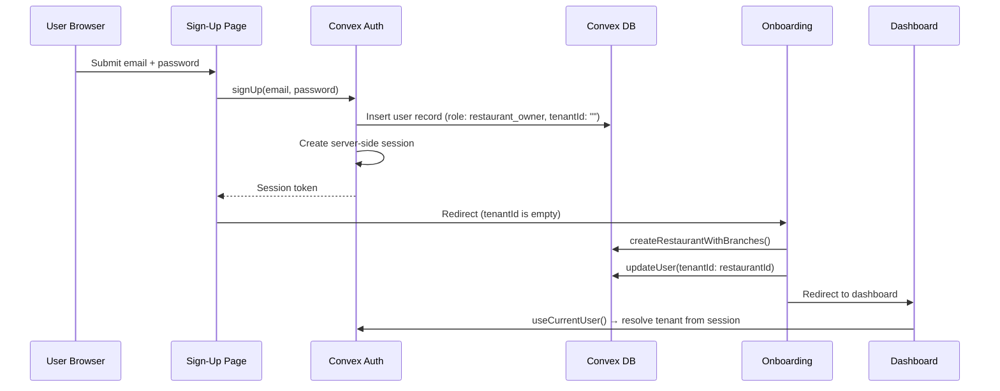

# Design Document: Convex Auth Integration

## Overview

This design replaces the localStorage-based identity system with real authentication powered by `@convex-dev/auth`. The current system stores a `restaurantId` in localStorage (`src/hooks/useRestaurantStorage.ts`), reads it in `AppProvider` to pass to `TenantProvider`, and hardcodes the user role to `supervisor`. There are no login pages, no session management, and no user resolution.

The new system introduces:
- Email/Password authentication via `@convex-dev/auth` with server-side sessions
- Auth pages (signup, login, forgot-password, reset-password) at `/client/*` routes
- Session-based tenant resolution replacing localStorage reads in `AppProvider`
- Role resolution from the authenticated user record instead of hardcoded `supervisor`
- Team invitation system with role assignment
- Subscription plan selection during onboarding
- Platform admin panel for user/tenant management
- Client-side auth guard component for route protection

### Why `@convex-dev/auth`

The project already uses Convex as its real-time database and API layer. `@convex-dev/auth` is the official Convex authentication library that:
1. Integrates natively with Convex's session system — no separate auth server needed
2. Provides `ConvexAuthProvider` that plugs directly into the existing `ConvexProvider` chain
3. Handles session tokens, refresh, and server-side validation automatically
4. Supports Email/Password out of the box with extensible provider architecture
5. Works with the existing `users` table schema with minimal adaptation

Alternatives like NextAuth/Auth.js or Clerk would require a separate session store and additional API routes, adding complexity without benefit given the Convex-native stack.

## Architecture

### Provider Chain Modification

Current chain in `src/app/client/layout.tsx`:
```
ConvexClientProvider (ConvexProvider)
  └── AppProvider
        └── TenantProvider (reads restaurantId from localStorage)
              └── RestaurantProvider
                    └── CallsProvider
                          └── OrdersProvider
```

New chain:
```
ConvexClientProvider (ConvexProvider + ConvexAuthProvider)
  └── AuthGuard (redirects unauthenticated users)
        └── AppProvider
              └── TenantProvider (reads role/tenantId from session user)
                    └── RestaurantProvider
                          └── CallsProvider
                                └── OrdersProvider
```

### Authentication Flow



### Route Structure

| Route | Auth Required | Description |
|-------|--------------|-------------|
| `/client` | No | Landing/redirect |
| `/client/login` | No | Login page |
| `/client/signup` | No | Sign-up page |
| `/client/forgot-password` | No | Password reset request |
| `/client/reset-password` | No | Password reset confirmation |
| `/client/onboarding` | Yes | Onboarding wizard |
| `/client/dashboard` | Yes + tenantId | Main dashboard |
| `/client/dashboard/admin` | Yes + platform_admin | Admin panel |


## Components and Interfaces

### Convex Auth Configuration Files (New)

**`convex/auth.ts`** — Main auth configuration file required by `@convex-dev/auth`. Configures the Email/Password provider and links to the existing `users` table schema. This file exports the auth helpers (`auth`, `signIn`, `signOut`, `store`) that other Convex functions use to validate sessions.

**`convex/auth.config.ts`** — Provider configuration specifying Email/Password as the sole authentication provider. Configures password hashing (bcrypt), session token expiry, and the `CONVEX_AUTH_SECRET` environment variable requirement.

### Modified: `src/components/providers/ConvexClientProvider.tsx`

Current implementation creates a `ConvexReactClient` and wraps children with `ConvexProvider`. The modification adds `ConvexAuthProvider` from `@convex-dev/auth/react` as an inner wrapper:

```typescript
// Before
<ConvexProvider client={convex}>{children}</ConvexProvider>

// After
<ConvexProvider client={convex}>
  <ConvexAuthProvider client={convex}>
    {children}
  </ConvexAuthProvider>
</ConvexProvider>
```

This provides `useConvexAuth()` (authentication state: `isLoading`, `isAuthenticated`) and session management to all child components.

### New: `src/hooks/useCurrentUser.ts`

Custom hook that queries the authenticated user's full record from the `users` table using the session identity. Returns `{ user, isLoading, isAuthenticated }`. This replaces the need to read identity from localStorage.

```typescript
interface UseCurrentUserResult {
  user: Doc<"users"> | null;
  isLoading: boolean;
  isAuthenticated: boolean;
}
```

### New: `src/components/auth/AuthGuard.tsx`

Client-side route protection component. Wraps protected routes and handles three states:
1. **Loading** — shows a spinner while session is being resolved
2. **Unauthenticated** — redirects to `/client/login`
3. **Authenticated but no tenantId** — redirects to `/client/onboarding`
4. **Authenticated with tenantId** — renders children

This replaces the current localStorage check in `src/app/client/dashboard/page.tsx`.

### Modified: `src/contexts/AppProvider.tsx`

Current implementation reads `restaurantId` from `useRestaurantStorage()` and passes it to `TenantProvider`. The modification:
1. Replaces `useRestaurantStorage()` call with `useCurrentUser()` hook
2. Derives `initialRestaurantId`, `initialPlatformId`, `initialBranchId`, and `initialRole` from the authenticated user's `tenantType`, `tenantId`, and `role` fields
3. Falls back gracefully when user is not yet loaded (loading state)

```typescript
// Before
const { restaurantId } = useRestaurantStorage();
<TenantProvider initialRestaurantId={restaurantId || undefined}>

// After
const { user, isLoading } = useCurrentUser();
const initialRole = user?.role ?? 'supervisor';
const initialRestaurantId = (user?.tenantType === 'restaurant' || user?.tenantType === 'business')
  ? user.tenantId : undefined;
const initialPlatformId = user?.tenantType === 'platform' ? user.tenantId : undefined;
<TenantProvider
  initialPlatformId={initialPlatformId}
  initialRestaurantId={initialRestaurantId}
  initialRole={initialRole}
>
```

### New: Auth Page Components

All auth pages use the existing design system (`card`, `input`, `btn` utilities from `globals.css`) and follow the dark theme established in the onboarding flow.

**`src/app/client/signup/page.tsx`** — Sign-up form with email, password, confirm password fields. Handles invite token from query params (`?invite={token}`). On success, creates user via Convex Auth and redirects to onboarding.

**`src/app/client/login/page.tsx`** — Login form with email, password fields. On success, checks if user has `tenantId` — redirects to dashboard if yes, onboarding if no.

**`src/app/client/forgot-password/page.tsx`** — Email input form. Triggers password reset token generation and email sending.

**`src/app/client/reset-password/page.tsx`** — New password form. Reads reset token from query params, validates, updates password hash.

### New: `src/components/onboarding/PlanPicker.tsx`

Displays the three subscription plans from `SUBSCRIPTION_PLANS` in `src/lib/billing/SubscriptionService.ts`. Features:
- Card layout for each plan (Starter, Growth, Enterprise)
- Monthly/yearly billing toggle
- "Recommended" badge on Growth plan
- Feature limits comparison
- Naira price formatting via `formatNairaPrice()`
- "Skip" option that defaults to Starter with 14-day trial

### New: `src/components/dashboard/TeamInvitations.tsx`

Invitation management UI rendered within the Settings tab of `DashboardLayout`. Features:
- "Invite Team Member" form with email input and role dropdown (`branch_manager`, `supervisor`)
- List of pending/accepted/expired invitations
- Resend and revoke actions for pending invitations
- Only visible to users with `restaurant_owner` role (checked via `useTenant().actions.hasPermission`)

### New: `src/app/client/dashboard/admin/page.tsx`

Platform admin panel. Only accessible to `platform_admin` users. Features:
- Restaurant list table (name, restaurantId, createdAt, subscription status)
- User list table (email, role, tenantType, tenantId, lastLoginAt)
- Role change dropdown per user (calls `updateUser` mutation)
- User deactivation toggle

### Modified: `src/components/dashboard/DashboardLayout.tsx`

Adds a sign-out button to the header navigation area (next to the settings gear icon). Calls `useAuthActions().signOut()` on click, then resets `TenantContext` and clears localStorage for consistency.

### Modified: `src/app/client/onboarding/page.tsx`

Changes to the onboarding flow:
1. Requires authenticated session (wrapped by `AuthGuard`)
2. Adds `plan-selection` step after `module-activation` and before `restaurant-id`
3. After `createRestaurantWithBranches()`, calls `updateUser()` to set `tenantId` on the user record
4. Creates subscription record via `createSubscription()` in `convex/subscriptions.ts`
5. Removes localStorage write as primary identity mechanism

Updated step flow:
```
business-type → business-setup → module-activation → plan-selection → integration-setup → restaurant-id → complete
```

### Modified: `convex/users.ts`

Validator alignment fixes:
- `userRoleValidator`: Add `v.literal("business_owner")` to match schema
- `tenantTypeValidator`: Add `v.literal("business")` to match schema
- Type definitions updated accordingly

### Unchanged: `src/lib/partner-api/middleware.ts`

The partner API authentication system (`validateApiRequest`, `withApiAuth`, API key hash lookup, rate limiting) remains completely unchanged. It uses its own `apiKeys` table and has no dependency on Convex Auth sessions.

## Data Models

### New Table: `invitations`

```typescript
invitations: defineTable({
  email: v.string(),
  role: v.union(
    v.literal("branch_manager"),
    v.literal("supervisor")
  ),
  tenantId: v.string(),        // restaurantId of the inviting owner
  invitedBy: v.string(),       // userId of the inviting owner
  inviteToken: v.string(),     // unique token for the invite link
  status: v.union(
    v.literal("pending"),
    v.literal("accepted"),
    v.literal("expired"),
    v.literal("revoked")
  ),
  createdAt: v.number(),
  expiresAt: v.number(),       // createdAt + 7 days
  acceptedAt: v.optional(v.number()),
})
  .index("by_invite_token", ["inviteToken"])
  .index("by_email", ["email"])
  .index("by_tenant_id", ["tenantId"])
  .index("by_status", ["status"])
```

### New Table: `authSessions` (managed by `@convex-dev/auth`)

`@convex-dev/auth` automatically creates and manages `authSessions`, `authAccounts`, and `authRefreshTokens` tables. These are internal to the library and should not be manually queried. The library also adds fields to the existing `users` table or creates its own user mapping — the design bridges this by looking up the app's `users` table via email after Convex Auth creates the session.

### New Table: `passwordResetTokens`

```typescript
passwordResetTokens: defineTable({
  email: v.string(),
  tokenHash: v.string(),       // hashed reset token
  expiresAt: v.number(),       // createdAt + 1 hour
  used: v.boolean(),
  createdAt: v.number(),
})
  .index("by_token_hash", ["tokenHash"])
  .index("by_email", ["email"])
  .index("by_expires_at", ["expiresAt"])
```

### Modified Table: `users`

No schema changes needed — the `users` table in `convex/schema.ts` already defines the full set of roles (`platform_admin`, `restaurant_owner`, `business_owner`, `branch_manager`, `supervisor`) and tenant types (`platform`, `restaurant`, `business`, `branch`). The fix is in `convex/users.ts` validators only.

### Existing Tables Used (Unchanged)

- **`subscriptions`** — Used during onboarding to create a subscription record when a plan is selected
- **`restaurants`** — Used via `createRestaurantWithBranches()` during onboarding
- **`apiKeys`**, **`oauthClients`**, **`partners`** — Partner API auth tables, completely untouched

### File Impact Summary

**New Files:**
| File | Purpose |
|------|---------|
| `convex/auth.ts` | Convex Auth configuration |
| `convex/auth.config.ts` | Auth provider configuration |
| `src/hooks/useCurrentUser.ts` | Hook to get authenticated user |
| `src/components/auth/AuthGuard.tsx` | Route protection component |
| `src/app/client/signup/page.tsx` | Sign-up page |
| `src/app/client/login/page.tsx` | Login page |
| `src/app/client/forgot-password/page.tsx` | Password reset request page |
| `src/app/client/reset-password/page.tsx` | Password reset confirmation page |
| `src/components/onboarding/PlanPicker.tsx` | Subscription plan selection |
| `src/components/dashboard/TeamInvitations.tsx` | Team invitation management |
| `src/app/client/dashboard/admin/page.tsx` | Platform admin panel |
| `convex/invitations.ts` | Invitation CRUD mutations/queries |
| `convex/passwordResetTokens.ts` | Password reset token mutations |

**Modified Files:**
| File | Change |
|------|--------|
| `package.json` | Add `@convex-dev/auth` dependency |
| `convex/schema.ts` | Add `invitations` and `passwordResetTokens` tables |
| `convex/users.ts` | Fix validators to include `business_owner` role and `business` tenantType |
| `src/components/providers/ConvexClientProvider.tsx` | Add `ConvexAuthProvider` wrapper |
| `src/contexts/AppProvider.tsx` | Replace localStorage read with session-based user resolution |
| `src/app/client/layout.tsx` | Add `AuthGuard` for protected routes |
| `src/app/client/onboarding/page.tsx` | Add plan-selection step, link user to restaurant |
| `src/app/client/dashboard/page.tsx` | Remove localStorage redirect logic (handled by AuthGuard) |
| `src/components/dashboard/DashboardLayout.tsx` | Add sign-out button |
| `src/components/dashboard/SettingsSection.tsx` | Add TeamInvitations component |

**Unchanged Files:**
| File | Reason |
|------|--------|
| `src/lib/partner-api/middleware.ts` | Partner API auth is independent |
| `src/lib/partner-api/auth.ts` | OAuth/webhook auth is independent |
| `src/hooks/useRestaurantStorage.ts` | Kept for backward compatibility during migration |
| `src/hooks/useBusinessStorage.ts` | Thin wrapper, kept for compatibility |
| `convex/restaurants.ts` | No changes needed |
| `convex/subscriptions.ts` | No changes needed, used as-is |
| `src/lib/billing/SubscriptionService.ts` | Plan definitions used by PlanPicker, no changes |
| `src/contexts/TenantContext.tsx` | No code changes — receives correct values from modified AppProvider |


## Correctness Properties

*A property is a characteristic or behavior that should hold true across all valid executions of a system — essentially, a formal statement about what the system should do. Properties serve as the bridge between human-readable specifications and machine-verifiable correctness guarantees.*

### Property 1: User mutation validators accept all schema-defined roles and tenant types

*For any* role in `{platform_admin, restaurant_owner, business_owner, branch_manager, supervisor}` and *for any* tenantType in `{platform, restaurant, business, branch}`, calling `createUser` or `updateUser` with that role and tenantType should succeed without a validation error.

**Validates: Requirements 2.1, 2.2, 2.3**

### Property 2: Sign-up creates user with correct defaults

*For any* valid email (not already registered) and *for any* password of 8+ characters, calling the sign-up flow should create a User_Record with `role = "restaurant_owner"`, `tenantType = "restaurant"`, and `tenantId = ""`.

**Validates: Requirements 3.2**

### Property 3: Duplicate email rejection

*For any* email that already exists in the `users` table, attempting to create a new user with that email should fail with an error, and the total number of users with that email should remain exactly 1.

**Validates: Requirements 3.3**

### Property 4: Password length validation

*For any* string shorter than 8 characters, the sign-up form should reject the submission. *For any* string of 8 or more characters (that is otherwise valid), the password should be accepted.

**Validates: Requirements 3.4**

### Property 5: Successful sign-up produces an authenticated session

*For any* successful sign-up (valid email + valid password), the user should immediately have an active session (i.e., `isAuthenticated === true`) without requiring a separate login step.

**Validates: Requirements 3.5**

### Property 6: Login with valid credentials creates a session

*For any* user with a known email and correct password, calling the login flow should result in an active session and an updated `lastLoginAt` timestamp on the User_Record.

**Validates: Requirements 4.2**

### Property 7: Invalid credentials produce a generic error

*For any* login attempt with an incorrect email or incorrect password, the error message returned should be identical regardless of which field was wrong (i.e., the message should not distinguish between "email not found" and "wrong password").

**Validates: Requirements 4.3**

### Property 8: Password reset round trip

*For any* user with a registered email, generating a password reset token and then submitting that token with a new password should result in the user's `passwordHash` being updated, and the user should be able to log in with the new password.

**Validates: Requirements 5.2, 5.4**

### Property 9: Reset token expiry

*For any* password reset token, if more than 1 hour has elapsed since creation, the token should be rejected when used.

**Validates: Requirements 5.6**

### Property 10: Session-based tenant resolution

*For any* authenticated user, the `TenantContext` should reflect the user's `role` from the User_Record (not the hardcoded `supervisor` default), and the tenant scope should be derived from the user's `tenantType` and `tenantId`.

**Validates: Requirements 6.1, 6.2**

### Property 11: Role-based tenant filtering

*For any* authenticated user with role `restaurant_owner`, the `getTenantFilter()` should return `{ restaurantId: user.tenantId }`. *For any* authenticated user with role `platform_admin`, the `getTenantFilter()` should not include a `restaurantId` constraint.

**Validates: Requirements 6.3, 6.4**

### Property 12: Onboarding links user to restaurant

*For any* authenticated user who completes the business setup step in onboarding, the User_Record's `tenantId` should be updated to match the `restaurantId` returned by `createRestaurantWithBranches()`.

**Validates: Requirements 7.1**

### Property 13: Route protection by authentication state

*For any* route in the protected set (`/client/dashboard`, `/client/onboarding`, `/client/dashboard/admin`), an unauthenticated user should be redirected to `/client/login`. *For any* route in the public set (`/client/login`, `/client/signup`, `/client/forgot-password`, `/client/reset-password`), an unauthenticated user should be allowed access.

**Validates: Requirements 7.2, 8.1, 8.3**

### Property 14: Incomplete onboarding redirect

*For any* authenticated user with an empty `tenantId`, navigating to `/client/dashboard` should redirect to `/client/onboarding`.

**Validates: Requirements 4.5, 8.2**

### Property 15: Invitation creation by authorized owner

*For any* user with role `restaurant_owner`, creating an invitation should produce an Invitation record with the correct `email`, `role`, `tenantId` (matching the owner's), and a unique `inviteToken`. *For any* user with a role other than `restaurant_owner`, creating an invitation should fail.

**Validates: Requirements 9.3, 9.7**

### Property 16: Invitation sign-up assigns correct role and tenant

*For any* valid (non-expired, non-used) invitation token, signing up via that token should create a User_Record with the `role` and `tenantId` specified in the Invitation record, rather than the default `restaurant_owner` role.

**Validates: Requirements 9.5**

### Property 17: Invitation token expiry

*For any* invitation, if more than 7 days have elapsed since creation, the invitation token should be rejected when used for sign-up.

**Validates: Requirements 9.8**

### Property 18: Plan display completeness and pricing correctness

*For any* subscription plan in `SUBSCRIPTION_PLANS`, the rendered Plan_Picker output should contain the plan's name, monthly price, and feature limits. The yearly savings displayed should equal `(priceMonthly * 12) - priceYearly`.

**Validates: Requirements 10.2, 10.3**

### Property 19: Subscription creation during onboarding

*For any* plan selection during onboarding, a subscription record should be created with `status = "trialing"`, `trialEndsAt` set to 14 days from now, and `planId` matching the selected plan.

**Validates: Requirements 10.4**

### Property 20: Admin panel access restriction

*For any* user with a role other than `platform_admin`, navigating to `/client/dashboard/admin` should redirect to `/client/dashboard`.

**Validates: Requirements 11.1, 11.2**

### Property 21: Admin panel data completeness

*For any* set of restaurants in the database, the admin panel should display all of them. *For any* set of users returned by `getAllUsers()`, the admin panel should display all of them with email, role, tenantType, tenantId, and lastLoginAt fields.

**Validates: Requirements 11.3, 11.4**

### Property 22: Admin role change and deactivation

*For any* platform_admin user, changing another user's role via `updateUser` should persist the new role. Deactivating a user should prevent that user from accessing protected routes.

**Validates: Requirements 11.5, 11.6**

### Property 23: Partner API independence from Convex Auth

*For any* partner API request with a valid API key, the request should be authenticated successfully using the `apiKeys` table without requiring a Convex Auth session.

**Validates: Requirements 12.2, 12.3**

### Property 24: Sign-out cleanup

*For any* authenticated user who triggers sign-out, the server-side session should be invalidated (subsequent `isAuthenticated` checks return `false`), the `TenantContext` should reset to initial state (no tenant scope, role back to default), and the `restaurantId` in localStorage should be cleared.

**Validates: Requirements 8.4, 13.2, 13.3, 13.4**

## Error Handling

### Authentication Errors

| Error Scenario | Handling |
|---------------|----------|
| Sign-up with existing email | Inline form error: "An account with this email already exists" |
| Sign-up with short password | Inline validation error: "Password must be at least 8 characters" |
| Login with invalid credentials | Generic inline error: "Invalid email or password" (no field-specific hint) |
| Expired reset token | Error page with "This reset link has expired" + resend option |
| Invalid reset token | Error page with "This reset link is invalid" + resend option |
| Expired invitation token | Sign-up page error: "This invitation has expired. Please ask the team owner to resend." |
| Used invitation token | Sign-up page error: "This invitation has already been used." |
| Missing CONVEX_AUTH_SECRET | Startup failure with descriptive console error |

### Session Errors

| Error Scenario | Handling |
|---------------|----------|
| Session expired during use | `AuthGuard` detects `isAuthenticated === false`, redirects to `/client/login` |
| Network error during auth check | Loading state with retry, toast notification on persistent failure |
| User record deleted while session active | `useCurrentUser` returns null, `AuthGuard` redirects to login |

### Authorization Errors

| Error Scenario | Handling |
|---------------|----------|
| Non-admin accessing admin panel | Redirect to `/client/dashboard` |
| Non-owner creating invitation | Mutation throws error, toast: "You don't have permission to invite team members" |
| Invitation for non-existent tenant | Mutation throws error, logged server-side |

### Onboarding Errors

| Error Scenario | Handling |
|---------------|----------|
| `createRestaurantWithBranches` fails | Toast error, user stays on current step, can retry |
| `updateUser` (tenantId link) fails | Toast error with retry, restaurant created but user not linked — retry links them |
| Subscription creation fails | Toast warning, user proceeds (subscription can be created later from settings) |

### Data Consistency

- If restaurant creation succeeds but user update fails, the restaurant exists without a linked user. The retry flow in onboarding detects this (user has empty tenantId but restaurant exists) and re-attempts the link.
- If sign-out fails to clear localStorage, the `AuthGuard` still redirects based on session state, so the stale localStorage value has no security impact.

## Testing Strategy

### Dual Testing Approach

This feature requires both unit tests and property-based tests:

- **Unit tests**: Verify specific examples, edge cases, integration points, and UI rendering
- **Property-based tests**: Verify universal properties across randomized inputs

### Property-Based Testing Configuration

- **Library**: `fast-check` (already in `devDependencies` at version `4.5.3`)
- **Test runner**: `vitest` (already in `devDependencies` at version `3.2.4`)
- **Minimum iterations**: 100 per property test
- **Tag format**: `Feature: convex-auth-integration, Property {number}: {property_text}`

Each correctness property from the design document maps to exactly one property-based test.

### Unit Test Coverage

| Area | Tests |
|------|-------|
| Validator alignment | Verify `createUser` accepts `business_owner` role and `business` tenantType |
| Sign-up flow | Test successful sign-up, duplicate email, short password |
| Login flow | Test valid login, invalid credentials, redirect logic |
| Password reset | Test token generation, token usage, expired token |
| AuthGuard | Test redirect for unauthenticated, authenticated-no-tenant, authenticated-with-tenant |
| Invitation system | Test creation, acceptance, expiry, authorization |
| PlanPicker | Test plan rendering, billing toggle, savings calculation |
| Admin panel | Test access restriction, data display, role change |
| Sign-out | Test session invalidation, context reset, localStorage cleanup |
| Partner API | Test that API key auth still works without Convex Auth session |

### Property-Based Test Coverage

| Property | Test Description |
|----------|-----------------|
| P1 | Generate random valid role/tenantType pairs, verify mutation acceptance |
| P2 | Generate random valid emails and passwords (8+ chars), verify user defaults |
| P3 | Generate random emails, create user, attempt duplicate, verify rejection |
| P4 | Generate random strings of varying length, verify 8-char boundary |
| P5 | Generate random valid sign-up data, verify session is active post-signup |
| P6 | Generate random valid credentials, verify session creation and lastLoginAt update |
| P7 | Generate random invalid credential pairs, verify error message is identical |
| P8 | Generate random users, create reset token, use it, verify password changed |
| P9 | Generate random tokens with timestamps, verify expiry after 1 hour |
| P10 | Generate random users with various roles, verify TenantContext reflects role |
| P11 | Generate random users with restaurant_owner/platform_admin roles, verify filter |
| P12 | Generate random business data, complete onboarding, verify tenantId link |
| P13 | Generate random routes from protected/public sets, verify auth behavior |
| P14 | Generate random authenticated users with empty tenantId, verify redirect |
| P15 | Generate random invitation data with various user roles, verify authorization |
| P16 | Generate random valid invitations, sign up via token, verify role/tenant assignment |
| P17 | Generate random invitations with timestamps, verify 7-day expiry |
| P18 | For each plan in SUBSCRIPTION_PLANS, verify rendered output and savings math |
| P19 | Generate random plan selections, verify subscription record fields |
| P20 | Generate random users with non-admin roles, verify admin panel redirect |
| P21 | Generate random restaurant/user datasets, verify admin panel displays all |
| P22 | Generate random role changes by platform_admin, verify persistence |
| P23 | Generate random API key requests, verify auth without Convex Auth session |
| P24 | Generate random authenticated users, trigger sign-out, verify full cleanup |

### Integration Test Priorities

1. **Sign-up → Onboarding → Dashboard** end-to-end flow
2. **Invitation → Sign-up with token → Dashboard** flow
3. **Login → Session expiry → Re-login** flow
4. **Partner API request during active Convex Auth session** (independence verification)

