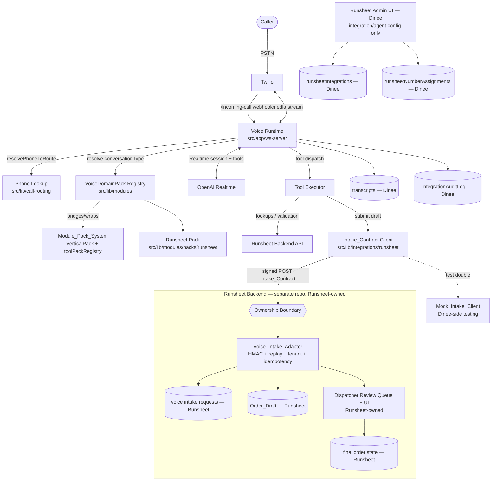
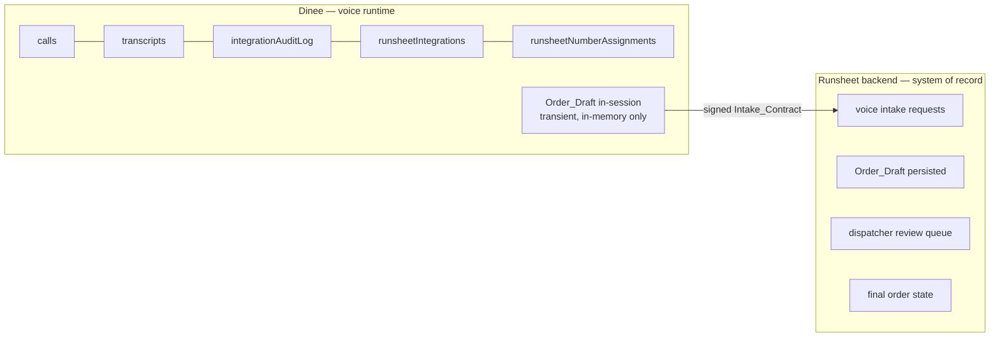

# Design Document

## Overview

This design turns Dinee from a two-vertical (restaurant + logistics) call-management app into a **voice-agent platform** on which external products register **VoiceDomainPacks** and operate voice agents. The first external product is **Runsheet**, a fuel and logistics dispatch product.

The end-to-end path is:

```
Caller → Twilio number → Dinee Voice Runtime → OpenAI Realtime agent
       → Runsheet VoiceDomainPack (tools + phases)
       → [signed Intake_Contract over HTTP]
       → Runsheet Backend (separate repo): Voice_Intake_Adapter
       → Runsheet Backend: Dispatcher Review Queue
```

Dinee owns the agent runtime; the **Runsheet backend owns operational truth** (customers, sites, tanks, orders, dispatch, and the voice intake request record itself).

### Ownership Boundary (the governing principle)

This is the most important constraint in the design. Operational truth lives in the **Runsheet backend** (a separate Python/FastAPI repository), never in Dinee.

| Concern | Owner / system of record | Storage |
|---|---|---|
| Voice intake request record | **Runsheet backend** | Runsheet DB |
| `Order_Draft` (authoritative) | **Runsheet backend** | Runsheet DB |
| Dispatcher review queue + review UI | **Runsheet backend** | Runsheet DB + Runsheet UI |
| Final order state | **Runsheet backend** | Runsheet DB |
| Idempotency ledger, replay protection, tenant match | **Runsheet backend** (Voice_Intake_Adapter) | Runsheet DB |
| Phone-number → conversation-type mapping | **Dinee** | Convex `runsheetNumberAssignments` |
| Agent / `VoiceDomainPack` configuration | **Dinee** | code + Convex config |
| Integration configuration | **Dinee** | Convex `runsheetIntegrations` |
| Call records, transcripts | **Dinee** | Convex `calls`, `transcripts` |
| Audit logs | **Dinee** | Convex `integrationAuditLog` |

Dinee submits voice-originated orders to the Runsheet backend over a defined, versioned, signed **Intake_Contract** and **never acts as the system of record for orders**. Dinee may hold an `Order_Draft` **transiently in-session** (as an in-memory TypeScript value) for submission and retry, but it is **not persisted** in a Dinee Convex table. There is no `orderDrafts` table and no `voiceIntakeRequests` ledger in Dinee.

The Runsheet backend voice-intake endpoints, idempotency handling, replay protection, tenant matching, and review-queue behavior are implemented as a **parallel Runsheet-repository track** (see *Runsheet Backend Implementation Track*). Dinee codes against that track through the **Intake_Contract** and a Dinee-side **Mock_Intake_Client** that implements the same contract for local/CI testing.

### Two Threads of Work

1. **Phase 0 stabilization, then gradual platform generalization (Requirements 1–4, 20).** The current codebase **does not pass `npm run type-check`** and the current runtime (`src/app/ws-server/index.ts`) hardcodes an `isLogistics` branch, inlines every tool definition twice, and keeps two separate call-phase state machines (`call-phase.ts`, `logistics-call-phase.ts`). We first **stabilize** (Phase 0), then **incrementally extract** the existing handlers/retry logic/utilities into `VoiceDomainPack` modules behind compatibility tests, and remove legacy branching **only after** packs cover the existing flows. The abstraction is a **`VoiceDomainPack`** — a voice-specific layer that **bridges to and extends** the existing module-pack system (`src/lib/modules/types.ts` `VerticalPack`, `src/lib/modules/toolPackRegistry.ts`), not a duplicated parallel registry.

2. **The Runsheet product (Requirements 5–12, 18, 20).** The `Runsheet_Pack` defines the fuel-intake agent (slots, tools, phases), a per-tenant `Runsheet_Integration` configuration with a Dinee admin UI limited to integration/agent configuration, a **signed Intake_Contract client** (HMAC over the exact raw body or RFC 8785 JCS, idempotency, replay window, tenant matching, deterministic round-trip serialization), and a **Mock_Intake_Client**. The Voice_Intake_Adapter, the review queue, and their storage are **Runsheet-backend concerns**.

**MVP scope (this design's primary deliverable):** Requirements 1–12, 18, and 20. A caller reaches a Runsheet number, the Fuel Intake Agent collects the order, Dinee submits it over the signed Intake_Contract, and a draft (with transcript and extracted fields) lands in the **Runsheet backend** dispatcher review queue in review-only mode.

**Later phases (designed at section level, explicitly out of MVP):** Requirement 13 (auto-submit eligibility), 14 (status agent), 15 (driver agent), 16 (monitoring/metrics), 17 (alerting), 19 (optional parahackAI telephony).

### Design Principles

- **The runtime is product-agnostic.** No `if (isRunsheet)` or `if (isLogistics)` in the runtime. Behavior is data, supplied by the resolved pack.
- **Truth stays in Runsheet.** Dinee produces a non-authoritative `Order_Draft` in-session and submits it through the signed Intake_Contract. The Runsheet backend persists it and dispatchers act on it. Dinee stores no order-of-record data.
- **VoiceDomainPack bridges, not duplicates.** The voice layer reuses/wraps existing `VerticalPack` and `toolPackRegistry` registrations where they already exist rather than standing up a parallel registry.
- **Stabilize before refactor.** Phase 0 fixes or quarantines pre-existing type errors and pins the current Twilio/OpenAI path with regression tests. The zero-error `npm run type-check` gate applies to the refactored platform **after** Phase 0.
- **Extract gradually behind compatibility tests.** Existing runtime files with real handlers, retry logic, and utilities are moved into packs incrementally; legacy branches are deleted only once packs cover the flows.
- **Gating is enforced twice** — once when building the tool set exposed to the model (membership + integration gating), once at tool-call time (membership + phase gating). Defense in depth against model hallucination.
- **Security properties are mandatory.** HMAC authentication, replay window, tenant match, idempotency, tool gating, and serialization round-trip protect the platform boundary and are non-optional.
- **Reuse existing primitives.** AES-256-GCM `encryptionService`, `integrationAuditLog`, `transcripts`, the phone-lookup routing seam, and the `fast-check` + `vitest` property-testing setup already exist and are extended rather than replaced.

### Requirements Coverage Map

| Design section | Requirements |
|---|---|
| Ownership Boundary | 20.1, 20.2, 20.3, 10.7, 10.8, 12.8 |
| Phase 0 Stabilization | 1.1, 1.2, 1.3, 1.8–1.13 |
| Gradual Extraction Migration Plan | 1.4, 1.5, 1.6, 1.7 |
| VoiceDomainPack Contract (bridges Module_Pack_System) | 2.1, 2.5, 2.7, 2.8, 2.9 |
| VoiceDomainPack Registry | 2.2–2.6, 2.9, 3.1, 4.2, 4.3 |
| Voice Runtime (pack-driven) | 1.9–1.12, 3.2–3.8, 4.4–4.6, 6.9, 6.10, 18.1 |
| Runsheet Pack | 4.1, 5.1–5.11, 6.1–6.10, 7.1–7.4 |
| Runsheet Integration Config + Admin UI (Dinee) | 8.1–8.7, 9.1–9.7 |
| Intake Contract (Dinee client) + Mock Intake Client | 10.6, 10.9, 11.1, 11.6, 11.7, 20.4, 20.6 |
| Voice Intake Security (signing/serialization on Dinee side) | 11.1, 11.6, 11.7 |
| Runsheet Backend Implementation Track (separate repo) | 10.1–10.5, 11.2–11.5, 12.1–12.8, 20.2, 20.5 |
| Transcript capture (runtime side-effect + full transcript in payload) | 10.9, 18.1–18.3 |
| Secret handling / audit | 1.13, 8.3 |
| Later phases | 13–17, 19 |

---

## Architecture

### High-Level Component View

The boundary between Dinee (voice runtime) and the Runsheet backend (system of record) is drawn explicitly. Everything to the right of the signed Intake_Contract is a **separate repository** that Dinee does not host or store.



### Layered Responsibilities

| Layer | Location | Owner | Responsibility |
|---|---|---|---|
| **Transport bridge** | `src/app/ws-server/index.ts` | Dinee | Twilio webhooks, media-stream sockets, OpenAI socket lifecycle. No domain logic. |
| **Session driver** | `src/app/ws-server/runtime/` (new) | Dinee | Generic, pack-driven session: builds session config from a pack, dispatches tool calls, drives phase transitions, buffers transcript. |
| **Registry + contract** | `src/lib/modules/voiceDomainPack.ts`, `voiceDomainPackRegistry.ts` (new) | Dinee | The `VoiceDomainPack` interface, validation, resolution by conversation type, and the **bridge** to `VerticalPack` / `toolPackRegistry`. |
| **Voice domain packs** | `src/lib/modules/packs/**` | Dinee | Product definitions: prompts, tools, phases, escalation, integration requirements. `runsheet/` is added here. |
| **Runsheet read/validate client** | `src/lib/integrations/runsheet/apiClient.ts` | Dinee | Runsheet API client for in-call lookups/validation. |
| **Intake_Contract client** | `src/lib/integrations/runsheet/voiceIntakeClient.ts` | Dinee | Canonicalizes, HMAC-signs, and POSTs voice orders over the Intake_Contract. |
| **Mock_Intake_Client** | `src/lib/integrations/runsheet/mockIntakeClient.ts` (new) | Dinee | Test double implementing the Intake_Contract for Dinee-side tests. |
| **Voice_Intake_Adapter + review queue** | Runsheet repository (Python/FastAPI) | **Runsheet** | Signature verification, idempotency, replay window, tenant match, draft persistence, review routing, dispatcher UI. **Not in Dinee.** |
| **Admin UI (config only)** | `src/app/dashboard/integrations/runsheet/**` | Dinee | Integration and agent configuration. Dinee does **not** render a dispatcher review queue. |

### Call Sequence (MVP: fuel order intake)

```mermaid
sequenceDiagram
  participant C as Caller
  participant T as Twilio
  participant R as Voice Runtime (Dinee)
  participant Reg as VoiceDomainPack Registry (Dinee)
  participant O as OpenAI Realtime
  participant RS as Runsheet API (Runsheet)
  participant IC as Intake_Contract Client (Dinee)
  participant IA as Voice_Intake_Adapter (Runsheet backend)
  participant D as Dispatcher Queue (Runsheet backend)

  C->>T: dials Runsheet number
  T->>R: /incoming-call (To, From, CallSid)
  R->>R: resolvePhoneToRoute(To) → tenant + conversationType
  R->>Reg: resolvePackByConversationType(runsheet_fuel_order_intake)
  Reg-->>R: Runsheet Pack (prompt, tools, phases)
  R->>R: build tool set (membership + integration gating)
  alt no pack owns conversationType OR no number mapping
    R->>T: play message, terminate, write audit (Dinee)
  else resolved
    R->>O: session.update(prompt, gated tools)
    O-->>C: greeting + slot questions
    loop slot collection (customer-id → order-building)
      O->>R: tool call (e.g. runsheet_lookup_customer)
      R->>R: gate(tool ∈ set ∧ allowed in phase)?
      R->>RS: execute (5s timeout, fallback on error)
      RS-->>R: result
      R-->>O: tool result → phase transition
    end
    O->>R: runsheet_create_order_draft (order-building phase) [transient in-session]
    O->>R: runsheet_queue_dispatch_review (finalized phase)
    R->>IC: Order_Draft (transient) + intake metadata + full transcript content
    IC->>IC: canonicalize (raw body / JCS), HMAC-SHA256, idempotency key, ts
    IC->>IA: signed POST over Intake_Contract  ==== ownership boundary ====
    IA->>IA: verify sig, ts window, tenant, idempotency (Runsheet-owned)
    IA->>D: persist voice intake request + Order_Draft (review_required)
    IA-->>IC: {draftId, accepted}
    IC-->>R: IntakeResult
    Note over R: transcript appended as runtime side-effect (no model tool)
    R->>R: wrap up; if queue unconfirmed at call end → escalate/transfer per Escalation_Target
  end
```

### Data Ownership Sequence (who stores what)



### Migration Plan: Phase 0 Stabilization, then Gradual Extraction (Requirements 1.1–1.7)

The migration is deliberately **stabilize-first, then incremental and behavior-preserving**. Legacy restaurant/logistics flows keep working until they are re-expressed as packs and verified by compatibility tests.

#### Phase 0 — Stabilization (runs BEFORE any VoiceDomainPack refactor) (Req 1.1, 1.2, 1.3)

1. **Fix or quarantine pre-existing TypeScript errors (Req 1.1).** The baseline does not pass `npm run type-check` — known problem areas include phone provisioning, scheduled functions, billing fields, and implicit `any` declarations. For each pre-existing error, either fix it or record it in a documented **quarantine list** (`.kiro/specs/dinee-voice-platform/type-quarantine.md`) that names the file and the error. The zero-error type-check gate (Req 1.7) applies to the refactored platform **only after** Phase 0, excluding quarantined files.
2. **Preserve the current Twilio→OpenAI path (Req 1.2).** No refactor work begins until a caller reaching an existing configured number still reaches a Realtime_Agent on the current code path.
3. **Add regression coverage for the current path (Req 1.3).** Introduce regression tests that exercise the existing Twilio→OpenAI call path and pass at the completion of Phase 0. These become the behavioral baseline the extraction must not break.
4. **Secret hygiene (Req 1.13).** Any secret identified as exposed in committed environment configuration is referenced by name in an audit record without reproducing the value.

#### Extraction Phase — Gradual, behind compatibility tests (Req 1.4, 1.5, 1.6, 1.7)

1. **Introduce the contract and registry** (`voiceDomainPack.ts`, `voiceDomainPackRegistry.ts`) alongside the existing `VerticalPack` / `toolPackRegistry`. The new registry is conversation-type-keyed and **bridges** to the Module_Pack_System (see below), reusing/wrapping existing registrations rather than duplicating them.
2. **Extract a generic session driver** from `index.ts` into `src/app/ws-server/runtime/`:
   - `sessionConfig.ts` — builds the OpenAI `session.update` payload from a resolved pack (prompt + gated tools + transcription hint).
   - `toolExecutor.ts` — maps a pack tool name to its handler, applies the 5s timeout and fallback, returns a normalized result.
   - `phaseEngine.ts` — generic phase state machine driven by `CallPhaseDefinition[]` and transition events declared by the pack (eventually replaces `call-phase.ts` and `logistics-call-phase.ts`).
   - `transcriptBuffer.ts` — appends confirmed turns keyed by `callId` as a runtime side-effect, with no model tool involved (Req 18.1), and with retry retention on persistence failure (Req 18.3).
3. **Extract existing handlers/retry logic/utilities into pack modules incrementally (Req 1.4).** The real handlers and utilities in `src/app/ws-server/tools.ts` and `src/app/ws-server/logistics-tools.ts`, and the two call-phase modules `src/app/ws-server/call-phase.ts` and `src/app/ws-server/logistics-call-phase.ts`, are moved into `VoiceDomainPack` modules under `src/lib/modules/packs/**` **one extraction at a time**. Each extraction is covered by a **compatibility test** that asserts the extracted behavior matches the behavior recorded before extraction (against the Phase 0 baseline).
4. **Add the Runsheet Pack** under `src/lib/modules/packs/runsheet/`.
5. **Remove legacy branching only after packs cover the flows (Req 1.5, 1.6).** The `isLogistics` branching, duplicated tool arrays, and the two phase modules are deleted **only once** the corresponding `VoiceDomainPack` modules cover the existing call flows, as verified by passing compatibility tests. After extraction, all domain-specific voice logic lives under `src/lib/modules/packs`, not in the Voice_Runtime entry module.
6. **Type-check gate after Phase 0 (Req 1.7).** Once Phase 0 is complete and the refactor is applied, `npm run type-check` must report zero errors excluding the Phase 0 quarantine list; enforced as a CI smoke gate.
7. **Runtime health test (Req 1.12).** An integration-style harness verifies: phone-number lookup resolves a route, phase state initializes, tool definitions load for the resolved domain, and out-of-set tool calls are rejected.

Order of legacy removal (end of extraction): fold `logistics-call-phase.ts` and `call-phase.ts` into `phaseEngine.ts` + pack phase definitions; move the handler/retry logic from `tools.ts` / `logistics-tools.ts` into pack tool modules; delete the inlined tool arrays and `isLogistics` branch in `index.ts`. Nothing is deleted until its replacement pack passes compatibility tests.

---

## Components and Interfaces

### VoiceDomainPack Contract — bridging the Module_Pack_System (Requirements 2.1, 2.5, 2.7, 2.8, 2.9)

New file `src/lib/modules/voiceDomainPack.ts`. The `VoiceDomainPack` is a **voice-specific layer that extends and bridges to** the existing Module_Pack_System (`src/lib/modules/types.ts` `VerticalPack`, `src/lib/modules/toolPackRegistry.ts`). It is **not** a duplicated parallel registry: where a `VerticalPack` or tool pack already exists for a product, the VoiceDomainPack **references/wraps** that registration and adds only the voice concerns (prompts, conversation types, phases, escalation, integration gating) that the module-pack system does not model.

```typescript
import type { VerticalPack } from "@/lib/modules/types";

/**
 * A dynamically loadable definition of an external product's VOICE capabilities.
 * It bridges to the existing Module_Pack_System rather than duplicating it (Req 2.8, 2.9).
 */
export interface VoiceDomainPack {
  /** Unique identifier, 1–64 chars, unique across the registry (Req 2.1, 2.2). */
  id: string;
  /** Human-readable name, 1–128 chars (Req 2.1). */
  name: string;
  /** Description, 0–1024 chars (Req 2.1). */
  description: string;
  /** 1–50 conversation types this pack owns (Req 2.1). */
  conversationTypes: ConversationTypeDefinition[];
  /** At most 100 tool definitions (Req 2.1). */
  tools: VoiceToolDefinition[];
  /** 1–20 call-phase definitions (Req 2.1). */
  phases: CallPhaseDefinition[];
  /** Default system prompt used when a conversation type omits its own (Req 2.1). */
  defaultPrompt: string;
  /** Escalation rules applied when the agent cannot complete (Req 2.1). */
  escalationRules: EscalationRule[];
  /** Integrations this pack requires to operate (Req 2.1, 4.4). */
  integrations: IntegrationRequirement[];
  /**
   * Bridge to the Module_Pack_System (Req 2.8, 2.9).
   * When set, the registry links this voice pack to an existing VerticalPack /
   * tool-pack registration instead of creating a parallel one. The voice pack
   * REUSES the linked pack's tool-pack membership for integration gating and
   * dashboard/analytics registration; it only adds voice-specific behavior.
   */
  moduleBridge?: ModulePackBridge;
}

/** Links a VoiceDomainPack to an existing Module_Pack_System registration (Req 2.8, 2.9). */
export interface ModulePackBridge {
  /** The VerticalPack id already registered in src/lib/modules (e.g. "logistics"). */
  verticalPackId: string;
  /** Existing tool-pack ids whose registrations should be reused/wrapped, not duplicated. */
  reuseToolPackIds: string[];
  /**
   * How to resolve tools: "reuse" pulls tool membership from the linked tool packs,
   * "extend" adds voice-only tools on top of the reused set. Prevents blind duplication.
   */
  mode: "reuse" | "extend";
}

/** One conversation type owned by a pack (Req 2.7). */
export interface ConversationTypeDefinition {
  /** e.g. "runsheet_fuel_order_intake". */
  type: string;
  /** Optional per-conversation prompt override; falls back to defaultPrompt. */
  prompt?: string;
  /** The phase the session starts in (must be a defined phase id). */
  initialPhase: string;
  /** Shape/labels of transcript metadata captured for this conversation (Req 2.7). */
  transcriptMetadata: TranscriptMetadataShape;
  /** Behavior when the agent cannot proceed (Req 2.7). */
  fallbackBehavior: FallbackBehavior;
}

/** A backend tool the agent may call (Req 2.5). */
export interface VoiceToolDefinition {
  /** Tool name exposed to the model. */
  name: string;
  /** Natural-language description for the model. */
  description: string;
  /** JSON-schema parameter definition (OpenAI function-tool shape). */
  parameters: JSONSchema;
  /** Phase ids in which this tool is permitted (Req 2.5, 2.6). */
  allowedPhases: string[];
  /** Integration id required for this tool to be exposed (Req 4.4). */
  requiresIntegration?: string;
  /** true for read-only tools; mutation tools are gated more strictly. */
  readOnly: boolean;
  /** Handler key resolved by the tool executor to an implementation. */
  handler: string;
  /**
   * When the pack bridges in "reuse" mode, this names the tool-pack tool this
   * voice tool wraps, so the same handler/registration is reused (Req 2.9).
   */
  reusesModuleTool?: string;
}

/** A named call phase and the events that advance it (Req 2.1). */
export interface CallPhaseDefinition {
  /** Phase id, referenced by tools' allowedPhases and transitions. */
  id: string;
  /** Ordered transitions: on `event` in this phase, move to `to`. */
  transitions: Array<{ event: string; to: string }>;
  /** true when the phase represents a finalized order (Req 7.3). */
  terminal?: boolean;
}

/** Escalation target + trigger (Req 2.1, 9.4). */
export interface EscalationRule {
  trigger: "max_slot_retries" | "tool_failure" | "explicit_request" | "no_pack";
  target: EscalationTarget;
}

export type EscalationTarget =
  | { kind: "phone"; value: string }
  | { kind: "email"; value: string }
  | { kind: "webhook"; value: string };

/** Declares an integration the pack needs; presence is resolved per tenant (Req 4.4). */
export interface IntegrationRequirement {
  /** e.g. "runsheet". */
  id: string;
  /** Whether the pack can operate at all without it. */
  required: boolean;
}

export type FallbackBehavior =
  | { kind: "escalate" }
  | { kind: "voicemail" }
  | { kind: "apologize_and_end" };
```

**Bridging behavior (Req 2.8, 2.9).** When a pack carries a `moduleBridge`, the registry:
- Validates that `verticalPackId` and each `reuseToolPackIds` entry exist in the Module_Pack_System; a missing reference is a registration error.
- In `mode: "reuse"`, the exposed tool set is derived from the linked tool packs' membership (voice tools that set `reusesModuleTool` map onto existing handlers); in `mode: "extend"`, voice-only tools are added on top of the reused set.
- Reuses the existing tool-pack **integration gating** so a tool disabled at the module level is not re-exposed at the voice level.

This keeps a single source of truth for a product's tool membership and prevents a blindly duplicated parallel registry.

### VoiceDomainPack Registry (Requirements 2.2–2.6, 2.9, 3.1, 4.2, 4.3)

New file `src/lib/modules/voiceDomainPackRegistry.ts`. Pure, in-memory, deterministic — directly property-testable.

```typescript
export type RegisterResult =
  | { ok: true }
  | { ok: false; error: RegistrationError };

export interface RegistrationError {
  code:
    | "duplicate_id"          // Req 2.3
    | "invalid_id"            // Req 2.2, 2.4
    | "missing_field"         // Req 2.4
    | "field_out_of_bounds"   // Req 2.4
    | "invalid_tool_phase"    // Req 2.6
    | "unknown_module_bridge"; // Req 2.8, 2.9 (bridge target not in Module_Pack_System)
  /** Names the offending field / conflicting id / invalid phase / missing bridge (Req 2.3, 2.4, 2.6, 2.9). */
  detail: string;
}

/** Validates and registers a voice pack. On failure the registry is unchanged (Req 2.3, 2.4, 2.6). */
export function registerVoiceDomainPack(pack: VoiceDomainPack): RegisterResult;

/** Resolves the single pack whose conversationTypes include `type`, or null (Req 3.1). */
export function resolvePackByConversationType(type: string): VoiceDomainPack | null;

/**
 * Tools exposed for a tenant: membership + integration gating, honoring any
 * moduleBridge reuse so module-level gating is not bypassed (Req 4.4, 2.9).
 */
export function resolveToolSet(pack: VoiceDomainPack, enabledIntegrations: string[]): VoiceToolDefinition[];

/** True iff `toolName` is in the set AND permitted in `phaseId` (Req 3.6). */
export function isToolCallPermitted(
  toolSet: VoiceToolDefinition[],
  toolName: string,
  phaseId: string
): { permitted: boolean; reason?: "not_in_set" | "not_in_phase" };

export function clearRegistry(): void; // testing only
```

**Validation order** (each failure returns unchanged registry):
1. `id` present, 1–64 chars → else `invalid_id`.
2. `id` unique → else `duplicate_id` (detail = conflicting id).
3. `name` present 1–128; `description` ≤ 1024; `conversationTypes` length 1–50; `tools` length ≤ 100; `phases` length 1–20 → else `missing_field`/`field_out_of_bounds` (detail = field name).
4. Every `tool.allowedPhases` entry ∈ `phases[].id` → else `invalid_tool_phase` (detail = phase id).
5. Every `conversationType.initialPhase` ∈ `phases[].id` → else `field_out_of_bounds`.
6. If `moduleBridge` is present, `verticalPackId` and each `reuseToolPackIds` entry exist in the Module_Pack_System → else `unknown_module_bridge` (detail = missing reference).

Registration is atomic: validation completes fully before the pack is inserted, so a rejected pack never mutates the registry.

### Voice Runtime — Pack-Driven Session Driver (Requirements 1.9–1.12, 3.2–3.8, 4.5–4.6, 18.1)

`src/app/ws-server/runtime/session.ts` (new) owns a single call's lifecycle. `index.ts` calls into it.

```typescript
export interface ResolvedCallContext {
  callSid: string;
  fromNumber: string;
  toNumber: string;
  tenantId: string;
  conversationType: string;
  enabledIntegrations: string[];
}

export interface SessionInit {
  pack: VoiceDomainPack;
  conversation: ConversationTypeDefinition;
  toolSet: VoiceToolDefinition[];   // already integration-gated (Req 4.4)
  prompt: string;
  initialPhase: string;
}

/**
 * Resolves the pack and builds session config, or returns a termination
 * decision when no pack owns the conversation type / no number mapping.
 * (Req 3.1, 3.2, 3.5, 4.6)
 */
export function prepareSession(ctx: ResolvedCallContext):
  | { kind: "start"; init: SessionInit }
  | { kind: "terminate"; reason: "no_pack" | "no_mapping"; audit: AuditRecord };
```

Key behaviors:

- **Resolution precedes session init (Req 3.2, 3.3, 3.4).** `prepareSession` runs before the OpenAI `session.update` is sent. Tools + prompt are applied before the first `response.create` (the greeting).
- **No-route handling (Req 1.11, 3.5, 4.6).** If `resolvePhoneToRoute` yields no conversation route, or no pack owns the conversation type, the runtime does **not** open the OpenAI socket; it plays an audio message via TwiML, terminates, and writes an audit entry containing the unresolved conversation type / called number and the call id.
- **Tool-call gating at dispatch time (Req 3.6, 3.7, 3.8, 7.4).** On `response.function_call_arguments.done`, the driver calls `isToolCallPermitted(toolSet, name, phase)`:
  - `not_in_set` → return a rejection result to the model, do not execute, preserve state, audit `{tool, callId}`.
  - `not_in_phase` → same, audit `{tool, phase, callId}`.
  - permitted → execute via `toolExecutor`, then apply any declared phase transition.
- **Transcript buffering as a runtime side-effect (Req 18.1).** Each confirmed human/AI turn is appended to the Dinee-owned transcript keyed by `callSid` **automatically by the session driver's `transcriptBuffer`** — this is a Voice_Runtime side-effect, **not** a model/LLM tool call. There is no `runsheet_append_call_transcript` (or any transcript-append) tool exposed to the model; the runtime observes confirmed turns and appends them without any agent action. On persistence failure the turn is retained in an in-memory buffer for retry (Req 18.3).

The generic `phaseEngine`:

```typescript
export function nextPhase(
  phases: CallPhaseDefinition[],
  current: string,
  event: string
): string; // returns target phase or `current` if no transition matches
```

### Tool Executor and Timeout/Fallback (Requirements 6.5, 6.6, 6.8)

`src/app/ws-server/runtime/toolExecutor.ts`:

```typescript
export interface ToolOutcome {
  status: "ok" | "error" | "timeout";
  result?: unknown;
  error?: string;
}

/** Executes a resolved handler with a 5s deadline (Req 6.5). */
export async function executeTool(
  handlerKey: string,
  args: unknown,
  ctx: ToolExecContext,
  timeoutMs = 5000
): Promise<ToolOutcome>;
```

- Timeout (Req 6.5): if a handler does not resolve within 5s, outcome is `timeout`; the driver records `{tool, "timeout"}` and continues with the conversation-type `fallbackBehavior`.
- Backend error (Req 6.6): outcome `error`; record `{tool, error}` and continue with fallback.
- `runsheet_queue_dispatch_review` non-confirmation (Req 6.9, 6.10): while the call is still active the driver records the failure and retains the **transient in-session** draft for retry. If placement is still unconfirmed when the call ends, the runtime **escalates or transfers per the configured `Escalation_Target`** rather than silently discarding the draft. The draft is never persisted as a Dinee order-of-record.

### Runsheet Pack (Requirements 4.1, 5.x, 6.1, 7.x)

New directory `src/lib/modules/packs/runsheet/`:

- `index.ts` — assembles and registers the `VoiceDomainPack`. Where a logistics `VerticalPack` / tool pack already exists in the Module_Pack_System, the Runsheet voice pack sets `moduleBridge` to reuse it rather than duplicating tool registrations (Req 2.8, 2.9).
- `conversationTypes.ts` — exactly the four types (Req 4.1): `runsheet_fuel_order_intake`, `runsheet_order_status`, `runsheet_driver_exception`, `runsheet_dispatch_callback`.
- `tools.ts` — the fuel-intake tool definitions (Req 6.1) plus later-phase status/driver tools (declared but gated by conversation type). Handlers extracted from the existing `logistics-tools.ts` are reused here during the gradual extraction.
- `phases.ts` — the fuel-intake phase machine.
- `slots.ts` — required-slot definitions, validators, and the transient `Order_Draft` builder.
- `prompts.ts` — system prompts per conversation type.

**Fuel intake phases (Req 7.1–7.4):**

| Phase id | Permitted tools | Advances on |
|---|---|---|
| `customer_identification` | `runsheet_lookup_customer`, `runsheet_list_customer_sites`, `runsheet_list_customer_tanks` (all read-only) | `customer_identified` |
| `order_building` | `runsheet_validate_product`, `runsheet_create_order_draft` | `draft_created` |
| `order_finalized` (terminal) | `runsheet_queue_dispatch_review` | — |

The finalized phase permits **only** the dispatch-review queueing tool. There is no model-invoked transcript-append tool in any phase — transcript capture is a Voice_Runtime side-effect (Req 18.1), not a tool the model calls (see *Transcript capture as a runtime side-effect* below).

Mutation tools (`create_order_draft`, `queue_dispatch_review`) are absent from `customer_identification`, so any mutation attempted before customer identification completes is rejected by `isToolCallPermitted` with an audit entry (Req 7.4).

**Fuel intake tools (Req 6.1).** The review-only MVP fuel-intake tool set is exactly **six** tools: `runsheet_lookup_customer`, `runsheet_list_customer_sites`, `runsheet_list_customer_tanks`, `runsheet_validate_product`, `runsheet_create_order_draft`, and `runsheet_queue_dispatch_review`. All declare `requiresIntegration: "runsheet"` so they are excluded when the tenant's integration is disabled/absent (Req 4.4). `runsheet_queue_dispatch_review` submits the transient draft to the Runsheet backend over the Intake_Contract (Req 6.8).

The set deliberately **excludes** two things:

- `runsheet_submit_order` is a **later-phase tool** tied to Auto_Submit (Req 13). It is never placed in the resolved tool set until that feature ships (Req 6.2, 13.5); it does not appear in the MVP set.
- There is **no model-invoked transcript-capture tool** (Req 6.1, 18.1). Transcript capture is a Voice_Runtime side-effect; the runtime's `transcriptBuffer` appends confirmed turns automatically, so the model never calls a transcript tool.

**Slot collection (Req 5.1–5.11).** `slots.ts` defines required slots and validators:

```typescript
export interface SlotDefinition {
  key: "customer" | "delivery_site" | "product_code" | "quantity" | "delivery_window" | "po_number" | "urgency";
  required: (tenant: RunsheetTenantConfig) => boolean; // po_number required only WHERE tenant requires it (Req 5.6)
  validate: (raw: string) => { ok: true; value: unknown } | { ok: false };
  maxRequests: 3; // Req 5.9
}

/** The transient, non-authoritative in-session draft. NOT a Dinee Convex table. */
export interface OrderDraft {
  slots: Record<string, unknown>;   // collected values (Req 5.11)
  missingSlots: string[];           // slots unresolved after 3 requests (Req 5.9)
  urgency: "normal" | "urgent" | "emergency"; // Req 5.7
  confidenceScore: number;          // 0.0–1.0 (Req 5.8)
}

/** Produces a transient Order_Draft once required slots are collected (Req 5.8, 5.11). */
export function buildOrderDraft(input: OrderDraftInput, tenant: RunsheetTenantConfig): OrderDraft;
```

Rules encoded here: invalid values are not recorded and trigger a re-request (Req 5.10); a slot still unresolved after 3 requests is marked missing (Req 5.9); urgency is constrained to the three-value enum (Req 5.7); every collected slot value appears in the draft's `slots` (Req 5.11); the draft carries a confidence score in `[0,1]` (Req 5.8). The draft lives only in session memory; the Runsheet backend is the system of record once submitted (Req 10.7, 10.8, 20.2, 20.3).

### Runsheet Read/Validate Client (Requirements 6.2–6.4, 8.5)

`src/lib/integrations/runsheet/apiClient.ts` — extends the existing `runsheetClient.ts` (shipment-oriented and partly stubbed) with the intake-side read tools:

```typescript
export class RunsheetApiClient {
  constructor(cfg: { baseUrl: string; apiKey: string; tenantId: string });

  /** Req 6.2, 6.3: requires phone OR account id; single/list/empty result. */
  lookupCustomer(q: { phone?: string; accountId?: string }): Promise<CustomerMatch[]>;
  listCustomerSites(customerId: string): Promise<Site[]>;
  listCustomerTanks(customerId: string): Promise<Tank[]>;
  /** Req 6.4: boolean validity for the tenant. */
  validateProduct(productCode: string): Promise<boolean>;
  /** Req 8.5: authenticated ping for credential test. */
  testCredential(): Promise<{ valid: boolean }>;
}
```

`lookupCustomer` rejects when neither `phone` nor `accountId` is provided (Req 6.3). All network calls are wrapped by the runtime's 5s executor (Req 6.5).

### Intake Contract (Dinee client) and Mock Intake Client (Requirements 10.6, 11.1, 11.6, 11.7, 20.4, 20.6)

This section defines the **HTTP contract Dinee codes against** to submit voice-originated orders to the Runsheet backend, and the Dinee-side test double. Dinee owns only the *client* side; the *server* (Voice_Intake_Adapter) is a Runsheet-backend concern (see next section).

#### Intake_Contract (HTTP)

- **Method / path:** `POST {baseUrl}/voice-intake` (Runsheet-hosted).
- **Headers:**
  - `X-Runsheet-Tenant`: Runsheet tenant identifier (Req 11.4 tenant match input).
  - `X-Idempotency-Key`: unique per call-or-order attempt (Req 11.3).
  - `X-Timestamp`: epoch-ms send time (Req 11.5 replay window input).
  - `X-Signature`: `sha256=` + hex HMAC-SHA256 of the **Canonical_Payload** under the tenant's webhook secret (Req 11.1).
  - `X-Schema-Version`: intake payload schema version (Req 10.3).
  - `Content-Type: application/json`.
- **Body (`VoiceIntakePayload`)** — the JSON document described below. It carries the **full confirmed transcript content** (`transcript`) in addition to the `transcriptId` reference, so the Runsheet backend review queue receives the transcript without any callback into Dinee (Req 10.9, 18.2). Dinee remains the owner and system of record for the transcript store; the payload delivers a **copy** of the transcript inside the signed request.
- **Canonical_Payload (Req 11.1, 11.7):** the signature input is, in preference order:
  1. **The exact raw transmitted HTTP body** (bytes on the wire), or
  2. an **RFC 8785 JSON Canonicalization Scheme (JCS)** serialization of the payload.
  Both Dinee (TypeScript signing) and Runsheet (Python verification) MUST use the **same** documented method so that identical payloads yield identical signature inputs. The default is "sign the exact raw body": Dinee computes the HMAC over the exact byte string it sends, and Runsheet verifies over the exact bytes it received, so no cross-language JSON re-encoding is involved. JCS is the alternative only if a structured canonicalization is required, and then both sides use a conformant JCS implementation.
- **Responses:**
  - `200` `{ accepted: true, draftId }` — accepted (or idempotent replay of the original result, Req 11.3).
  - `400` — missing required field (Req 10.5) or replay/stale timestamp (Req 11.5).
  - `401` — signature mismatch (Req 11.2).
  - `403` — tenant mismatch (Req 11.4).

```typescript
export interface VoiceIntakePayload {
  schemaVersion: string;            // Req 10.3, X-Schema-Version
  tenantId: string;                 // Req 11.4
  idempotencyKey: string;           // Req 11.3
  timestamp: number;                // epoch ms, Req 11.5
  callId: string;                   // Req 10.2, 10.5
  transcriptId: string;             // Req 10.2, 18.2 (reference to the Dinee-owned transcript store)
  transcript: TranscriptTurn[];     // Req 10.2, 10.9, 18.2 — FULL confirmed transcript content carried in the payload
  recordingRef: string | null;      // Req 10.2
  confidenceScore: number;          // Req 10.2
  agentId: string;                  // Req 10.2
  sessionId: string;                // Req 10.2
  callerPhone: string;              // Req 10.2, 10.5
  reviewRequired: boolean;          // Req 10.2
  extractedSlots: Record<string, unknown>; // Req 10.2, 10.5
}

/** One confirmed dialogue turn carried in the signed payload (Req 10.9, 18.1, 18.2). */
export interface TranscriptTurn {
  role: "caller" | "agent";
  text: string;
  /** epoch ms when the turn was confirmed. */
  at: number;
}

/** The Dinee-side Intake_Contract client interface. Implemented by the real client
 *  and by the Mock_Intake_Client (Req 20.6). */
export interface IntakeClient {
  submit(payload: VoiceIntakePayload, secret: string): Promise<IntakeResult>;
}

export interface IntakeResult {
  status: "accepted" | "rejected";
  httpStatus: number;
  draftId?: string;
  error?: string;
}
```

`src/lib/integrations/runsheet/voiceIntakeClient.ts` — the real **Dinee → Runsheet submit client** over the Intake_Contract (Req 20.4):

```typescript
/** Canonicalize (raw-body default; JCS optional), HMAC-SHA256, POST (Req 11.1, 11.7). */
export function submitVoiceIntake(payload: VoiceIntakePayload, secret: string): Promise<IntakeResult>;

/**
 * Produces the exact bytes transmitted AND signed. This is the Canonical_Payload
 * when raw-body signing is used. When JCS is selected, this returns the RFC 8785
 * canonical form. The same function output is what Runsheet verifies against (Req 11.1, 11.6, 11.7).
 */
export function canonicalizeIntake(payload: VoiceIntakePayload): string;

/** Inverse used by the Mock_Intake_Client and by cross-language round-trip tests (Req 11.6). */
export function deserializeIntake(raw: string): VoiceIntakePayload;

/** HMAC-SHA256 over the canonical bytes, hex-encoded (Req 11.1). */
export function signIntake(canonical: string, secret: string): string;
```

#### Mock_Intake_Client (Req 20.6)

`src/lib/integrations/runsheet/mockIntakeClient.ts` implements `IntakeClient` and mirrors the Runsheet-backend verification order **for Dinee-side testing only**, so submission behavior can be verified without the live Runsheet backend:

```typescript
export class MockIntakeClient implements IntakeClient {
  // In-memory idempotency + replay + tenant checks matching the contract semantics.
  // Records received canonical bytes + signature so tests can assert HMAC correctness,
  // replay-window rejection, tenant mismatch, idempotent replay, and round-trip fidelity.
  submit(payload: VoiceIntakePayload, secret: string): Promise<IntakeResult>;
}
```

The Mock_Intake_Client is the test seam for Dinee's mandatory security properties (HMAC, replay, tenant, idempotency, round-trip). It is not used in production; the real client talks to the Runsheet backend.

### Runsheet Backend Implementation Track (separate repo) (Requirements 10.1–10.5, 11.2–11.5, 12.1–12.8, 20.2, 20.5)

> **This section is a parallel plan for the Runsheet team, not Dinee-side work.** It lives in the Runsheet repository (Python/FastAPI). Dinee does not host, implement, or store any of the following. It is documented here so the two tracks can be built and tested in parallel against the shared Intake_Contract (Req 20.5).

The Runsheet backend must build and own:

1. **Voice_Intake_Adapter endpoint** (`POST /voice-intake`) that accepts voice-originated orders with `channel: "voice"` (Req 10.1) and, in a fixed check order, enforces:
   1. **HMAC verification** over the same Canonical_Payload method Dinee uses (exact raw body, or RFC 8785 JCS) → reject `401`, record, create no order (Req 11.2). Use a constant-time comparison.
   2. **Freshness window** on `X-Timestamp` → reject stale/early as replay `400`, record, create no order (Req 11.5).
   3. **Tenant match** of `X-Runsheet-Tenant` / payload `tenantId` against the authenticated integration → reject `403`, record, create no order (Req 11.4).
   4. **Idempotency**: if `X-Idempotency-Key` was seen, return the original stored result, create no duplicate (Req 11.3).
   5. **Required fields**: `callId`, `callerPhone`, `extractedSlots` present → else `400` naming the missing field, create no order (Req 10.5).
2. **Intake persistence** (Runsheet DB): record the voice intake request with all intake metadata — call id, transcript id, **full transcript content**, recording ref, confidence score, Dinee agent id, Dinee session id, caller phone, review-required flag, extracted slots (Req 10.2, 10.9) — plus the source **schema version** (Req 10.3), and write a structured audit log entry (Req 10.4). Because the full transcript content arrives in the signed payload, the backend does not call back into Dinee to fetch it (Req 10.9).
3. **Order_Draft store** (Runsheet DB): the authoritative `Order_Draft` and its lifecycle (Req 20.2). Dinee holds it only transiently (Req 10.7, 20.3).
4. **Idempotency + replay ledger** (Runsheet DB): keyed by idempotency key + tenant, with the stored original response for replay (Req 11.3) and timestamp bookkeeping for the freshness window (Req 11.5).
5. **Dispatcher Review Queue + dispatcher UI** (Runsheet-owned, Req 12.1–12.8):
   - List each draft with the extracted order form, transcript, confidence score, missing/uncertain fields, and a recommended action (Req 12.1); accept / edit / reject controls (Req 12.2); a link to the call recording (Req 12.3).
   - Accept → submit as a Runsheet order and record the accepting dispatcher (Req 12.4, 12.5).
   - Reject → mark rejected, create no order (Req 12.6).
   - `always_review` mode routes every draft to the queue (Req 12.7).
   - The queue and its storage are owned by Runsheet; **Dinee does not store the review queue** (Req 12.8, 20.2).

**Parallel-development contract stubs.** Because the Runsheet track is separate, the shared artifacts are: the Intake_Contract definition above, an OpenAPI schema for `POST /voice-intake`, and a canonicalization/HMAC test vector file (fixed payloads → expected canonical bytes → expected signature) that **both** the Dinee TypeScript client and the Runsheet Python adapter run against. Matching test vectors are how the two languages are proven signature-compatible (Req 11.7).

### Admin UI — Configuration Only (Requirements 8.x, 9.x)

Dinee's UI scope is **limited to integration and agent configuration**. Dinee does **not** render a dispatcher review queue (that is Runsheet-owned, Req 12.8).

- **Runsheet Admin config** (`src/app/dashboard/integrations/runsheet/page.tsx`, Tailwind v4): forms to store base URL, tenant id, API key (encrypted on save, Req 8.2), webhook secret, default review mode (Req 8.4), allowed conversation types; a **Test credential** action (Req 8.5); number-to-conversation-type assignment (Req 9.1); escalation target config (Req 9.4). While in MVP scope, the Auto_Submit setting is stored internally and **no Auto_Submit toggle is surfaced** (Req 9.2); the toggle appears only when Requirement 13 is delivered (Req 9.3). Validation errors surface inline and leave stored config unchanged (Req 8.6, 8.7, 9.6, 9.7).

There is no Dinee `src/app/dashboard/runsheet/review` page; the review workflow is delivered into the Runsheet backend over the Intake_Contract.

---

## Data Models

Dinee stores **only** the concerns it owns under the ownership boundary (Req 20.1): phone-number→conversation-type mappings, agent/`VoiceDomainPack` configuration, integration configuration, call records, transcripts, and audit logs. The voice intake request record, the persisted `Order_Draft`, the dispatcher review queue, and final order state are **owned and stored by the Runsheet backend** (Req 20.2) and therefore have **no Dinee Convex tables**. In particular, there is **no `orderDrafts` table** and **no `voiceIntakeRequests` ledger** in Dinee — those were removed as part of correcting the ownership boundary. Idempotency, replay protection, and the intake ledger live in the Runsheet backend.

All new Dinee tables follow existing conventions (string business ids, `by_*` indexes, `createdAt` epoch ms).

### `runsheetIntegrations` (Dinee-owned) (Requirements 8.1, 8.4, 9.1–9.4, 13 later, 20.1)

Per-tenant Runsheet **integration configuration**. Kept as a dedicated table (rather than nesting under `restaurants.integrations`) because Runsheet tenants are platform tenants, not restaurants. This is configuration Dinee owns; it is not order-of-record data.

```typescript
runsheetIntegrations: defineTable({
  tenantId: v.string(),
  baseUrl: v.string(),                       // Req 8.1 (Intake_Contract target)
  runsheetTenantId: v.string(),              // Req 8.1, 11.4
  apiKeyEncrypted: v.string(),               // AES-256-GCM (Req 8.1, 8.2)
  apiKeyLast4: v.string(),                   // masked display (Req 8.3)
  webhookSecretEncrypted: v.string(),        // HMAC secret for the Intake_Contract (Req 8.1, 11.1)
  defaultReviewMode: v.union(
    v.literal("always_review"),
    v.literal("auto_submit_low_risk")        // Req 8.4
  ),
  allowedConversationTypes: v.array(v.string()), // Req 8.1, 9.5
  autoSubmitEnabled: v.boolean(),            // stored internally in MVP; no UI toggle (Req 9.2)
  confidenceThreshold: v.optional(v.number()), // Req 13.1 (later)
  escalationTarget: v.optional(v.object({    // Req 9.4
    kind: v.union(v.literal("phone"), v.literal("email"), v.literal("webhook")),
    value: v.string(),
  })),
  status: v.union(v.literal("connected"), v.literal("disconnected"), v.literal("error")),
  createdAt: v.number(),
  updatedAt: v.number(),
})
  .index("by_tenant_id", ["tenantId"])
  .index("by_runsheet_tenant_id", ["runsheetTenantId"]),
```

### `runsheetNumberAssignments` (Dinee-owned) (Requirements 9.1, 9.5, 9.6, 20.1)

The phone-number→conversation-type mapping Dinee owns (Req 20.1). A tenant can map multiple numbers.

```typescript
runsheetNumberAssignments: defineTable({
  tenantId: v.string(),
  phoneNumber: v.string(),
  conversationType: v.string(),   // must be in allowedConversationTypes (Req 9.5, 9.6)
  createdAt: v.number(),
})
  .index("by_tenant_id", ["tenantId"])
  .index("by_phone_number", ["phoneNumber"]),
```

### Transient in-session `Order_Draft` (NOT a table)

The `Order_Draft` produced by the Fuel_Intake_Agent is an **in-memory TypeScript value** (`OrderDraft`, defined in `src/lib/modules/packs/runsheet/slots.ts`) held only for the duration of the call for submission and retry (Req 10.7, 20.3). It is **never written to a Dinee Convex table** and is **never persisted as a Dinee order-of-record** (Req 6.10). While the call is active and `runsheet_queue_dispatch_review` placement is unconfirmed, the draft is retained in the session buffer for retry (Req 6.9, 6.10). If placement remains unconfirmed when the call ends, the runtime **escalates or transfers per the configured `Escalation_Target`** rather than discarding the draft (Req 6.9). The Runsheet backend is the system of record once it accepts the draft over the Intake_Contract.

### Reused Dinee tables

- **`transcripts`** (existing, Dinee-owned): confirmed dialogue turns keyed by `callId` (Req 18.1, 18.3). No schema change needed; the driver writes here.
- **`integrationAuditLog`** (existing, Dinee-owned): reused for Dinee-side audit — tool-rejection and no-route audits (Req 3.5, 3.7, 3.8, 7.4) and secret-reference-by-name entries (Req 1.13, 8.3). If a runtime-specific `actionType` is needed, extend the `actionType` union with `"tool_rejected"` and `"no_route"`. (Intake-side audit — Req 10.4 — is written by the Runsheet backend, not here.)
- **`calls.conversationType`** (existing `conversationTypeValidator`): extend the union with the four `runsheet_*` conversation types (Req 4.1).
- **`calls`** (existing): reused for per-agent monitoring inputs (Req 16, later phase) via existing `asrConfidence`, `fallbackTriggered`, `duration`, `conversationType`.

### Runsheet-backend tables (separate repo — listed for the parallel track, NOT built in Dinee)

Owned and stored by Runsheet (Req 20.2); documented so the parallel track knows the shape it must persist:

- **voice intake requests** — intake metadata + schema version (Req 10.2, 10.3).
- **Order_Draft (authoritative)** — extracted slots, urgency, missing fields, confidence, status lifecycle, accepting dispatcher, resulting order id (Req 12.4, 12.5, 12.6).
- **idempotency + replay ledger** — key + tenant + stored original response + client timestamp (Req 11.3, 11.5).
- **dispatcher review queue + final order state** (Req 12.1–12.8).

### Later-phase Dinee tables (designed, not built in MVP)

- **`agentMetrics`** (Req 16): per-agent windowed counters (calls received/completed, duration, tool success/failure, fallback, review-required, auto-submit).
- **`agentAlerts`** (Req 17): can reuse `monitoringAlerts`; add `tenantId` scoping for tenant-level thresholds.

---

## Correctness Properties

*A property is a characteristic or behavior that should hold true across all valid executions of a system — essentially, a formal statement about what the system should do. Properties serve as the bridge between human-readable specifications and machine-verifiable correctness guarantees.*

This feature is well suited to property-based testing: the registry, gating (including module-bridge reuse), slot logic, config validation, and the intake **signing/serialization** layer are pure, deterministic functions over large input spaces (pack shapes, tool sets, phases, strings, payloads). Transport, UI rendering, latency SLAs, and external-service wiring are covered by integration/example tests instead (see Testing Strategy). Runsheet-backend adapter behavior (Req 10.1–10.4, 12.x) is verified in the Runsheet repository; on the Dinee side the same contract semantics are exercised through the **Mock_Intake_Client** and the **shared HMAC/canonicalization test vectors**.

Properties were consolidated during prework reflection: all phase/membership gating criteria collapse into one Tool Gating property; registration bounds collapse into one Registration Validation property; termination criteria collapse into one property; the intake metadata/schema/round-trip criteria collapse into one deterministic Round-Trip property; HMAC criteria collapse into one authentication property proven cross-language via shared test vectors.

### Mandatory security properties (non-optional — protect the platform boundary)

The following properties are **MANDATORY** and ship with the MVP, because they protect the Dinee↔Runsheet ownership boundary and the order-creating intake path: **Property 6 (tool gating), Property 18 (HMAC authentication), Property 19 (idempotency), Property 20 (tenant match), Property 21 (replay window), and Property 22 (serialization round-trip)**. Each is tagged **MANDATORY** below and mapped to its requirements. They are not deferrable and not "nice to have"; a build that does not satisfy them does not satisfy the boundary contract.

### Property 1: VoiceDomainPack registration validation

*For any* candidate voice domain pack, `registerVoiceDomainPack` succeeds if and only if all of the following hold: `id` is 1–64 characters, `id` is unique in the registry, `name` is 1–128 characters, `description` is ≤ 1024 characters, `conversationTypes` count is 1–50, `tools` count is ≤ 100, and `phases` count is 1–20. When any bound is violated, registration is rejected with an error naming the offending field, and the set of registered packs is unchanged.

**Validates: Requirements 2.1, 2.2, 2.4, 2.5, 4.3**

### Property 2: Duplicate identifier rejection leaves the registry unchanged

*For any* registry already containing a pack with id `X`, registering another pack whose id is `X` is rejected with a `duplicate_id` error whose detail records `X`, and the set of registered packs is exactly what it was before the attempt.

**Validates: Requirements 2.3**

### Property 3: Tool phase references must be defined phases

*For any* voice domain pack, registration passes the tool-phase check if and only if every phase listed in every tool's `allowedPhases` is one of the pack's defined phase ids. If any tool references an undefined phase, registration is rejected with an `invalid_tool_phase` error naming that phase, and the registry is unchanged.

**Validates: Requirements 2.6**

### Property 4: Conversation-type resolution is unique

*For any* registry of valid packs whose conversation types are pairwise disjoint, and any conversation type `t`, `resolvePackByConversationType(t)` returns the single pack that declares `t`, or `null` when no registered pack declares `t`.

**Validates: Requirements 3.1**

### Property 5: Unresolved route terminates the call without a session

*For any* call context whose conversation type is owned by no registered pack, or whose called number has no conversation-type mapping for its tenant, `prepareSession` returns a `terminate` decision (with reason `no_pack` or `no_mapping`) carrying an audit record that contains the unresolved conversation type / called number and the call id, and never returns a `start` initialization (no Realtime session is created).

**Validates: Requirements 1.11, 3.5, 4.6**

### Property 6: Tool-call gating (membership ∧ phase) — **MANDATORY**

*For any* resolved tool set, any active phase id, and any tool name, `isToolCallPermitted` reports permitted if and only if the tool is present in the resolved tool set **and** the active phase is in that tool's `allowedPhases`. When a tool call is not permitted, the runtime does not execute the tool, returns a rejection result to the agent, preserves the call state (phase unchanged), and records an audit entry containing the rejected tool name, the active phase, and the call id.

**Validates: Requirements 3.6, 3.7, 3.8, 7.1, 7.2, 7.3, 7.4**

### Property 7: Integration gating of the exposed tool set (honors module bridge)

*For any* voice domain pack and any set of enabled integrations, `resolveToolSet` includes a tool if and only if the tool declares no required integration, or the tool's required integration is in the enabled set. Every tool whose `requiresIntegration` is not enabled is excluded from the resolved set. When the pack carries a `moduleBridge` in `reuse` mode, the resolved tools derive from the linked Module_Pack_System tool packs and never re-expose a tool that is disabled at the module level (no parallel duplication).

**Validates: Requirements 4.4, 2.9**

### Property 8: Number-to-conversation-type mapping and allowed-set restriction

*For any* tenant with a set of allowed conversation types: assigning a Dinee-managed number to a conversation type succeeds if and only if that conversation type is in the tenant's allowed set, and a rejected assignment leaves existing assignments unchanged; and for any accepted assignment, resolving that number selects exactly the mapped conversation type. The set of callable conversation types is always a subset of the tenant's allowed conversation types.

**Validates: Requirements 4.5, 9.5, 9.6**

### Property 9: Invalid slot values are never recorded

*For any* required slot and any caller-provided value that fails that slot's validator, the value is not recorded on the transient Order_Draft and the slot remains unresolved (eligible for re-request).

**Validates: Requirements 5.10**

### Property 10: Unresolved slots are marked missing after the retry limit

*For any* required slot that remains unresolved after being requested 3 times, the produced Order_Draft lists that slot in its `missingSlots`.

**Validates: Requirements 5.9**

### Property 11: Draft completeness, urgency enum, and slot inclusion

*For any* tenant configuration and any set of valid collected slot values that satisfies the tenant's required slots (including the purchase-order number when the tenant requires one), `buildOrderDraft` produces an Order_Draft whose `slots` contains every collected slot value, whose `urgency` is exactly one of `normal`, `urgent`, or `emergency`, and whose `confidenceScore` is within the inclusive range 0.0 to 1.0. When the tenant requires a purchase-order number and it has not been collected, no complete Order_Draft is produced.

**Validates: Requirements 5.6, 5.7, 5.8, 5.11**

### Property 12: Customer lookup result shape matches match count

*For any* set of customer records returned by the backend for a `runsheet_lookup_customer` invocation, the tool yields a single customer when exactly one matches, an ordered list when more than one matches, and an empty result when none match.

**Validates: Requirements 6.2**

### Property 13: API key encryption round-trips and hides plaintext

*For any* API key string `k`, `decrypt(encrypt(k))` equals `k`, and the produced ciphertext is not equal to `k`.

**Validates: Requirements 8.2**

### Property 14: Secrets are referenced by name, never by value, in audit records

*For any* stored credential value `s` and any audit entry that references that credential, the serialized audit entry does not contain `s`; it references the credential only by name (and at most a masked last-4 preview).

**Validates: Requirements 1.13, 8.3**

### Property 15: Review-mode and required-field configuration validation

*For any* submitted Runsheet integration configuration, the configuration is accepted only if its review mode is exactly one of `always_review` or `auto_submit_low_risk` and its base URL, tenant identifier, and API key are all present; otherwise it is rejected with an error naming the offending field and the stored integration is left unchanged.

**Validates: Requirements 8.4, 8.6, 8.7**

### Property 16: Escalation-target validation

*For any* submitted escalation target, the target is accepted if and only if it is a valid phone number, a valid email address, or a valid webhook URL; an invalid target is rejected with an error and the existing escalation target is left unchanged.

**Validates: Requirements 9.7**

### Property 17: Intake required-field validation

*For any* voice intake payload that omits the call identifier, the caller phone number, or the extracted slots, the Intake_Contract check (verified on the Dinee side via the Mock_Intake_Client and on the Runsheet side by the Voice_Intake_Adapter) rejects the request with an error naming the missing field and creates no Runsheet order.

**Validates: Requirements 10.5**

### Property 18: HMAC authentication of the intake path — **MANDATORY**

*For any* intake payload and shared secret, a request whose signature is the HMAC-SHA256 of the **Canonical_Payload** — the exact raw transmitted HTTP body, or an RFC 8785 JCS serialization when structured canonicalization is used — under that secret is authenticated; and any request whose signature does not match the expected signature (because the signature or the payload was altered) is rejected, recorded, and creates no Runsheet order. Signing (TypeScript, Dinee) and verification (Python, Runsheet) use the **same documented canonicalization method** and are proven signature-compatible by a shared test-vector fixture that both implementations run against.

**Validates: Requirements 11.1, 11.2, 11.7**

### Property 19: Idempotent intake submission — **MANDATORY**

*For any* intake request that has been accepted with idempotency key `K`, a subsequent request presenting the same key `K` returns the original stored result and creates no duplicate Runsheet order.

**Validates: Requirements 11.3**

### Property 20: Tenant match on the intake path — **MANDATORY**

*For any* intake request whose tenant identifier does not match the tenant of the authenticated integration, the request is rejected, the tenant mismatch is recorded, and no Runsheet order is created.

**Validates: Requirements 11.4**

### Property 21: Replay-window freshness — **MANDATORY**

*For any* intake request whose timestamp falls outside the accepted freshness window, the request is rejected as a replay and creates no Runsheet order; a request whose timestamp is within the window (and is otherwise valid) is accepted.

**Validates: Requirements 11.5**

### Property 22: Intake payload serialization round-trip (deterministic, byte-identical, cross-language) — **MANDATORY**

*For any* voice intake payload produced by the Dinee_Platform, `deserializeIntake(canonicalizeIntake(payload))` reconstructs extracted slots and intake metadata — **including the full transcript content (every confirmed turn, its role, text, and timestamp) and the transcript identifier** — equivalent to the values that were submitted, and re-running `canonicalizeIntake` on the reconstructed values produces bytes **byte-identical** to the transmitted Canonical_Payload. The canonicalization is deterministic and identical between the TypeScript (Dinee) and Python (Runsheet) implementations, as verified by the shared test-vector fixture, so identical payloads yield identical signature inputs on both sides.

**Validates: Requirements 10.2, 10.3, 10.9, 11.6, 11.7**

### Property 23: Transcript append preserves all turns in order

*For any* sequence of confirmed dialogue turns appended during a call as a Voice_Runtime side-effect (no model tool call), the Dinee-owned transcript stored under that call identifier contains all appended turns in the order they were appended.

**Validates: Requirements 18.1**

### Runsheet-backend properties (verified in the Runsheet repository, mirrored on Dinee via Mock_Intake_Client)

These assert behavior the **Runsheet backend** owns (Req 20.2, 20.5). They are listed for the parallel track; the Runsheet team implements them as property/integration tests in their repo, and Dinee exercises the same contract semantics against the Mock_Intake_Client:

- **always_review routing (Req 12.7):** *For any* voice-originated Order_Draft, while the tenant's default review mode is `always_review`, the draft is routed to the dispatcher review queue and is never auto-submitted.
- **Reject → no order (Req 12.6):** *For any* Order_Draft, when a dispatcher rejects it, the draft is marked rejected and no Runsheet order is created.
- **Accept → order + dispatcher recorded (Req 12.4, 12.5):** *For any* accepted Order_Draft, a Runsheet order is created and the accepting dispatcher is recorded.

### Later-phase properties (out of MVP scope, documented for continuity)

Not implemented in the MVP but recorded so later phases can lift them directly:

- **Auto-submit eligibility (Req 13.1, 13.2):** *For any* Order_Draft under `auto_submit_low_risk`, it is auto-submitted if and only if the full eligibility conjunction holds (known customer, site, tank, product; confidence ≥ threshold; no compliance warning, credit hold, or unusual instruction); otherwise it routes to review.
- **Read-only agent mutation rejection (Req 14.3):** subsumed by Property 6 applied to the `runsheet_order_status` tool set (no mutation tools present).
- **Driver verification gating (Req 15.2, 15.5, 15.6):** subsumed by Property 6 applied to the driver phases.
- **parahackAI rule gating (Req 19.6):** *For any* call, while parahackAI is enabled, a Realtime agent is connected only if all configured consent, do-not-call, and recording-retention rules are satisfied.

---

## Error Handling

### Runtime resolution and gating (Dinee-owned)

- **No pack / no number mapping (Req 1.11, 3.5, 4.6):** the runtime never opens the OpenAI socket. It responds to Twilio with a TwiML `<Say>` + `<Hangup>` message and writes an `integrationAuditLog` entry (`no_route`) containing the unresolved conversation type or called number and the call id. Fail-closed.
- **Rejected tool call (Req 3.7, 3.8, 7.4):** the executor is never invoked. A structured rejection (`{ success: false, error }`) is returned to the model so it can recover verbally; the phase is preserved; an audit entry records the tool, phase, and call id.
- **Tool timeout (Req 6.5):** the 5s deadline in `executeTool` resolves to a `timeout` outcome. The driver records `{tool, "timeout"}` and continues per the conversation type's `fallbackBehavior` (escalate / voicemail / apologize-and-end). Fail-soft — the call continues.
- **Tool backend error (Req 6.6):** `error` outcome; recorded with the backend error string; continues with fallback.
- **Dispatch-review not confirmed (Req 6.9, 6.10):** while the call is active, the **transient in-session** draft is retained in the session buffer for retry and the failure is recorded. If `runsheet_queue_dispatch_review` placement is still unconfirmed when the call ends, the runtime **escalates or transfers per the configured `Escalation_Target`** — it does **not** simply discard the draft at call end, and it never persists the draft as a Dinee order-of-record. Fail-safe on unconfirmed submission.
- **Transcript persistence failure (Req 18.3):** the confirmed turn (appended as a runtime side-effect, not via a model tool) is retained in an in-memory buffer and flushed on the next successful write or at call end; the failure is logged.

### Intake path — Dinee client side (Intake_Contract)

Dinee's responsibility ends at producing a correctly signed, canonicalized request and interpreting the contract response:

- **Canonicalization/signing (Req 11.1, 11.7):** the client signs the exact bytes it transmits (raw-body default) or the RFC 8785 JCS form; a signing failure aborts submission and the draft is retained in-session for retry.
- **Contract responses:** `401` (signature), `400` (missing field or replay), `403` (tenant mismatch) are surfaced as `IntakeResult.status = "rejected"`; `200` idempotent replays are treated as success. On any non-acceptance the draft is retained in-session for retry (Req 6.8) — never persisted.
- **Mock_Intake_Client** mirrors these outcomes deterministically for tests.

### Intake path — Runsheet backend side (separate repo, documented for the parallel track)

The Voice_Intake_Adapter enforces all rejections **fail-closed** (no order created) and records them, in a fixed order so the cheapest/most-security-relevant checks run first:

1. Signature (Req 11.2) → 401, record. Constant-time comparison (as in the existing `validateRunsheetSignature`) to avoid timing side channels.
2. Freshness window (Req 11.5) → 400 replay, record.
3. Tenant match (Req 11.4) → 403, record.
4. Idempotency (Req 11.3) → 200 with the original result (not an error).
5. Required fields (Req 10.5) → 400 naming the missing field.

Secrets are decrypted only at the moment of use and never logged; audit and error records reference them by name and last-4 only (Req 1.13, 8.3).

### Configuration (Dinee-owned)

- Invalid review mode, missing base URL / tenant id / API key (Req 8.6, 8.7), disallowed number-to-conversation-type assignment (Req 9.6), and invalid escalation target (Req 9.7) are all rejected before any write; the stored integration/assignments are left unchanged. Errors name the offending field for inline UI display.

### Security posture notes

- The intake HTTP endpoint (Runsheet-hosted) is authenticated solely by HMAC over the Canonical_Payload plus tenant match and freshness — there is no unauthenticated mutation path. This is called out explicitly because it is a network-exposed, order-creating endpoint owned by the Runsheet backend; Dinee must never expose an equivalent unauthenticated path.
- The Runsheet API key and webhook secret are stored encrypted in Dinee (AES-256-GCM via the existing `encryptionService`) and decrypted per request.

---

## Testing Strategy

### Dual approach

- **Property-based tests** (Vitest + `fast-check`, matching the existing `__tests__/properties/**` convention) verify the 23 universal Dinee-side properties above across generated inputs.
- **Unit / example tests** verify specific behaviors, enumerated sets, and edge cases (the EXAMPLE and EDGE_CASE items from prework), including the VoiceDomainPack↔Module_Pack_System bridge (reuse of an existing registration; rejection of a missing bridge target).
- **Integration / smoke tests** verify transport wiring, latency SLAs, and external-service behavior (the INTEGRATION and SMOKE items), which are not suitable for PBT.
- **Compatibility tests** (Phase 0 baseline) pin the existing Twilio/OpenAI behavior and guard each incremental extraction (Req 1.3, 1.4, 1.5).
- **Cross-language contract vectors** — a shared fixture of `payload → canonical bytes → expected HMAC` that both the Dinee TypeScript client and the Runsheet Python adapter run, proving signature compatibility (Req 11.7).

### Mandatory security property coverage

The following property tests are **mandatory** and gate the MVP (they protect the ownership boundary and the order-creating path): Property 6 (tool gating), Property 18 (HMAC authentication), Property 19 (idempotency), Property 20 (tenant match), Property 21 (replay window), and Property 22 (deterministic round-trip serialization). CI must fail if any of these is missing or failing. The intake-side mandatory properties (18–22) are exercised on the Dinee side through the **Mock_Intake_Client** and the shared cross-language test vectors.

### Property test configuration

- Library: `fast-check` (already a dependency; see `__tests__/properties/toolPackEnforcement.test.ts`).
- Minimum **100 iterations** per property (`fc.assert(..., { numRuns: 100 })`).
- Each property test is tagged with a comment in the format:
  `// Feature: dinee-voice-platform, Property {number}: {property text}`
- Each property test references the design property it implements.

Property → test-file mapping (new files under `__tests__/properties/`):

| Property | Suggested test file | Notes |
|---|---|---|
| 1 Registration validation | `voiceDomainPackRegistration.property.test.ts` | Generate packs with mutated bounds. |
| 2 Duplicate id unchanged | `voiceDomainPackDuplicateId.property.test.ts` | Assert registry snapshot equality. |
| 3 Tool phase validity | `voiceDomainPackToolPhase.property.test.ts` | Tools referencing valid/invalid phases. |
| 4 Resolution uniqueness | `packResolution.property.test.ts` | Disjoint conversation-type generator. |
| 5 Unresolved route terminate | `routeTermination.property.test.ts` | Assert never-start + audit. |
| 6 Tool gating (**MANDATORY**) | `voiceToolGating.property.test.ts` | Core gating; mirrors existing `toolPackEnforcement.test.ts`. |
| 7 Integration + bridge gating | `integrationGating.property.test.ts` | requiresIntegration + moduleBridge reuse. |
| 8 Number mapping | `numberMapping.property.test.ts` | Assignment + allowed-set subset. |
| 9 Invalid slot rejection | `slotValidation.property.test.ts` | Invalid values not recorded. |
| 10 Missing-slot marking | `slotMissing.property.test.ts` | 3-retry limit. |
| 11 Draft completeness | `orderDraftCompleteness.property.test.ts` | Slots ⊆ draft, urgency enum, confidence ∈ [0,1]. |
| 12 Lookup result shape | `customerLookupShape.property.test.ts` | Mock match sets. |
| 13 Encryption round-trip | `apiKeyEncryption.property.test.ts` | decrypt(encrypt(k)) == k. |
| 14 Secret masking | `secretMasking.property.test.ts` | Value absent from serialized audit. |
| 15 Config validation | `integrationConfigValidation.property.test.ts` | Review mode + required fields. |
| 16 Escalation-target validation | `escalationTarget.property.test.ts` | phone/email/webhook. |
| 17 Intake required fields | `intakeRequiredFields.property.test.ts` | Missing field → rejected via Mock_Intake_Client. |
| 18 HMAC auth (**MANDATORY**) | `intakeHmac.property.test.ts` | Valid verifies; altered rejects; runs shared vectors. |
| 19 Idempotency (**MANDATORY**) | `intakeIdempotency.property.test.ts` | Same key → original result, no dup (Mock_Intake_Client). |
| 20 Tenant match (**MANDATORY**) | `intakeTenantMatch.property.test.ts` | Mismatch → rejected, no order. |
| 21 Replay window (**MANDATORY**) | `intakeReplayWindow.property.test.ts` | Boundary timestamps. |
| 22 Round-trip serialization (**MANDATORY**) | `intakeRoundTrip.property.test.ts` | **Req 11.6/11.7** — byte-identical canonical form; cross-language vectors. |
| 23 Transcript order | `transcriptAppend.property.test.ts` | All turns, in order. |

### Generators (fast-check arbitraries)

- **Voice domain packs:** `packArb` generates ids (varying length incl. out-of-bounds), names, description lengths, conversation-type counts (0–60), tool counts (0–120), phase counts (0–25), tools referencing in/out-of-set phases, and optional `moduleBridge` configs (present/absent, valid/invalid targets) — driving Properties 1–3 and 7.
- **Tool sets + phases:** reuse the pattern in `toolPackEnforcement.test.ts` (constantFrom over known tool names ∪ invalid names) for Property 6.
- **Intake payloads:** `intakePayloadArb` generates full `VoiceIntakePayload`s with arbitrary slot maps (including unicode, empty, nested), timestamps (in/out of window), tenant ids, and idempotency keys — driving Properties 17–22. The round-trip generator must include awkward slot values (special characters, numbers-as-strings, empty strings, key-order permutations) since canonicalization/serialization correctness is the highest-risk area and must be byte-identical across TypeScript and Python.
- **Secrets:** arbitrary strings for Properties 13 and 14.

### Example / edge-case tests

- VoiceDomainPack↔Module_Pack_System bridge: a Runsheet pack with a `moduleBridge` reuses an existing logistics `VerticalPack`/tool-pack registration (no duplicate registry); a bridge to a missing target is rejected with `unknown_module_bridge` (Req 2.8, 2.9).
- Runsheet pack declares exactly the four conversation types (Req 4.1); the review-only MVP fuel-intake tool set is exactly the six tools and contains no transcript-append tool and no `runsheet_submit_order` (Req 6.1, 6.2).
- `lookup_customer` with neither phone nor account id → error (Req 6.3).
- Tool timeout and backend error paths use fake timers / rejected mocks (Req 6.5, 6.6).
- Dispatch-review non-confirmation retains the transient draft in-session during the call and, when unconfirmed at call end, escalates/transfers per the `Escalation_Target` instead of discarding it, and never persists it as a Dinee order-of-record (Req 6.9, 6.10, 10.7, 20.3).
- Transcript persistence failure retains the buffered turn (Req 18.3).
- Ownership-boundary structural checks: the Dinee Convex schema contains **no** `orderDrafts`, `voiceIntakeRequests`, or dispatcher-review-queue tables, and there is no Dinee review-queue page (Req 20.1, 12.8); the only Dinee submission path is the Intake_Contract client (Req 20.4).
- Mock_Intake_Client exists, implements `IntakeClient`, and passes the shared contract vectors (Req 20.6).
- Admin UI presents no Auto_Submit toggle in MVP (Req 9.2).

### Integration / smoke tests

- Phase 0: `npm run type-check` reports zero errors excluding the quarantine list (Req 1.1, 1.7) — CI gate; the current Twilio→OpenAI path passes regression (Req 1.2, 1.3).
- `/health` returns success within 5s (Req 1.8) — smoke.
- Phone-number lookup latency < 2s and media-stream establishment (Req 1.9, 1.10) — integration.
- Agent-runtime health harness: lookup resolves → phase inits → tools load → out-of-set tool rejected (Req 1.12).
- Credential test performs an authenticated request and reports within 5s (Req 8.5).
- Domain logic resides under `src/lib/modules/packs` after extraction (Req 1.6) — structure check.

### Runsheet backend track testing (separate repo, documented for parallel work)

The Runsheet team owns tests for adapter acceptance/persistence/audit (Req 10.1–10.4), the mandatory security checks on the server side (Req 11.2–11.5), and the dispatcher review workflow (Req 12.1–12.8). They MUST run the **shared cross-language HMAC/canonicalization vectors** (Req 11.7) so Python verification matches TypeScript signing. These tests live in the Runsheet repository and are not part of Dinee's suite; Dinee's coverage of the same semantics goes through the Mock_Intake_Client.

### Later-phase test coverage (deferred)

Auto-submit eligibility (13), status/driver agents (14, 15), monitoring/metrics (16), alerting (17), and parahackAI gating (19) will add their own property and example suites when built; their properties are sketched in the Correctness Properties section.
