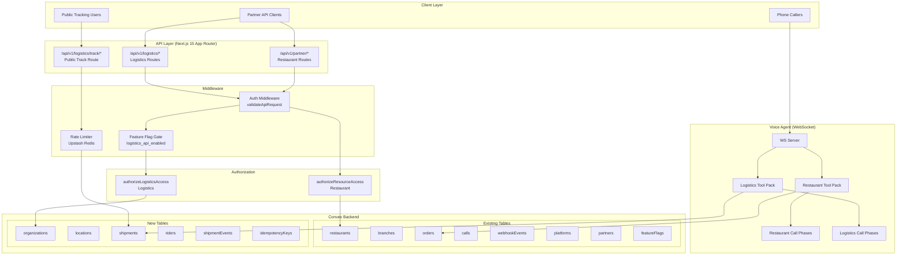
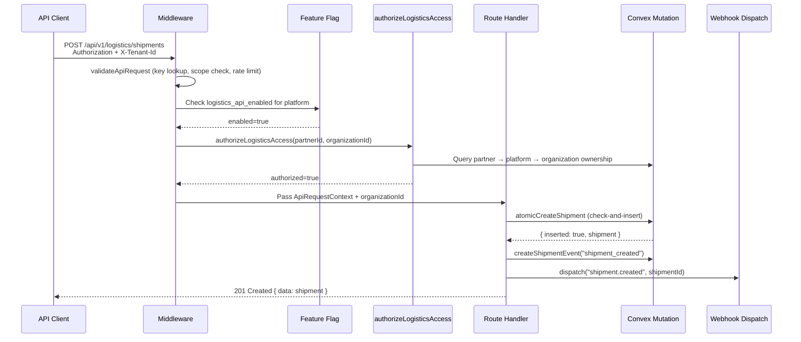
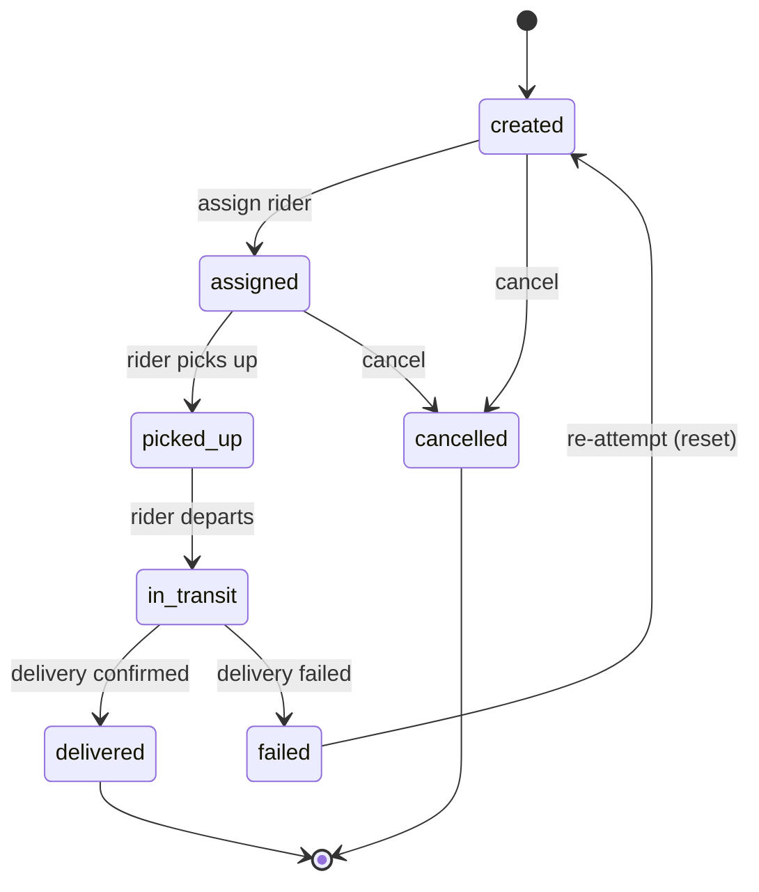
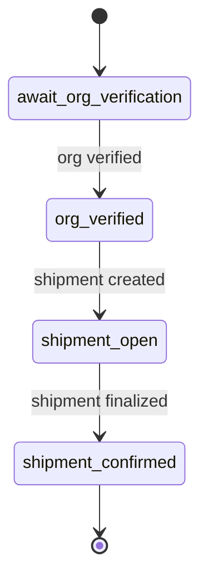

# Design Document: Logistics Vertical

## Overview

This design adds a logistics vertical alongside the existing restaurant domain. The core strategy is **additive coexistence**: new tables, endpoints, voice tools, and state machines are introduced in parallel without modifying any existing restaurant code paths. A shared `vertical` discriminator (`"restaurant" | "logistics"`) unifies tenant identity, authentication, webhooks, and voice agent infrastructure across both domains.

The logistics vertical introduces five new Convex tables (`organizations`, `locations`, `shipments`, `riders`, `shipmentEvents`), a dedicated REST API surface under `/api/v1/logistics/*`, a logistics-specific voice agent tool pack with its own call-phase state machine, and polymorphic webhook event support. Feature flags gate all logistics functionality per-platform, enabling staged rollout and instant rollback.

### Key Design Decisions

1. **No migration of existing data**: Restaurant records are not migrated into Organization/Location tables. Read-only compatibility adapters provide a unified view when needed.
2. **Separate API prefix**: Logistics endpoints live under `/api/v1/logistics/` to avoid any collision with `/api/v1/partner/` restaurant routes. Vertical is inferred from path prefix.
3. **Shared auth, scoped access**: The same `Authorization: Bearer <key>` / `X-API-Key` mechanism authenticates both verticals. A new `authorizeLogisticsAccess()` function enforces organization-level ownership for logistics resources.
4. **Shipment status state machine**: A strict transition graph prevents invalid lifecycle jumps, enforced at the Convex mutation layer.
5. **Atomic uniqueness**: All entity creation uses the check-and-insert-in-one-mutation pattern from `atomicInsertWebhookEvent` to prevent duplicate IDs under concurrency.

## Architecture

### System Architecture Diagram



### Request Flow for Logistics Endpoints



### Shipment Status State Machine



### Logistics Voice Agent Call Phases



## Components and Interfaces

### 1. Shared Validators (`convex/shared/validators.ts`)

Shared Convex validator definitions used across logistics mutations and queries.

```typescript
// Vertical discriminator
export const verticalValidator = v.union(v.literal("restaurant"), v.literal("logistics"));

// Delivery status enum
export const deliveryStatusValidator = v.union(
  v.literal("created"), v.literal("assigned"), v.literal("picked_up"),
  v.literal("in_transit"), v.literal("delivered"), v.literal("failed"),
  v.literal("cancelled")
);

// Service type enum
export const serviceTypeValidator = v.union(
  v.literal("same_day"), v.literal("next_day"),
  v.literal("express"), v.literal("scheduled")
);

// Rider status enum
export const riderStatusValidator = v.union(
  v.literal("offline"), v.literal("available"), v.literal("busy")
);

// Payment method (logistics-specific, adds "wallet")
export const logisticsPaymentMethodValidator = v.union(
  v.literal("paystack"), v.literal("flutterwave"),
  v.literal("cod"), v.literal("wallet")
);

// Payment status
export const paymentStatusValidator = v.union(
  v.literal("pending"), v.literal("paid"),
  v.literal("failed"), v.literal("refunded")
);

// Actor type for shipment events
export const actorTypeValidator = v.union(
  v.literal("system"), v.literal("agent"),
  v.literal("rider"), v.literal("merchant")
);

// Address object (sender/recipient)
export const addressValidator = v.object({
  name: v.string(), phone: v.string(), address: v.string(),
  city: v.string(), state: v.string(),
  lat: v.optional(v.number()), lng: v.optional(v.number()),
});

// Parcel object
export const parcelValidator = v.object({
  type: v.string(), weightKg: v.optional(v.number()),
  dimensions: v.optional(v.string()), declaredValue: v.optional(v.number()),
  notes: v.optional(v.string()),
});

// Proof of delivery
export const proofOfDeliveryValidator = v.object({
  photoUrl: v.optional(v.string()), signatureUrl: v.optional(v.string()),
  recipientName: v.optional(v.string()), deliveredAt: v.number(),
});
```

### 2. Convex Mutations (`convex/logistics/`)

New Convex module directory containing logistics-specific mutations and queries:

- `convex/logistics/organizations.ts` — CRUD for organizations with atomic uniqueness
- `convex/logistics/locations.ts` — CRUD for locations with atomic uniqueness
- `convex/logistics/shipments.ts` — Shipment creation (atomic), status transitions (state machine enforced), pagination queries
- `convex/logistics/riders.ts` — Rider CRUD, status/location heartbeat updates
- `convex/logistics/shipmentEvents.ts` — Append-only event log, reject updates/deletes
- `convex/logistics/adapters.ts` — Read-only adapters mapping Restaurant→Organization and Branch→Location

Key patterns:
- Every create mutation uses atomic check-and-insert (query index + insert in same mutation)
- Status transitions call `validateTransition(currentStatus, newStatus)` before patching
- Every status change creates a corresponding `shipmentEvent` in the same mutation

### 3. Status Transition Validator (`src/lib/logistics/status-machine.ts`)

```typescript
const VALID_TRANSITIONS: Record<DeliveryStatus, DeliveryStatus[]> = {
  created: ["assigned", "cancelled"],
  assigned: ["picked_up", "cancelled"],
  picked_up: ["in_transit"],
  in_transit: ["delivered", "failed"],
  delivered: [],
  failed: ["created"],  // re-attempt
  cancelled: [],
};

export function validateTransition(current: DeliveryStatus, next: DeliveryStatus): boolean {
  return VALID_TRANSITIONS[current]?.includes(next) ?? false;
}
```

### 4. Logistics Authorization (`src/lib/logistics/authorization.ts`)

```typescript
export async function authorizeLogisticsAccess(
  convexClient: ConvexHttpClient,
  partnerId: string,
  organizationId: string
): Promise<{ authorized: boolean; error?: string }>;
```

Verifies: partner → platform → organization ownership chain. Returns 403 if the partner's platform does not own the target organization.

### 5. Feature Flag Gate (`src/lib/logistics/feature-gate.ts`)

```typescript
export async function isLogisticsEnabled(
  convexClient: ConvexHttpClient,
  platformId: string
): Promise<boolean>;
```

Checks both `platforms.enabledVerticals` includes `"logistics"` and the `logistics_api_enabled` feature flag is true for the platform.

### 6. PII Masking Utilities (`src/lib/logistics/masking.ts`)

```typescript
export function maskPhone(phone: string): string;       // "****1234"
export function maskAddress(addr: Address): MaskedAddress; // city + state only
```

Applied consistently in public tracking responses and structured log outputs.

### 7. Idempotency Layer (`src/lib/logistics/idempotency.ts`)

Uses a new `idempotencyKeys` Convex table. On write endpoints:
1. Check if key exists (scoped to partnerId)
2. If exists with same request hash → return stored response
3. If exists with different request hash → 422 key mismatch
4. If not exists → execute mutation, store key + response, return result
5. Keys expire after 24 hours (TTL cleanup via scheduled Convex action)

### 8. Correlation/Request ID (`src/lib/logistics/correlation.ts`)

```typescript
export function getOrCreateRequestId(headers: Headers): string;
```

Reads `X-Request-Id` header or generates a UUID. Propagated to all downstream Convex mutations, voice tool calls, and webhook payloads. Returned in response `X-Request-Id` header.

### 9. Logistics API Route Handlers (`src/app/client/api/v1/logistics/`)

Directory structure:
```
src/app/client/api/v1/logistics/
├── shipments/
│   ├── route.ts                    # POST (create), GET (list)
│   └── [shipmentId]/
│       ├── route.ts                # GET (single shipment)
│       ├── assign/route.ts         # POST (assign rider)
│       └── status/route.ts         # POST (update status)
├── riders/
│   └── [riderId]/
│       └── status/route.ts         # POST (heartbeat)
└── track/
    └── [trackingCode]/route.ts     # GET (public, no auth)
```

Each authenticated route handler follows this pattern:
1. `validateApiRequest(request)` — auth + rate limit
2. `isLogisticsEnabled(platformId)` — feature flag check
3. `authorizeLogisticsAccess(partnerId, organizationId)` — ownership check
4. Idempotency check (for POST endpoints with `X-Idempotency-Key`)
5. Execute Convex mutation/query
6. Dispatch webhook event (for state-changing operations)
7. Return response with `X-Request-Id` header

### 10. Logistics Voice Agent Tool Pack (`src/app/ws-server/logistics-tools.ts`)

New tool functions:
- `wrapperCreateShipment(data)` — Creates shipment via internal API
- `wrapperUpdateShipment(shipmentId, updates)` — Updates shipment fields
- `wrapperAssignRider(shipmentId, riderId)` — Assigns rider
- `wrapperAddShipmentEvent(shipmentId, eventType, payload)` — Appends event
- `wrapperQuoteDelivery(sender, recipient, serviceType)` — Returns cost + ETA estimate

### 11. Logistics Call Phase Manager (`src/app/ws-server/logistics-call-phase.ts`)

```typescript
export type LogisticsCallPhase =
  | "await_org_verification"
  | "org_verified"
  | "shipment_open"
  | "shipment_confirmed";

const ALLOWED_TOOLS: Record<LogisticsCallPhase, Set<string>> = {
  await_org_verification: new Set(["get_organization_details"]),
  org_verified: new Set(["create_shipment", "quote_delivery"]),
  shipment_open: new Set(["update_shipment", "assign_rider", "add_shipment_event"]),
  shipment_confirmed: new Set(["add_shipment_event"]),
};

export function isLogisticsToolAllowed(phase: LogisticsCallPhase, toolName: string): boolean;
export function nextLogisticsPhase(current: LogisticsCallPhase, event: string): LogisticsCallPhase;
```

Mirrors the existing `call-phase.ts` pattern exactly. The WS server dispatches to either restaurant or logistics phase manager based on the conversation type determined at call setup.

### 12. Webhook Event Extensions

The existing `webhookEvents` table gains optional fields: `shipmentId`, `resourceType`, `resourceId`. A new `dispatchLogisticsWebhook()` function creates webhook events with `resourceType: "shipment"` and dispatches them through the existing `webhookDeliveries` infrastructure.

### 13. Compatibility Adapters (`convex/logistics/adapters.ts`)

Read-only query functions:
- `getOrganizationFromRestaurant(restaurantId)` — Returns an Organization-shaped object from a Restaurant record
- `getLocationFromBranch(branchId)` — Returns a Location-shaped object from a Branch record
- `listOrganizationsWithAdapted(platformId, vertical?)` — Merges native organizations with adapted restaurant records when `vertical` is `"restaurant"` or unspecified

These are query-only. All mutations for restaurant data continue using the original tables.

## Data Models

### New Tables

#### `organizations`
| Field | Type | Description |
|-------|------|-------------|
| organizationId | string | Unique identifier (indexed) |
| platformId | string | FK to platforms (indexed) |
| vertical | "restaurant" \| "logistics" | Domain vertical (indexed) |
| name | string | Organization display name |
| settings | object | Vertical-specific settings |
| createdAt | number | Unix timestamp |

Indexes: `by_organization_id`, `by_platform_id`, `by_vertical`

#### `locations`
| Field | Type | Description |
|-------|------|-------------|
| locationId | string | Unique identifier (indexed) |
| organizationId | string | FK to organizations (indexed) |
| name | string | Location display name |
| address | string | Street address |
| city | string | City (indexed with state) |
| state | string | State |
| geo | { lat: number, lng: number } | Coordinates |
| isActive | boolean | Active status |
| operatingHours | object | Hours per day |
| createdAt | number | Unix timestamp |

Indexes: `by_location_id`, `by_organization_id`, `by_city_state`

#### `shipments`
| Field | Type | Description |
|-------|------|-------------|
| shipmentId | string | Unique identifier (indexed) |
| trackingCode | string | Human-readable code (indexed) |
| organizationId | string | FK to organizations (indexed) |
| locationId | string? | Optional FK to locations |
| customerId | string? | Optional customer reference |
| sender | Address object | Sender details |
| recipient | Address object | Recipient details |
| parcel | Parcel object | Package details |
| serviceType | ServiceType enum | Speed tier |
| paymentMethod | PaymentMethod? | Payment method |
| paymentStatus | PaymentStatus? | Payment state |
| deliveryStatus | DeliveryStatus | Lifecycle state (indexed) |
| failureReason | string? | Failure description |
| etaMinutes | number? | Estimated time of arrival |
| assignedRiderId | string? | FK to riders (indexed) |
| proofOfDelivery | ProofOfDelivery? | Delivery evidence |
| createdAt | number | Unix timestamp |
| updatedAt | number | Last modified timestamp |

Indexes: `by_shipment_id`, `by_tracking_code`, `by_organization_id`, `by_delivery_status`, `by_assigned_rider_id`

#### `riders`
| Field | Type | Description |
|-------|------|-------------|
| riderId | string | Unique identifier (indexed) |
| organizationId | string | FK to organizations (indexed) |
| name | string | Rider display name |
| phone | string | Contact number |
| vehicleType | string | Vehicle description |
| status | RiderStatus | offline/available/busy (indexed) |
| lastLocation | { lat, lng, updatedAt }? | Last known position |
| isActive | boolean | Active status |

Indexes: `by_rider_id`, `by_organization_id`, `by_status`

#### `shipmentEvents`
| Field | Type | Description |
|-------|------|-------------|
| eventId | string | Unique identifier (indexed) |
| shipmentId | string | FK to shipments (indexed) |
| eventType | string | Event classification (indexed) |
| actorType | ActorType | system/agent/rider/merchant |
| actorId | string | Actor identifier |
| payload | string | JSON-encoded event data |
| createdAt | number | Unix timestamp |

Indexes: `by_shipment_id`, `by_event_type`

#### `idempotencyKeys`
| Field | Type | Description |
|-------|------|-------------|
| key | string | Idempotency key (indexed) |
| partnerId | string | Scoped to partner (indexed) |
| requestHash | string | Hash of request body |
| responseStatus | number | Stored HTTP status |
| responseBody | string | Stored response JSON |
| createdAt | number | Unix timestamp |
| expiresAt | number | TTL (24h from creation) |

Indexes: `by_key_and_partner`, `by_expires_at`

### Additive Changes to Existing Tables

#### `platforms` — add field:
- `enabledVerticals`: `v.optional(v.array(verticalValidator))` — defaults to `["restaurant"]`

#### `webhookEvents` — add fields:
- `shipmentId`: `v.optional(v.string())`
- `resourceType`: `v.optional(v.union(v.literal("order"), v.literal("shipment")))`
- `resourceId`: `v.optional(v.string())`

New index: `by_shipment_id` on `webhookEvents`

#### `orders` — add fields (optional, non-breaking):
- `vertical`: `v.optional(verticalValidator)` — defaults to `"restaurant"`
- `locationId`: `v.optional(v.string())` — mirrors `branchId` for forward compat

#### `calls` — add field (optional, non-breaking):
- `vertical`: `v.optional(verticalValidator)` — defaults to `"restaurant"`

#### `partners` — add field:
- `organizationIds`: `v.optional(v.array(v.string()))` — logistics organization access list (alongside existing `restaurantIds`)

### Tracking Code Generation

Tracking codes are 10-character alphanumeric strings: `LG` prefix + 8 random uppercase alphanumeric characters (e.g., `LGAB12CD34`). Generated in the Convex mutation with uniqueness enforced by atomic check-and-insert against the `by_tracking_code` index.

