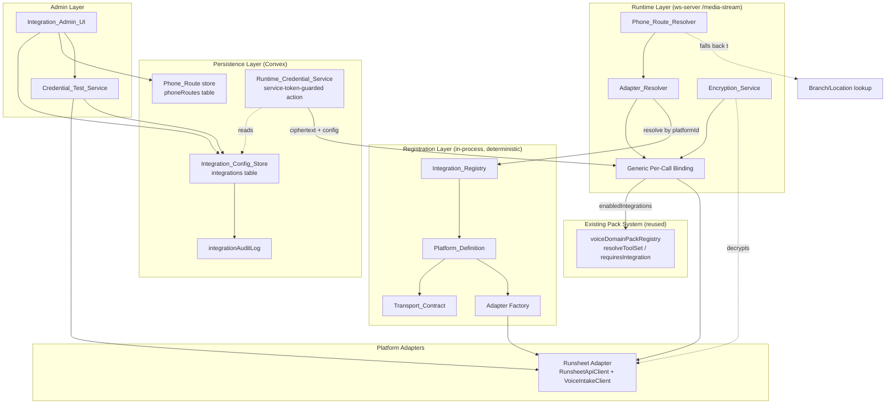
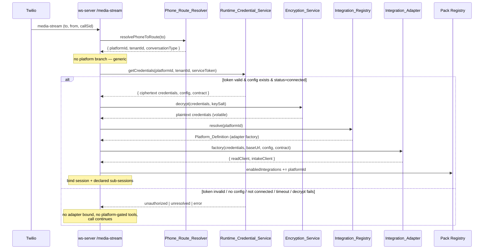

# Design Document

## Overview

This feature generalizes "Layer 2" of the Dinee voice platform — the connective tissue between a `VoiceDomainPack` and an external third-party platform backend — from a hardcoded, Runsheet-specific implementation into a generic, config-driven, multi-platform system.

Today, onboarding a new external platform requires bespoke code: a platform-specific credential table (`runsheetIntegrations`), platform-specific phone routing (`runsheetNumberAssignments`), an `isRunsheetCall` branch in the ws-server, and platform-specific outbound clients wired directly into the `/media-stream` handler. This design replaces those hardcoded seams with a small set of generic components so that a new platform onboards as *configuration plus one adapter implementation* rather than edits scattered across the call path.

The design deliberately **reuses**, and does not re-design, the already-generic pack system:

- `src/lib/modules/voiceDomainPack.ts` — `VoiceDomainPack`, `ConversationTypeDefinition`, `VoiceToolDefinition.requiresIntegration`, `IntegrationRequirement`, `ModulePackBridge`.
- `src/lib/modules/voiceDomainPackRegistry.ts` — `registerVoiceDomainPack`, `resolvePackByConversationType`, `resolveToolSet` (which already gates tools by `enabledIntegrations`).

The generic Layer-2 components introduced here mirror the *patterns* of `voiceDomainPackRegistry` (in-process, deterministic, validate-before-mutate, resolve-by-key) and treat the existing Runsheet code (`convex/runsheet/integrationsData.ts`, `src/lib/integrations/runsheet/apiClient.ts`, `src/lib/integrations/runsheet/voiceIntakeClient.ts`, `src/lib/integrations/encryptionService.ts`) as the reference implementation that Runsheet — the first adapter — will conform to.

**Ownership boundary is preserved:** Dinee is never the system of record for external orders. It holds transient in-session `Order_Draft`s and submits over each platform's signed contract. This design introduces **no** order-of-record tables — only integration *configuration* and phone *routing*, both of which Dinee already owns.

### Goals

1. Register any external platform as a first-class `Platform_Definition` in an in-process `Integration_Registry`.
2. Store per-tenant integration configuration and encrypted credentials in a generic `integrations` table keyed by `(platformId, tenantId)`, superseding `runsheetIntegrations`.
3. Retrieve credentials at call time behind a per-platform service-token-guarded action.
4. Resolve inbound phone numbers to `(platformId, tenantId, conversationTypes)` through a generalized `Phone_Route_Resolver` that preserves the existing branch/location fallback.
5. Drive every platform through a single `Integration_Adapter` shape (read client + intake client) described by a `Transport_Contract`.
6. Replace the ws-server `isRunsheetCall` branch with generic adapter resolution and per-call binding.
7. Migrate Runsheet into the first adapter with zero data loss and zero live-traffic disruption.

### Non-Goals

- Re-specifying the `VoiceDomainPack` system (out of scope by requirement).
- Introducing any order-of-record persistence.
- Changing the Runsheet backend's wire contract (Bearer read surface under `/voice`, HMAC-signed `POST /voice-intake`).

## Architecture

The system is organized into a **registration layer** (in-process, deterministic), a **persistence layer** (Convex), a **runtime layer** (the standalone ws-server), and an **admin layer** (UI). The Runsheet-specific pieces become the first concrete `Integration_Adapter` behind these generic seams.

### Component Diagram



### Inbound-Call Sequence (generic)



### Design Principles

- **Validate before mutate.** The `Integration_Registry` and `Integration_Config_Store` fully validate input before any state change, mirroring `voiceDomainPackRegistry.validatePack`. A rejected registration or save leaves existing state untouched (Req 1.5, 2.3).
- **Fail closed on credentials, fail open on routing.** Credential retrieval and adapter binding fail closed (no adapter, no platform-gated tools) so an unverified integration never drives a call (Req 7.2, 7.3, 7.6, 8.5). Phone routing fails open to the restaurant inbound-order route so a routing fault never drops a call (Req 4.5).
- **Decrypt at the moment of use, hold in volatile memory only.** Credentials are decrypted locally at bind time and discarded when the call ends — never cached or logged (Req 7.4, 7.7, 12.3), exactly as the current ws-server does.
- **Per-platform isolation.** Each platform has its own runtime service token env var and optional key salt so a compromise of one platform or tenant cannot decrypt another's secrets (Req 12.2, 12.5).

## Components and Interfaces

### Integration_Registry & Platform_Definition

An in-process registry that mirrors `voiceDomainPackRegistry`: a `Map<platformId, Platform_Definition>`, a pure `validate` step, and `resolve` returning an explicit unresolved result rather than throwing.

```typescript
// src/lib/integrations/platform/types.ts

/** Auth scheme a platform's read surface uses (Req 5.4, 5.5). */
export type AuthScheme = "bearer" | "hmac";

/** How the intake timestamp header is formatted (Req 5.5, 11.2). */
export type TimestampFormat = "iso-8601" | "epoch-seconds" | "epoch-millis";

/**
 * Per-platform descriptor of auth + transport details consumed by the adapter.
 * Mirrors the Runsheet wire contract: Bearer reads under a path prefix, and an
 * HMAC-signed intake POST with timestamp/schema-version headers.
 */
export interface TransportContract {
  /** Read-surface auth scheme (Runsheet: "bearer"). */
  authScheme: AuthScheme;
  /** Path prefix for the read/validate surface (Runsheet: "/voice"). */
  readPathPrefix: string;
  /** Path suffix for the signed intake POST (Runsheet: "/voice-intake"). */
  intakePath: string;
  /** Timestamp header format for signed intake (Runsheet: "iso-8601"). */
  timestampFormat: TimestampFormat;
  /** Schema version transmitted as X-Schema-Version (Runsheet: "1.0"). */
  schemaVersion: string;
  /** Header name carrying the tenant id (Runsheet: "X-Runsheet-Tenant"). */
  tenantHeader: string;
  /**
   * Optional per-platform key salt applied by the Encryption_Service so one
   * platform's credentials cannot be decrypted with another's salt (Req 12.2).
   * When absent, the shared INTEGRATION_ENCRYPTION_KEY is used unchanged so
   * Runsheet ciphertext migrated as-is still decrypts (Req 10.3, 10.5).
   */
  keySalt?: string;
}

/** Decrypted materials handed to an adapter factory at bind time (Req 5.3). */
export interface AdapterConstructionContext {
  baseUrl: string;
  /** Platform-scoped tenant identifier (e.g. Runsheet-side tenant id). */
  platformTenantId: string;
  /** Decrypted credential values keyed by credential name (volatile). */
  credentials: Record<string, string>;
  /** Arbitrary stored platform config (allowedConversationTypes, flags, etc.). */
  config: Record<string, unknown>;
  contract: TransportContract;
}

/** Factory that builds a per-call adapter from decrypted materials (Req 5.3). */
export type AdapterFactory = (
  ctx: AdapterConstructionContext,
) => IntegrationAdapter;

/**
 * A registered external platform. Declares which credential fields it needs so
 * the admin UI can render a platform-driven form (Req 9), and optionally which
 * extra per-call sub-session a conversation type binds (generalizes the
 * Runsheet driver-exception sub-session, Req 7.8, 11.4).
 */
export interface PlatformDefinition {
  /** Stable unique id, 1–64 chars (e.g. "runsheet") (Req 1.1, 1.3). */
  platformId: string;
  displayName: string;
  /** Credential field descriptors driving the admin form + encryption set. */
  credentialFields: CredentialFieldSpec[];
  adapterFactory: AdapterFactory;
  contract: TransportContract;
  /**
   * Sub-sessions this platform binds for specific conversation types, declared
   * as data rather than a hardcoded conversation-type check (Req 7.8).
   */
  subSessions?: SubSessionBinding[];
  /** Runtime service token env var name for this platform (Req 3, 12.5). */
  runtimeServiceTokenEnvVar: string;
}

/** A credential the platform needs; drives the admin form + encryption (Req 9.1). */
export interface CredentialFieldSpec {
  /** Machine name used as the map key and audit reference (e.g. "api_key"). */
  name: string;
  label: string;
  /** Whether the field is required for a valid save (Req 2.3, 9.5). */
  required: boolean;
}

/** Declares a per-call sub-session bound for a set of conversation types (Req 7.8). */
export interface SubSessionBinding {
  /** Conversation types that trigger this sub-session (e.g. driver-exception). */
  conversationTypes: string[];
  /** Opaque binder key the runtime resolves to a bind/release pair. */
  binderKey: string;
}

export type RegisterPlatformResult =
  | { ok: true }
  | { ok: false; error: PlatformRegistrationError };

export interface PlatformRegistrationError {
  code: "duplicate_id" | "invalid_id" | "missing_field";
  /** Names the conflicting id or omitted field (Req 1.2, 1.3, 1.4). */
  detail: string;
}

export type ResolvePlatformResult =
  | { resolved: true; definition: PlatformDefinition }
  | { resolved: false };
```

```typescript
// src/lib/integrations/platform/registry.ts

/** Validate + register a platform; on failure the registry is unchanged (Req 1.1–1.5). */
export function registerPlatform(def: PlatformDefinition): RegisterPlatformResult;

/** Resolve a platform by id; unresolved is an explicit result, never a throw (Req 1.6, 1.7). */
export function resolvePlatform(platformId: string): ResolvePlatformResult;

/** True when a platform id is registered (used by the config-store save guard, Req 2.4). */
export function isPlatformRegistered(platformId: string): boolean;

/** Clears all registered platforms. Testing only. */
export function clearPlatformRegistry(): void;
```

### Integration_Adapter, ReadClient & IntakeClient

The adapter is the common shape every platform supplies. It composes a **read client** (in-call lookups + credential test) and an **intake client** (signed outbound submit). Runsheet's existing `RunsheetApiClient` and `VoiceIntakeClient` are wrapped to satisfy these interfaces without modifying their wire behavior.

```typescript
// src/lib/integrations/platform/adapter.ts

/** In-call read/validate surface + credential probe (Req 5.1, 8.1). */
export interface ReadClient {
  /**
   * Authenticated probe against the configured base URL, resolving within the
   * caller-provided deadline (default 5s), reporting credential validity.
   * Never throws (Req 8.1, 8.4). Runsheet maps this to GET {readPrefix}/auth/ping.
   */
  testCredential(timeoutMs?: number): Promise<{ valid: boolean }>;
}

/** Outbound signed submit over the platform's intake contract (Req 5.2). */
export interface IntakeClient {
  /**
   * Canonicalize, sign, and POST a voice-originated payload. The concrete
   * canonicalization + signing is the platform's (Runsheet: deterministic JSON
   * + HMAC-SHA256 hex with "sha256=" prefix) (Req 5.5, 5.6).
   */
  submit(payload: IntakePayload, secret: string): Promise<IntakeResult>;
}

export interface IntakeResult {
  status: "accepted" | "rejected";
  httpStatus: number;
  // Provider-returned identifier for the submitted item (Runsheet maps its
  // placed-order `orderId` here) — a placed item, never a transient "draft".
  reference?: string;
  // Provider-returned disposition of the submission (Runsheet: placed-order disposition).
  disposition?: string;
  error?: string;
}

/**
 * Platform-agnostic intake payload envelope. Platform-specific fields live in
 * `fields`; transport metadata (tenant, idempotency, timestamp, schema) is
 * carried explicitly so the Transport_Contract can format headers uniformly.
 */
export interface IntakePayload {
  schemaVersion: string;
  tenantId: string;
  idempotencyKey: string;
  timestamp: number; // epoch ms
  fields: Record<string, unknown>;
}

/**
 * The common adapter shape. Constructed per call from decrypted credentials +
 * Transport_Contract; the read client and intake client are what the runtime
 * and Credential_Test_Service drive (Req 5.1, 5.2, 5.3).
 */
export interface IntegrationAdapter {
  readonly platformId: string;
  readonly contract: TransportContract;
  readClient: ReadClient;
  intakeClient: IntakeClient;
}
```

The Runsheet adapter factory (`src/lib/integrations/runsheet/adapter.ts`) wraps the existing clients:

```typescript
// src/lib/integrations/runsheet/adapter.ts
export const runsheetAdapterFactory: AdapterFactory = (ctx) => {
  const api = new RunsheetApiClient({
    baseUrl: ctx.baseUrl,
    apiKey: ctx.credentials.api_key,
    tenantId: ctx.platformTenantId,
  });
  const intake = new VoiceIntakeClient({ baseUrl: ctx.baseUrl });
  return {
    platformId: "runsheet",
    contract: ctx.contract,
    readClient: { testCredential: (ms) => api.testCredential(/* 5s internal */) },
    // The intake client adapts the generic IntakePayload envelope onto the
    // existing VoiceIntakePayload before delegating to VoiceIntakeClient.submit,
    // preserving the exact signed bytes + headers (Req 11.2).
    intakeClient: { submit: (p, secret) => submitViaRunsheet(intake, p, secret) },
  };
};
```

### Integration_Config_Store

A generic Convex surface superseding `runsheetIntegrations`. It re-uses the exact security posture of `integrationsData.ts`: masked public view, internal query behind a service-token action, validate-before-write, and audit entries that reference secrets by name only.

```typescript
// convex/integrations/configStore.ts (interface sketch)

export interface SaveIntegrationConfigInput {
  platformId: string;
  tenantId: string;
  baseUrl: string;
  platformTenantId: string;
  /** Already-encrypted credential ciphertext keyed by credential name. */
  credentialsEncrypted: Record<string, string>;
  /** Last-4 preview per credential, safe for display (Req 2.8, 12.4). */
  credentialsLast4: Record<string, string>;
  allowedConversationTypes: string[];
  /** Arbitrary platform config blob. */
  config: Record<string, unknown>;
  actorUserId?: string;
  actorRole?: string;
}

export type SaveResult =
  | { ok: true; created: boolean }
  | { ok: false; code: "missing_field" | "unknown_platform"; field: string };

/** Masked view for the admin UI — never returns decrypted or ciphertext values (Req 2.8). */
export interface MaskedIntegrationConfig {
  platformId: string;
  tenantId: string;
  baseUrl: string;
  platformTenantId: string;
  /** Last-4 only, per credential name (Req 2.8, 9.4). */
  credentialsLast4: Record<string, string>;
  allowedConversationTypes: string[];
  config: Record<string, unknown>;
  status: ConnectionStatus;
  createdAt: number;
  updatedAt: number;
}

export type ConnectionStatus = "connected" | "disconnected" | "error";

/**
 * Upsert keyed by (platformId, tenantId). Rejects an empty base URL and an
 * unregistered platform BEFORE any write, leaving an existing record unchanged
 * (Req 2.1, 2.3, 2.4, 2.5). New records start `disconnected` (Req 2.6).
 */
export function upsertIntegrationConfig(input: SaveIntegrationConfigInput): SaveResult;

/** Masked view for the admin UI (Req 2.8). */
export function getMaskedConfig(platformId: string, tenantId: string): MaskedIntegrationConfig | null;

/** Records a credential-test outcome onto the record's status (Req 8.2, 8.3). */
export function setConnectionStatus(platformId: string, tenantId: string, status: ConnectionStatus): void;
```

The pure validator and audit-detail builder are extracted (like `validateIntegrationConfig` / `buildIntegrationAuditDetail`) so they can be property-tested in isolation:

```typescript
export type ConfigValidation =
  | { ok: true }
  | { ok: false; code: "missing_field" | "unknown_platform"; field: string };

/** Pure: rejects empty base URL (Req 2.3) and unregistered platform (Req 2.4). */
export function validateIntegrationConfig(
  input: { platformId: string; baseUrl: string },
  isRegistered: (platformId: string) => boolean,
): ConfigValidation;

/** Pure: audit detail referencing secrets by NAME + last-4 only, never value (Req 12.3, 12.4). */
export function buildIntegrationAuditDetail(
  existing: boolean,
  platformId: string,
  credentialsLast4: Record<string, string>,
): string;
```

### Runtime_Credential_Service

The generic analogue of `getIntegrationForRuntime`: a per-platform service-token-guarded action fronting an internal query. Each platform declares its token env var name (`PlatformDefinition.runtimeServiceTokenEnvVar`), so a token for one platform cannot retrieve another platform's credentials (Req 12.5).

```typescript
// convex/integrations/runtimeCredentials.ts (interface sketch)

export interface RuntimeCredentialConfig {
  platformId: string;
  baseUrl: string;
  platformTenantId: string;
  /** AES-256-GCM ciphertext keyed by credential name — never plaintext (Req 3.5). */
  credentialsEncrypted: Record<string, string>;
  allowedConversationTypes: string[];
  config: Record<string, unknown>;
  status: ConnectionStatus;
}

export type RuntimeCredentialResult =
  | { resolution: "resolved"; config: RuntimeCredentialConfig }
  | { resolution: "unresolved" } // valid token, no stored config (Req 3.6)
  | { resolution: "unauthorized" }; // token/arg failure (Req 3.2, 3.3, 3.4)

/**
 * Service-token-guarded retrieval. Resolves within 2s (Req 3.1). Rejects when
 * the token is missing/empty/whitespace, no token is configured for the
 * platform, or the token is not byte-for-byte equal — returning `unauthorized`
 * with no credentials and writing an audit entry that omits token + credential
 * values (Req 3.2, 3.3, 3.4, 3.7). Constant-time comparison avoids timing leaks.
 */
export function getCredentialsForRuntime(args: {
  platformId: string;
  tenantId: string;
  serviceToken: string;
}): Promise<RuntimeCredentialResult>;
```

### Phone_Route_Resolver

Generalizes `resolvePhoneToRoute`. A new generic `phoneRoutes` store is consulted first (superseding the Runsheet-specific `resolveNumber` call); on miss it falls through to the existing branch/location lookup; on error it defaults to the restaurant inbound-order route.

```typescript
// src/lib/call-routing/phone-lookup.ts (generalized)

export interface PhoneRoute {
  platformId: string;
  tenantId: string;
  conversationType: ConversationType;
}

export interface PhoneLookupResult {
  vertical: "restaurant" | "logistics" | "runsheet" | string;
  conversationType: ConversationType;
  platformId?: string | null;
  tenantId?: string;
  // ...existing branch/location fields preserved
}

/**
 * Resolution order (Req 4.2, 4.4, 4.5):
 *   1. Generic phoneRoutes store → { platformId, tenantId, conversationType }.
 *   2. Fall through to branch/location lookup (existing behavior).
 *   3. On any thrown error, default to restaurant inbound-order route.
 */
export async function resolvePhoneToRoute(
  convexClient: ConvexHttpClient,
  toNumber: string,
  callbackReason?: string,
): Promise<PhoneLookupResult>;
```

Route-save validation (in the `phoneRoutes` mutation) rejects a conversation type not in the tenant's allowed set for that platform, naming the offending type and leaving existing routes unchanged — reusing the existing pure `isConversationTypeAllowed` predicate (Req 4.3).

### Adapter_Resolver

Bridges the pack's `IntegrationRequirement` and a call's resolved `platformId` to a concrete adapter, replacing the `isRunsheetCall` branch.

```typescript
// src/lib/integrations/platform/adapterResolver.ts

export type AdapterResolution =
  | { resolved: true; adapter: IntegrationAdapter; platformId: string }
  | { resolved: false };

/**
 * Resolves an adapter for a call from its platformId (Req 6.1, 6.2). Returns
 * unresolved for an unregistered platform so the runtime enables no
 * platform-gated tools (Req 6.3). When resolved, the caller adds platformId to
 * the call's enabledIntegrations so pack `requiresIntegration` gating applies
 * (Req 6.4).
 */
export function resolveAdapter(
  platformId: string,
  ctx: AdapterConstructionContext,
): AdapterResolution;
```

### Credential_Test_Service

Uses the resolved adapter's `readClient.testCredential` to probe the configured base URL and records the outcome via `setConnectionStatus`.

```typescript
// src/lib/integrations/platform/credentialTest.ts

/**
 * Probes via the adapter read client and maps the outcome to a status:
 *   success → "connected" (Req 8.2); failure → "error" (Req 8.3);
 *   no completion within 5s → treated invalid → "error" (Req 8.4).
 * Returns the recorded status for the UI to display (Req 9.3).
 */
export async function runCredentialTest(
  adapter: IntegrationAdapter,
  record: (status: ConnectionStatus) => Promise<void>,
): Promise<ConnectionStatus>;
```

### Generic Per-Call Binding (Voice_Runtime)

The ws-server `/media-stream` handler is refactored to remove `isRunsheetCall`. The flow becomes: resolve route → resolve platform → retrieve credentials via `Runtime_Credential_Service` using that platform's token → if `status === "connected"`, decrypt (with contract key salt) → build adapter via factory → bind session and any `Platform_Definition`-declared sub-sessions → add `platformId` to `enabledIntegrations`. On any failure at any step, no adapter is bound, no platform-gated tools are enabled, and the call continues. On socket close, the bound session and sub-sessions are released and decrypted credentials are discarded.

### Migration_Service

A one-time, idempotent migration copying Runsheet records into the generic tables, preserving ciphertext exactly.

```typescript
// convex/integrations/migrateRunsheet.ts (interface sketch)

export interface MigrationReport {
  integrationsCopied: number;
  routesCopied: number;
  /** Record ids that could not be migrated; originals left unchanged (Req 10.6). */
  failures: Array<{ table: "runsheetIntegrations" | "runsheetNumberAssignments"; id: string; reason: string }>;
  /** True when re-running produced no new writes (idempotence marker). */
  idempotentNoop: boolean;
}

/**
 * Copies each runsheetIntegrations row into integrations keyed by
 * (runsheet, tenantId), preserving baseUrl, ciphertext, config, and status
 * WITHOUT re-encrypting (Req 10.2, 10.3). Copies each runsheetNumberAssignments
 * row into phoneRoutes with platformId "runsheet" (Req 10.4). Idempotent: an
 * already-migrated pair is skipped, not duplicated. On a per-record failure the
 * original is left unchanged and the id is reported (Req 10.6).
 */
export function migrateRunsheetToGeneric(): Promise<MigrationReport>;
```

## Data Models

### Generic `integrations` table (supersedes `runsheetIntegrations`)

Keyed by `(platformId, tenantId)`. Credentials are stored as ciphertext in a name-keyed map so any platform's credential set (Runsheet: `api_key`, `webhook_secret`) fits without schema changes.

```typescript
integrations: defineTable({
  platformId: v.string(),            // Req 2.1 — registered Platform_Id
  tenantId: v.string(),              // Req 2.1 — Dinee tenant
  baseUrl: v.string(),               // Req 2.1
  platformTenantId: v.string(),      // platform-side tenant id (e.g. Runsheet tenant)
  // AES-256-GCM ciphertext keyed by credential name (Req 2.2). For Runsheet:
  // { api_key: <ct>, webhook_secret: <ct> } — migrated ciphertext preserved as-is.
  credentialsEncrypted: v.record(v.string(), v.string()),
  // Last-4 preview per credential for masked display + audit (Req 2.8, 12.4).
  credentialsLast4: v.record(v.string(), v.string()),
  allowedConversationTypes: v.array(v.string()), // Req 4.3
  // Arbitrary platform config (defaultReviewMode, autoSubmitEnabled,
  // confidenceThreshold, requiresPurchaseOrder, escalationTarget, ...).
  config: v.any(),
  status: v.union(                   // Req 2.6, 8.2, 8.3
    v.literal("connected"),
    v.literal("disconnected"),
    v.literal("error"),
  ),
  createdAt: v.number(),
  updatedAt: v.number(),
})
  .index("by_platform_tenant", ["platformId", "tenantId"])
  .index("by_tenant_id", ["tenantId"]),
```

### Generic `phoneRoutes` table (supersedes `runsheetNumberAssignments`)

```typescript
phoneRoutes: defineTable({
  phoneNumber: v.string(),           // inbound "To" number
  platformId: v.string(),            // Req 4.1
  tenantId: v.string(),              // Req 4.1
  conversationType: v.string(),      // Req 4.1 — must be in tenant's allowed set (Req 4.3)
  createdAt: v.number(),
})
  .index("by_phone_number", ["phoneNumber"])
  .index("by_platform_tenant", ["platformId", "tenantId"]),
```

### `integrationAuditLog` (reused, generalized `integrationName`)

The existing `integrationAuditLog` table is reused as-is; `integrationName` now carries the generic `platformId`. Unauthorized runtime retrievals (Req 3.7) and config changes (Req 12.4) write entries whose `details` reference credentials by name + last-4 only. A new `actionType` value is not required; `create`/`rotate`/`connect`/`disconnect` already cover the lifecycle.

### Ownership boundary

No order-of-record tables are added. `integrations` and `phoneRoutes` are integration *configuration* and *routing* — data Dinee already owns. Voice-originated orders remain transient in-session `Order_Draft`s submitted over each platform's signed contract, exactly as today.

## Correctness Properties

*A property is a characteristic or behavior that should hold true across all valid executions of a system — essentially, a formal statement about what the system should do. Properties serve as the bridge between human-readable specifications and machine-verifiable correctness guarantees.*

The following properties were derived from the acceptance criteria via the testability prework. Redundant criteria were consolidated: registry lookups fold into a register/resolve round-trip; the many credential-guard criteria fold into one comprehensive guard property; the encryption, HMAC-signing, and migration round-trips are the highest-value invariants and are each expressed once. UI wiring, ws-server control-flow degrade paths, and the type-check gate tooling are covered by example/integration tests (see Testing Strategy), not properties.

### Property 1: Platform registration round-trip

*For any* valid `Platform_Definition` (id length 1–64, present adapter factory and Transport_Contract), registering it and then resolving that Platform_Id returns the same definition and `isPlatformRegistered` reports true.

**Validates: Requirements 1.1, 1.6**

### Property 2: Rejected registration reports the correct error and leaves the registry unchanged

*For any* registration that is rejected — a duplicate id (reports `duplicate_id` naming the conflicting id), an id shorter than 1 or longer than 64 characters (reports `invalid_id`), or one omitting the adapter factory or Transport_Contract (reports `missing_field` naming the omitted field) — the set of registered Platform_Definitions is byte-for-byte identical before and after the attempt.

**Validates: Requirements 1.2, 1.3, 1.4, 1.5**

### Property 3: Unregistered lookup is an explicit unresolved result, never a throw

*For any* Platform_Id that is not registered, resolving it returns `{ resolved: false }` and does not raise an error.

**Validates: Requirements 1.7**

### Property 4: Credential encryption round-trip

*For any* credential string (including empty, unicode, and long values), decrypting the result of encrypting it with the Encryption_Service produces the original string.

**Validates: Requirements 2.2, 2.7**

### Property 5: Config store upsert keying and initial status

*For any* sequence of saves, an Integration_Config is keyed uniquely by `(Platform_Id, Tenant_Id)`: saving the same pair twice updates the single existing record rather than creating a duplicate, distinct pairs coexist independently, and a newly created record has Connection_Status `disconnected`.

**Validates: Requirements 2.1, 2.5, 2.6**

### Property 6: Config validation rejection

*For any* save input whose base URL is empty or whitespace, the store rejects with a `missing_field` error naming the base URL; *for any* save input whose Platform_Id is not registered, the store rejects with an `unknown_platform` error naming the Platform_Id; in both cases any existing stored record is left unchanged.

**Validates: Requirements 2.3, 2.4**

### Property 7: Masked view never exposes credential material

*For any* stored Integration_Config, the masked view returned to the admin UI exposes at most the last 4 characters of each credential and contains no decrypted plaintext and no ciphertext credential value.

**Validates: Requirements 2.8**

### Property 8: Runtime credential guard

*For any* call to the Runtime_Credential_Service: when the supplied service token is byte-for-byte equal to the token configured for that Platform and a config exists for the `(Platform_Id, Tenant_Id)` pair, the result is `resolved` and carries only AES-256-GCM ciphertext (never plaintext); when the token is unequal, missing, empty, whitespace, unconfigured for the Platform, or is a different Platform's token, the result is `unauthorized` with no credentials and no config, and an audit entry is written that records the supplied Platform_Id, Tenant_Id, and timestamp but no token or credential value; when the token is valid but no config exists, the result is explicitly `unresolved` without raising an error.

**Validates: Requirements 3.1, 3.2, 3.3, 3.4, 3.5, 3.6, 3.7, 12.5**

### Property 9: Phone route save→resolve round-trip

*For any* Phone_Route saved with an inbound number, Platform_Id, Tenant_Id, and allowed conversation type, resolving that inbound number returns the same Platform_Id, Tenant_Id, and conversation type.

**Validates: Requirements 4.1, 4.2**

### Property 10: Disallowed conversation type is rejected

*For any* Phone_Route save whose conversation type is not in the owning tenant's allowed conversation types for the Platform, the save is rejected with a disallowed-conversation-type error and existing routes are left unchanged.

**Validates: Requirements 4.3**

### Property 11: Intake signature round-trip

*For any* intake payload, canonicalizing then HMAC-signing then verifying the signature against the same secret confirms the signature; mutating any field of the payload causes verification against the original signature to fail.

**Validates: Requirements 5.5, 5.6**

### Property 12: Runsheet adapter preserves the existing wire contract

*For any* intake payload, submitting through the generic Runsheet Integration_Adapter produces the same canonical request body and the same signed headers (path prefix, `X-Timestamp` format, `X-Schema-Version`, `X-Signature`) as the pre-generalization `VoiceIntakeClient`.

**Validates: Requirements 11.2**

### Property 13: Adapter resolution by Platform_Id

*For any* set of registered platforms, resolving an adapter by a registered Platform_Id (whether from a pack's `IntegrationRequirement` or a call's resolved Platform_Id) returns that platform's adapter, and resolving any unregistered Platform_Id returns an unresolved result.

**Validates: Requirements 6.1, 6.2, 6.3**

### Property 14: Platform-gated tools require an enabled, connected integration

*For any* pack tool declaring `requiresIntegration = platformId`, the resolved tool set includes the tool only when `platformId` is in the call's enabled integrations, and the runtime adds `platformId` to the enabled integrations only when the resolved Integration_Config has Connection_Status `connected`; therefore whenever the status is not `connected`, no platform-gated tool appears in the resolved tool set.

**Validates: Requirements 6.4, 8.5**

### Property 15: Sub-session binding is data-driven

*For any* `Platform_Definition` sub-session binding and *any* conversation type, the runtime selects the declared sub-session binder if and only if the conversation type is a member of that binding's conversation-type set — never from a hardcoded conversation-type check.

**Validates: Requirements 7.8**

### Property 16: Credential-test outcome maps to connection status

*For any* credential probe outcome, a successful response sets Connection_Status to `connected`, an unsuccessful response sets it to `error`, and a probe that does not complete within 5 seconds is treated as invalid and sets it to `error`.

**Validates: Requirements 8.2, 8.3, 8.4**

### Property 17: Migration copy fidelity and ciphertext-preservation round-trip

*For any* set of existing Runsheet integration rows and number assignments, running the Migration_Service produces exactly one generic Integration_Config per row keyed by `(runsheet, Tenant_Id)` whose base URL, ciphertext, config, and status equal the original (ciphertext byte-for-byte, never re-encrypted) and exactly one `phoneRoute` per assignment with Platform_Id `runsheet`; consequently, decrypting a migrated config's credentials yields the same credential values as the pre-migration record.

**Validates: Requirements 10.2, 10.3, 10.4, 10.5**

### Property 18: Migration failure isolation

*For any* record the Migration_Service cannot migrate, the original Runsheet record is left unchanged and the failing record identifier appears in the migration report.

**Validates: Requirements 10.6**

### Property 19: Runtime credential retrieval is tenant- and platform-isolated

*For any* two distinct `(Platform_Id, Tenant_Id)` pairs with stored configs, retrieving credentials for one pair returns only that pair's ciphertext and never the other pair's.

**Validates: Requirements 12.1**

### Property 20: Per-platform key salt isolates decryption

*For any* credential encrypted with a Platform's key salt, decrypting with the same salt reproduces the original value, while decrypting with a different Platform's salt fails.

**Validates: Requirements 12.2**

### Property 21: Audit and log details reference secrets by name only

*For any* credential value, the audit-detail builder produces a string that includes the credential name and at most its last 4 characters and never contains the full credential value.

**Validates: Requirements 12.3, 12.4**

## Error Handling

The system distinguishes **fail-closed** paths (credentials/adapters — a fault must never let an unverified integration drive a call) from the single **fail-open** path (phone routing — a fault must never drop a call).

### Registration and configuration (validate before mutate)

- `registerPlatform` and `upsertIntegrationConfig` fully validate before any state change and return a typed error result (`duplicate_id` / `invalid_id` / `missing_field` / `unknown_platform`) naming the offending field or id. A rejected operation leaves existing state untouched (Req 1.5, 2.3). This mirrors `voiceDomainPackRegistry.validatePack` and `validateIntegrationConfig`.

### Runtime credential retrieval (fail closed)

- Unauthorized (bad/missing/whitespace token, unconfigured token, cross-platform token) → return `unauthorized`, no credentials, write a name-only audit entry (Req 3.2–3.4, 3.7, 12.5).
- Valid token, no config → return `unresolved`, no error (Req 3.6).
- Constant-time token comparison avoids timing side channels.

### Per-call binding in the Voice_Runtime (fail closed, call continues)

Every failure below results in **no adapter bound, no platform-gated tools enabled, and the call continuing** (Req 7.2, 7.3, 7.6):

- Credential retrieval fails or exceeds 5s.
- Retrieved config status is not `connected` (decryption is skipped entirely).
- Decryption throws (missing/invalid `INTEGRATION_ENCRYPTION_KEY`, wrong salt, malformed/tampered ciphertext — AES-GCM auth-tag failure).
- Adapter construction throws.

Decrypted credentials live only in the connection-scoped closure and are discarded when the socket closes; the release path clears bound sessions and sub-sessions (Req 7.7).

### Phone routing (fail open)

- `phoneRoutes` miss → fall through to branch/location lookup (Req 4.4).
- Any thrown error during resolution → default to `restaurant_inbound_order` so a routing fault never drops a call (Req 4.5).

### Adapter I/O

- Read-client network/non-2xx errors throw so the runtime tool executor records the error and applies the configured fallback (existing `RunsheetApiClient` behavior).
- `testCredential` never throws — a network error, non-2xx, or timeout is reported as an invalid credential, which the Credential_Test_Service maps to `error` status (Req 8.3, 8.4).
- Intake `submit` returns a typed `IntakeResult` (`accepted` / `rejected` with `httpStatus`) rather than throwing on a rejected submission.

### Migration (per-record isolation)

- Each record migrates independently; a per-record failure leaves the original unchanged and is reported by id (Req 10.6). Re-running is idempotent: an already-migrated pair is skipped, not duplicated (Req 10.2).

## Testing Strategy

Property-based testing **is** appropriate for this feature: the core logic is pure and universally quantifiable — encryption and HMAC-signing round-trips, registry validation/resolution, config-store keying, the credential guard, connection-status gating, and migration ciphertext-preservation. Convex I/O, ws-server control flow, and the type-check gate tooling are covered by example and integration tests.

### Dual approach

- **Property tests** verify the universal invariants in the Correctness Properties section across many generated inputs.
- **Unit / example tests** cover specific behaviors and control-flow degrade paths: ws-server bind-skip on non-connected status (Req 7.3 flow) and decrypt/construct failure (Req 7.4–7.6), routing fall-through and default (Req 4.4, 4.5), adapter structural shape and Bearer read headers (Req 5.1–5.4, 11.3), the Runsheet driver-exception sub-session (Req 11.4), and all Integration_Admin_UI wiring (Req 9.1–9.5).
- **Integration tests** cover the end-to-end credential retrieval within the deadline (Req 7.1) and a live-path Runsheet call binding the same tool set as baseline (Req 11.1).
- **Smoke test** asserts Runsheet is registered as `runsheet` at startup (Req 10.1).
- **Type-check gate tests** (example-based) exercise the baseline-diff tool: zero-new-errors pass (Req 13.4), new-error fail without source mutation (Req 13.3), quarantine exclusion (Req 13.2), and stale-quarantine warning (Req 13.5).

### Property test configuration

- Use the repository's existing property-testing library (`fast-check`, as used throughout `__tests__/properties/`).
- Each property test runs **a minimum of 100 iterations**.
- Each property test is tagged with a comment referencing its design property, in the format:
  **Feature: multi-platform-voice-integrations, Property {number}: {property_text}**
- Each of Properties 1–21 is implemented by a **single** property-based test.

### Property → test-file mapping (mirrors existing `__tests__/properties/` layout)

| Property | Suggested test file |
| --- | --- |
| P1–P3 registry | `platformRegistry.property.test.ts` |
| P4 encryption round-trip | reuse/extend `apiKeyEncryption.property.test.ts` pattern → `credentialEncryption.property.test.ts` |
| P5, P6, P7 config store | `integrationConfigStore.property.test.ts` |
| P8, P19 credential guard + isolation | `runtimeCredentialGuard.property.test.ts` |
| P9, P10 phone routes | `phoneRoute.property.test.ts` |
| P11 intake sign/verify | extend existing `intakeHmac.property.test.ts` / `intakeRoundTrip.property.test.ts` |
| P12 Runsheet wire-equivalence | `runsheetAdapterCompat.property.test.ts` |
| P13, P14 adapter resolution + gating | extend `integrationGating.property.test.ts` |
| P15 sub-session selection | `subSessionBinding.property.test.ts` |
| P16 credential-test status mapping | `credentialTestStatus.property.test.ts` |
| P17, P18 migration | `runsheetMigration.property.test.ts` |
| P20 salt isolation | `credentialEncryption.property.test.ts` |
| P21 audit secret-by-name | extend `integrationSecurity.test.ts` |

### Generators

- **Credential strings**: arbitrary strings including empty, whitespace, unicode, and long values (for P4, P7, P20, P21).
- **Platform_Definitions**: valid and invalid variants (bad id lengths, omitted factory/contract) for P1–P3.
- **Config inputs**: varying `(platformId, tenantId)` pairs, base URLs (incl. empty/whitespace), and credential maps for P5–P7.
- **Service-token scenarios**: matching/mismatching/empty/whitespace/unconfigured/cross-platform tokens for P8, P19.
- **Intake payloads**: structured envelopes with varying `fields`, tenant, idempotency, and timestamps for P11, P12.
- **Migration corpora**: sets of runsheet rows/assignments including a deliberately unmigratable record for P17, P18.

## Backward-Compatibility & Migration

### Strategy

Runsheet becomes the **first adapter** of the generic system, not a rewrite. The generalization is additive and staged so live traffic is never disrupted:

1. **Introduce generic components alongside the Runsheet-specific ones.** The `Integration_Registry`, generic `integrations`/`phoneRoutes` tables, `Runtime_Credential_Service`, and `Adapter_Resolver` are added without removing `runsheetIntegrations`, `runsheetNumberAssignments`, or `getIntegrationForRuntime` yet.
2. **Register Runsheet as `runsheet`** with a `Transport_Contract` capturing its exact wire behavior: `authScheme: "bearer"`, `readPathPrefix: "/voice"`, `intakePath: "/voice-intake"`, `timestampFormat: "iso-8601"`, `schemaVersion: "1.0"`, `tenantHeader: "X-Runsheet-Tenant"`, and **no `keySalt`** (so migrated ciphertext decrypts with the shared key unchanged) (Req 10.1, 10.3).
3. **Run the idempotent Migration_Service** to copy `runsheetIntegrations` → `integrations` (ciphertext preserved byte-for-byte) and `runsheetNumberAssignments` → `phoneRoutes` (Req 10.2–10.5). Because ciphertext is not re-encrypted, the shared `INTEGRATION_ENCRYPTION_KEY` decrypts migrated credentials identically (Property 17).
4. **Cut the ws-server over** to the generic path: replace the `isRunsheetCall` branch with route→platform→credential→decrypt→adapter binding. The Runsheet driver-exception sub-session is preserved via a `Platform_Definition.subSessions` binding for `runsheet_driver_exception` (Req 7.8, 11.4), so its behavior is unchanged (Property 15).
5. **Preserve the wire contract.** The Runsheet adapter wraps the unchanged `RunsheetApiClient` (Bearer reads under `/voice`) and `VoiceIntakeClient` (HMAC-signed `POST /voice-intake`). Property 12 asserts the generic path emits byte-identical signed requests, guaranteeing the Runsheet backend sees no change (Req 11.2, 11.3).

### Live-traffic guarantees

- A migrated Runsheet Phone_Route binds the Runsheet adapter and exposes the same tool set as before generalization (Req 11.1) — the same `enabledIntegrations = ["runsheet"]` (plus `runsheet_auto_submit` when configured) drives the existing `resolveToolSet` gating.
- The per-platform runtime service token for Runsheet reuses the existing `RUNSHEET_RUNTIME_SERVICE_TOKEN` via `runtimeServiceTokenEnvVar`, so the deployed ws-server keeps authenticating with no env change.
- The migration is idempotent and per-record isolated, so it can be re-run safely and a single bad record never blocks the rest (Req 10.6).

### Type-Check Gate note

The generalization must introduce **zero new TypeScript errors** for files outside the documented `Phase_0_Quarantine` list (Req 13.1–13.5). New generic modules (`src/lib/integrations/platform/*`, `convex/integrations/*`) are authored to compile cleanly against the existing `convex/_generated` types; the Runsheet adapter wraps existing clients without changing their signatures. The gate compares against the pre-generalization baseline and fails the build (without modifying source) if any new error appears outside quarantine.
