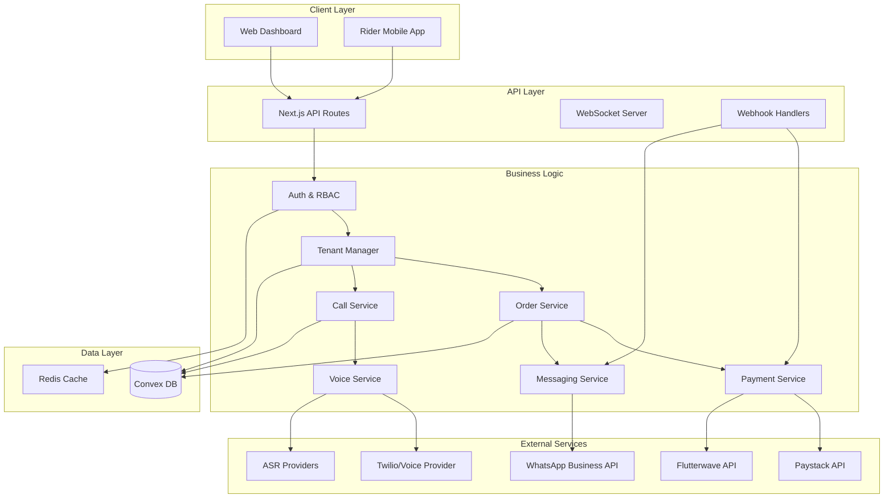
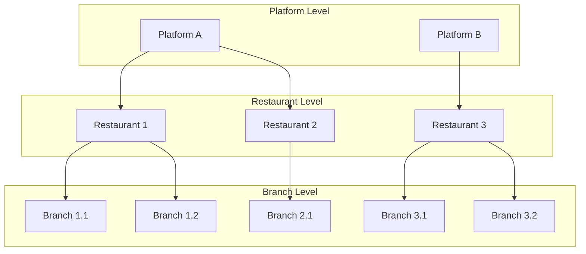
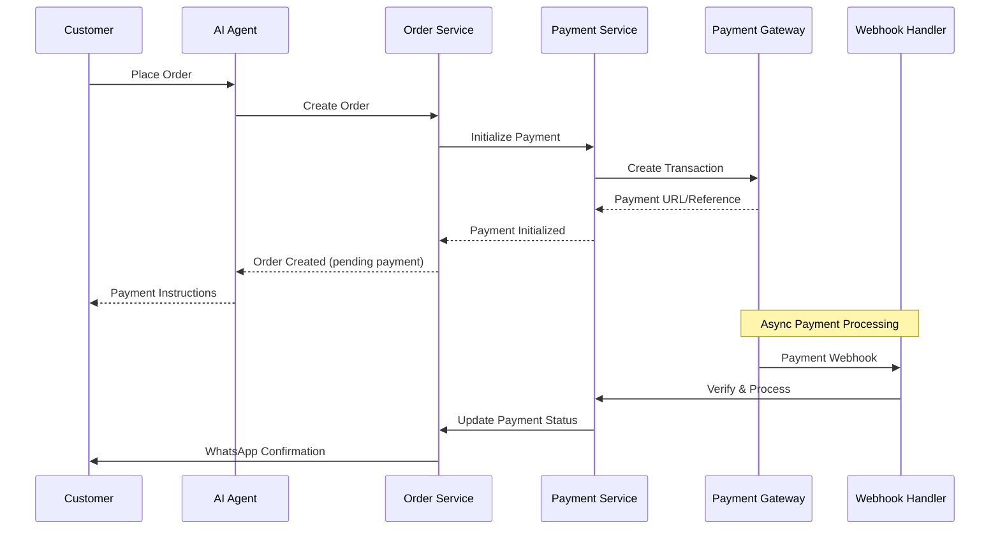

# Design Document: Nigeria Market Pivot

## Overview

This design document outlines the technical architecture for evolving the restaurant call management platform to support the Nigerian market. The pivot introduces a multi-tenant architecture, Nigerian payment integrations, WhatsApp messaging workflows, Nigerian language support, and platform-level analytics.

The design maintains backward compatibility with existing single-restaurant deployments while enabling the new multi-tenant capabilities. The implementation leverages the existing Convex real-time database, React Context patterns, and Tailwind CSS v4 styling conventions.

### Key Design Decisions

1. **Tenant Hierarchy**: Platform → Restaurant → Branch model with tenant-aware data access
2. **Payment Abstraction**: Unified payment interface supporting Paystack, Flutterwave, and COD
3. **Messaging Layer**: WhatsApp Business API integration with fallback to SMS
4. **Voice Localization**: ASR provider abstraction for Nigerian English and Pidgin support
5. **Backward Compatibility**: Feature flags and migration utilities for existing deployments

## Architecture

### High-Level System Architecture



### Tenant Isolation Architecture



### Payment Flow Architecture



## Components and Interfaces

### 1. Tenant Management Module

```typescript
// src/lib/tenant/types.ts
interface Platform {
  platformId: string;
  name: string;
  settings: PlatformSettings;
  createdAt: number;
}

interface PlatformSettings {
  defaultLanguage: LanguagePreference;
  enabledPaymentMethods: PaymentMethod[];
  whatsappEnabled: boolean;
  smsEnabled: boolean;
}

interface TenantContext {
  platformId: string;
  restaurantId?: string;
  branchId?: string;
  role: UserRole;
}

type UserRole = 'platform_admin' | 'restaurant_owner' | 'branch_manager' | 'supervisor';

// Tenant access guard
interface TenantGuard {
  canAccess(resource: TenantResource, action: ResourceAction): boolean;
  filterQuery<T>(query: T, tenantContext: TenantContext): T;
}
```

### 2. Authentication & RBAC Module

```typescript
// src/lib/auth/types.ts
interface User {
  userId: string;
  email: string;
  passwordHash: string;
  role: UserRole;
  tenantType: 'platform' | 'restaurant' | 'branch';
  tenantId: string;
  lastLoginAt: number;
}

interface AuthContext {
  user: User;
  tenant: TenantContext;
  permissions: Permission[];
}

interface Permission {
  resource: string;
  actions: ('create' | 'read' | 'update' | 'delete')[];
}

// Role permission matrix
const ROLE_PERMISSIONS: Record<UserRole, Permission[]> = {
  platform_admin: [
    { resource: '*', actions: ['create', 'read', 'update', 'delete'] }
  ],
  restaurant_owner: [
    { resource: 'restaurant', actions: ['read', 'update'] },
    { resource: 'branch', actions: ['create', 'read', 'update', 'delete'] },
    { resource: 'menu', actions: ['create', 'read', 'update', 'delete'] },
    { resource: 'order', actions: ['read', 'update'] },
    { resource: 'call', actions: ['read'] },
    { resource: 'analytics', actions: ['read'] }
  ],
  branch_manager: [
    { resource: 'branch', actions: ['read', 'update'] },
    { resource: 'menu', actions: ['read', 'update'] },
    { resource: 'order', actions: ['read', 'update'] },
    { resource: 'call', actions: ['read'] }
  ],
  supervisor: [
    { resource: 'order', actions: ['read'] },
    { resource: 'call', actions: ['read'] }
  ]
};
```

### 3. Payment Service Module

```typescript
// src/lib/payment/types.ts
type PaymentMethod = 'paystack' | 'flutterwave' | 'cod';
type PaymentStatus = 'pending' | 'paid' | 'failed' | 'refunded';

interface PaymentProvider {
  name: PaymentMethod;
  initializeTransaction(order: Order): Promise<PaymentInitResult>;
  verifyTransaction(reference: string): Promise<PaymentVerifyResult>;
  handleWebhook(payload: unknown, signature: string): Promise<WebhookResult>;
}

interface PaymentInitResult {
  success: boolean;
  reference: string;
  paymentUrl?: string;
  error?: string;
}

interface PaymentVerifyResult {
  success: boolean;
  status: PaymentStatus;
  amount: number;
  currency: string;
  metadata?: Record<string, unknown>;
}

interface WebhookResult {
  valid: boolean;
  event: string;
  orderId?: string;
  status?: PaymentStatus;
}

// Payment service interface
interface PaymentService {
  initializePayment(orderId: string, method: PaymentMethod): Promise<PaymentInitResult>;
  verifyPayment(reference: string, provider: PaymentMethod): Promise<PaymentVerifyResult>;
  processWebhook(provider: PaymentMethod, payload: unknown, signature: string): Promise<void>;
  recordCODCollection(orderId: string, collectedBy: string): Promise<void>;
}
```

### 4. Messaging Service Module

```typescript
// src/lib/messaging/types.ts
type MessageChannel = 'whatsapp' | 'sms';
type MessageStatus = 'queued' | 'sent' | 'delivered' | 'read' | 'failed';

interface MessageTemplate {
  templateId: string;
  channel: MessageChannel;
  name: string;
  language: string;
  components: TemplateComponent[];
}

interface TemplateComponent {
  type: 'header' | 'body' | 'footer' | 'button';
  parameters: TemplateParameter[];
}

interface TemplateParameter {
  type: 'text' | 'currency' | 'date_time';
  value: string;
}

interface MessagingService {
  sendOrderConfirmation(order: Order): Promise<MessageResult>;
  sendStatusUpdate(order: Order, status: string): Promise<MessageResult>;
  checkOptInStatus(phoneNumber: string): Promise<OptInStatus>;
  updateOptInStatus(phoneNumber: string, channel: MessageChannel, optIn: boolean): Promise<void>;
}

interface OptInStatus {
  phoneNumber: string;
  whatsappOptIn: boolean;
  smsOptIn: boolean;
  updatedAt: number;
}

interface MessageResult {
  success: boolean;
  messageId?: string;
  channel: MessageChannel;
  status: MessageStatus;
  error?: string;
}
```

### 5. Voice Service Module

```typescript
// src/lib/voice/types.ts
type LanguagePreference = 'english' | 'nigerian_english' | 'pidgin' | 'spanish' | 'french';

interface ASRProvider {
  name: string;
  supportedLanguages: LanguagePreference[];
  transcribe(audioStream: ReadableStream, language: LanguagePreference): Promise<TranscriptionResult>;
}

interface TranscriptionResult {
  text: string;
  confidence: number;
  language: LanguagePreference;
  alternatives?: { text: string; confidence: number }[];
}

interface VoiceService {
  transcribe(callId: string, audioStream: ReadableStream): Promise<TranscriptionResult>;
  shouldTriggerFallback(confidence: number): boolean;
  initiateFallback(callId: string, phoneNumber: string): Promise<FallbackResult>;
}

interface FallbackResult {
  triggered: boolean;
  channel: MessageChannel;
  conversationId?: string;
}

interface VoiceConfig {
  confidenceThreshold: number;
  fallbackEnabled: boolean;
  preferredFallbackChannel: MessageChannel;
}
```

### 6. Menu Import Module

```typescript
// src/lib/menu/types.ts
interface MenuImportRow {
  name: string;
  price: string;
  description?: string;
  category?: string;
  modifiers?: string;
  isAvailable?: string;
}

interface MenuValidationResult {
  valid: boolean;
  errors: ValidationError[];
  warnings: ValidationWarning[];
}

interface ValidationError {
  row: number;
  field: string;
  message: string;
  value?: string;
}

interface ValidationWarning {
  row: number;
  field: string;
  message: string;
}

interface MenuImportService {
  parseCSV(file: File): Promise<MenuImportRow[]>;
  parseGoogleSheet(url: string): Promise<MenuImportRow[]>;
  validateRows(rows: MenuImportRow[]): MenuValidationResult;
  importMenu(branchId: string, rows: MenuImportRow[]): Promise<ImportResult>;
  retryFailedRows(importId: string): Promise<ImportResult>;
}

interface ImportResult {
  importId: string;
  totalRows: number;
  successCount: number;
  failedCount: number;
  failedRows: { row: number; error: string }[];
}
```

### 7. Analytics Module

```typescript
// src/lib/analytics/types.ts
interface DashboardMetrics {
  totalCalls: number;
  totalOrders: number;
  totalRevenue: number;
  missedCalls: number;
  conversionRate: number;
  averageOrderValue: number;
  previousPeriodComparison: {
    calls: number;
    orders: number;
    revenue: number;
  };
}

interface FunnelStage {
  name: string;
  count: number;
  conversionRate: number;
  dropOffCount: number;
  averageTimeSeconds: number;
}

interface AnalyticsService {
  getDashboardMetrics(filter: MetricsFilter): Promise<DashboardMetrics>;
  getOrderFunnel(filter: MetricsFilter): Promise<FunnelStage[]>;
  getAgentPerformance(filter: MetricsFilter): Promise<AgentMetrics[]>;
  exportToCSV(dataType: 'calls' | 'orders', filter: MetricsFilter): Promise<Blob>;
}

interface MetricsFilter {
  platformId?: string;
  restaurantId?: string;
  branchId?: string;
  startDate: Date;
  endDate: Date;
}

interface AgentMetrics {
  agentId: string;
  agentName: string;
  totalCalls: number;
  averageCallDuration: number;
  conversionRate: number;
  asrAccuracy: number;
  fallbackRate: number;
}
```

### 8. Delivery Tracking Module

```typescript
// src/lib/delivery/types.ts
type DeliveryStatus = 'pending' | 'assigned' | 'dispatched' | 'in_transit' | 'delivered' | 'failed';

interface DeliveryInfo {
  orderId: string;
  status: DeliveryStatus;
  riderId?: string;
  riderName?: string;
  riderPhone?: string;
  dispatchedAt?: number;
  deliveredAt?: number;
  failureReason?: string;
  estimatedDeliveryTime?: number;
}

interface DeliveryService {
  assignRider(orderId: string, riderId: string): Promise<void>;
  updateStatus(orderId: string, status: DeliveryStatus, metadata?: Record<string, unknown>): Promise<void>;
  getDeliveryInfo(orderId: string): Promise<DeliveryInfo>;
  calculateEstimatedTime(branchId: string, customerLocation: Location): Promise<number>;
}

interface RiderAPI {
  authenticate(apiKey: string): Promise<RiderAuthResult>;
  updateDeliveryStatus(orderId: string, status: DeliveryStatus, failureReason?: string): Promise<void>;
  getAssignedOrders(riderId: string): Promise<Order[]>;
}
```

## Data Models

### Extended Convex Schema

```typescript
// convex/schema.ts (extended)
import { defineSchema, defineTable } from "convex/server";
import { v } from "convex/values";

export default defineSchema({
  // Platform (new)
  platforms: defineTable({
    platformId: v.string(),
    name: v.string(),
    settings: v.object({
      defaultLanguage: v.union(
        v.literal("english"),
        v.literal("nigerian_english"),
        v.literal("pidgin"),
        v.literal("spanish"),
        v.literal("french")
      ),
      enabledPaymentMethods: v.array(
        v.union(v.literal("paystack"), v.literal("flutterwave"), v.literal("cod"))
      ),
      whatsappEnabled: v.boolean(),
      smsEnabled: v.boolean(),
    }),
    createdAt: v.number(),
  }).index("by_platform_id", ["platformId"]),

  // Users (new)
  users: defineTable({
    userId: v.string(),
    email: v.string(),
    passwordHash: v.string(),
    role: v.union(
      v.literal("platform_admin"),
      v.literal("restaurant_owner"),
      v.literal("branch_manager"),
      v.literal("supervisor")
    ),
    tenantType: v.union(
      v.literal("platform"),
      v.literal("restaurant"),
      v.literal("branch")
    ),
    tenantId: v.string(),
    lastLoginAt: v.optional(v.number()),
    createdAt: v.number(),
  })
    .index("by_user_id", ["userId"])
    .index("by_email", ["email"])
    .index("by_tenant", ["tenantType", "tenantId"]),

  // Restaurant (extended)
  restaurants: defineTable({
    restaurantId: v.string(),
    platformId: v.string(), // NEW
    name: v.string(),
    agentName: v.string(),
    specialInstructions: v.string(),
    languagePreference: v.union(
      v.literal("english"),
      v.literal("nigerian_english"),
      v.literal("pidgin"),
      v.literal("spanish"),
      v.literal("french")
    ),
    branchCount: v.optional(v.number()), // NEW
    createdAt: v.number(),
  })
    .index("by_restaurant_id", ["restaurantId"])
    .index("by_platform_id", ["platformId"]), // NEW

  // Branches (new)
  branches: defineTable({
    branchId: v.string(),
    restaurantId: v.string(),
    name: v.string(),
    address: v.string(),
    phoneNumber: v.string(),
    operatingHours: v.object({
      monday: v.optional(v.object({ open: v.string(), close: v.string() })),
      tuesday: v.optional(v.object({ open: v.string(), close: v.string() })),
      wednesday: v.optional(v.object({ open: v.string(), close: v.string() })),
      thursday: v.optional(v.object({ open: v.string(), close: v.string() })),
      friday: v.optional(v.object({ open: v.string(), close: v.string() })),
      saturday: v.optional(v.object({ open: v.string(), close: v.string() })),
      sunday: v.optional(v.object({ open: v.string(), close: v.string() })),
    }),
    isActive: v.boolean(),
    createdAt: v.number(),
  })
    .index("by_branch_id", ["branchId"])
    .index("by_restaurant_id", ["restaurantId"]),

  // Menu items (extended)
  menuItems: defineTable({
    restaurantId: v.string(),
    branchId: v.optional(v.string()), // NEW - branch-specific menus
    name: v.string(),
    price: v.string(),
    priceNumeric: v.optional(v.number()), // NEW - for calculations
    description: v.optional(v.string()),
    category: v.optional(v.string()), // NEW
    modifiers: v.optional(v.array(v.object({
      name: v.string(),
      price: v.number(),
    }))), // NEW
    isAvailable: v.optional(v.boolean()), // NEW
  })
    .index("by_restaurant_id", ["restaurantId"])
    .index("by_branch_id", ["branchId"]), // NEW

  // Calls (extended)
  calls: defineTable({
    callId: v.string(),
    orderId: v.optional(v.string()),
    restaurantId: v.optional(v.string()),
    branchId: v.optional(v.string()), // NEW
    phoneNumber: v.optional(v.string()),
    callStartTime: v.optional(v.number()),
    callEndTime: v.optional(v.number()), // NEW
    duration: v.optional(v.number()), // NEW
    status: v.optional(v.union(v.literal("active"), v.literal("completed"))),
    asrConfidence: v.optional(v.number()), // NEW
    languageDetected: v.optional(v.string()), // NEW
    fallbackTriggered: v.optional(v.boolean()), // NEW
  })
    .index("by_restaurant_id", ["restaurantId"])
    .index("by_branch_id", ["branchId"]) // NEW
    .index("by_call_and_order_id", ["callId", "orderId"]),

  // Orders (extended)
  orders: defineTable({
    orderId: v.string(),
    restaurantId: v.string(),
    branchId: v.optional(v.string()), // NEW
    callId: v.optional(v.string()),
    customerName: v.string(),
    customerPhone: v.optional(v.string()), // NEW
    items: v.array(v.object({
      name: v.string(),
      quantity: v.number(),
      price: v.number(),
      modifiers: v.optional(v.array(v.object({
        name: v.string(),
        price: v.number(),
      }))), // NEW
    })),
    specialInstructions: v.optional(v.string()),
    totalAmount: v.optional(v.number()),
    status: v.union(
      v.literal("active"),
      v.literal("preparing"), // NEW
      v.literal("ready"), // NEW
      v.literal("completed"),
      v.literal("cancelled")
    ),
    // Payment fields (NEW)
    paymentMethod: v.optional(v.union(
      v.literal("paystack"),
      v.literal("flutterwave"),
      v.literal("cod")
    )),
    paymentStatus: v.optional(v.union(
      v.literal("pending"),
      v.literal("paid"),
      v.literal("failed"),
      v.literal("refunded")
    )),
    paymentReference: v.optional(v.string()),
    paymentTimestamp: v.optional(v.number()),
    // Delivery fields (NEW)
    deliveryStatus: v.optional(v.union(
      v.literal("pending"),
      v.literal("assigned"),
      v.literal("dispatched"),
      v.literal("in_transit"),
      v.literal("delivered"),
      v.literal("failed")
    )),
    riderId: v.optional(v.string()),
    riderName: v.optional(v.string()),
    dispatchedAt: v.optional(v.number()),
    deliveredAt: v.optional(v.number()),
    deliveryFailureReason: v.optional(v.string()),
    // WhatsApp fields (NEW)
    whatsappOptIn: v.optional(v.boolean()),
    whatsappMessageIds: v.optional(v.array(v.string())),
    // Timestamps
    orderPlacementTime: v.optional(v.number()),
    cancellationReason: v.optional(v.string()),
  })
    .index("by_restaurant_id", ["restaurantId"])
    .index("by_branch_id", ["branchId"]) // NEW
    .index("by_order_and_restaurant_id", ["orderId", "restaurantId"])
    .index("by_payment_status", ["paymentStatus"]) // NEW
    .index("by_delivery_status", ["deliveryStatus"]), // NEW

  // Customer Preferences (new)
  customerPreferences: defineTable({
    phoneNumber: v.string(),
    whatsappOptIn: v.boolean(),
    smsOptIn: v.boolean(),
    preferredLanguage: v.optional(v.string()),
    updatedAt: v.number(),
  }).index("by_phone", ["phoneNumber"]),

  // Prompts Library (new)
  prompts: defineTable({
    promptId: v.string(),
    restaurantId: v.string(),
    branchId: v.optional(v.string()),
    triggerCondition: v.union(
      v.literal("order_total_below"),
      v.literal("item_category"),
      v.literal("time_of_day"),
      v.literal("customer_history")
    ),
    triggerValue: v.string(),
    promptText: v.string(),
    isActive: v.boolean(),
    createdAt: v.number(),
  })
    .index("by_restaurant_id", ["restaurantId"])
    .index("by_branch_id", ["branchId"]),

  // Menu Imports (new)
  menuImports: defineTable({
    importId: v.string(),
    branchId: v.string(),
    restaurantId: v.string(),
    totalRows: v.number(),
    successCount: v.number(),
    failedCount: v.number(),
    failedRows: v.array(v.object({
      row: v.number(),
      error: v.string(),
      data: v.optional(v.string()),
    })),
    status: v.union(
      v.literal("pending"),
      v.literal("processing"),
      v.literal("completed"),
      v.literal("failed")
    ),
    createdAt: v.number(),
  })
    .index("by_import_id", ["importId"])
    .index("by_branch_id", ["branchId"]),

  // Webhook Events (new)
  webhookEvents: defineTable({
    eventId: v.string(),
    provider: v.union(
      v.literal("paystack"),
      v.literal("flutterwave"),
      v.literal("whatsapp")
    ),
    eventType: v.string(),
    payload: v.string(),
    signature: v.optional(v.string()),
    verified: v.boolean(),
    processed: v.boolean(),
    orderId: v.optional(v.string()),
    createdAt: v.number(),
  })
    .index("by_event_id", ["eventId"])
    .index("by_order_id", ["orderId"]),

  // Fraud Signals (new)
  fraudSignals: defineTable({
    phoneNumber: v.string(),
    signalType: v.union(
      v.literal("repeated_failed_payments"),
      v.literal("high_cancellation_rate"),
      v.literal("unusual_order_pattern")
    ),
    signalCount: v.number(),
    lastOccurrence: v.number(),
    isBlocked: v.boolean(),
    reviewedBy: v.optional(v.string()),
    reviewedAt: v.optional(v.number()),
    disposition: v.optional(v.union(
      v.literal("cleared"),
      v.literal("blocked"),
      v.literal("monitoring")
    )),
  })
    .index("by_phone", ["phoneNumber"])
    .index("by_blocked", ["isBlocked"]),

  // Transcripts (unchanged)
  transcripts: defineTable({
    callId: v.string(),
    dialogue: v.string(),
    speaker: v.union(v.literal("human"), v.literal("ai")),
  }).index("by_call_id", ["callId"]),
});
```

### React Context Extensions

```typescript
// src/contexts/TenantContext.tsx
interface TenantState {
  platform: Platform | null;
  restaurant: Restaurant | null;
  branch: Branch | null;
  userRole: UserRole;
  permissions: Permission[];
}

// src/contexts/PaymentContext.tsx
interface PaymentState {
  pendingPayments: Order[];
  recentTransactions: PaymentTransaction[];
  codCollections: CODCollection[];
}

// src/contexts/MessagingContext.tsx
interface MessagingState {
  messageQueue: QueuedMessage[];
  deliveryStatus: Map<string, MessageStatus>;
  optInPreferences: Map<string, OptInStatus>;
}
```


## Correctness Properties

*A property is a characteristic or behavior that should hold true across all valid executions of a system—essentially, a formal statement about what the system should do. Properties serve as the bridge between human-readable specifications and machine-verifiable correctness guarantees.*

### Property 1: Tenant Data Isolation

*For any* data query or mutation operation and *for any* authenticated user, the system should only return or modify data that belongs to the user's tenant scope (platform, restaurant, or branch level based on their role).

**Validates: Requirements 1.6, 1.8**

### Property 2: Role-Based Access Control Enforcement

*For any* user with *any* role attempting *any* action on *any* resource, access should be granted if and only if:
- The user's role has permission for that action type (create/read/update/delete) on that resource type
- The resource belongs to the user's tenant scope (platform_admin: all, restaurant_owner: their restaurant and branches, branch_manager: their branch, supervisor: read-only on their branch)

**Validates: Requirements 2.3, 2.4, 2.5, 2.6, 2.7, 2.8**

### Property 3: Restaurant Creation Creates Default Branch

*For any* restaurant creation operation that completes successfully, there should exist exactly one branch record with the same restaurantId and a default name.

**Validates: Requirements 1.4, 3.5**

### Property 4: Menu Import Validation Completeness

*For any* menu import row, validation should pass if and only if:
- The name field is present and between 2-100 characters
- The price field is present and matches valid Naira format (numeric, optionally with ₦ prefix)
- The description field (if present) does not exceed 500 characters
- All modifier prices (if present) are non-negative numeric values

**Validates: Requirements 4.3, 4.4, 5.1, 5.2, 5.3, 5.5, 5.7**

### Property 5: Menu Import Error Reporting

*For any* menu import operation with invalid rows, the error report should contain exactly the rows that failed validation, each with a specific error message describing the validation failure.

**Validates: Requirements 4.6, 5.8**

### Property 6: Menu Import Retry Idempotence

*For any* menu import retry operation, only the previously failed rows should be re-processed, and successfully imported rows from the original import should remain unchanged.

**Validates: Requirements 4.8**

### Property 7: Naira Price Format Parsing

*For any* price string in formats "500", "500.00", "₦500", or "₦500.00", the parser should extract the same numeric value (500.00).

**Validates: Requirements 4.4, 5.3**

### Property 8: Modifier String Round-Trip

*For any* valid modifier array, serializing to string format "modifier1:price1,modifier2:price2" and parsing back should produce an equivalent modifier array.

**Validates: Requirements 4.5**

### Property 9: Payment Status State Machine

*For any* order with a payment method, the payment status should transition according to:
- Initial state: "pending"
- On successful payment webhook: "pending" → "paid"
- On failed payment webhook: "pending" → "failed"
- On refund: "paid" → "refunded"
No other transitions should be allowed.

**Validates: Requirements 8.2, 8.6, 8.7, 9.4, 9.5**

### Property 10: Payment Webhook Signature Verification

*For any* incoming payment webhook, the system should verify the signature using the provider's secret key before processing. Invalid signatures should result in rejection and logging.

**Validates: Requirements 8.5, 8.9, 9.3**

### Property 11: COD Payment Collection Tracking

*For any* COD order marked as delivered, if payment collection is confirmed, the payment status should be "paid" and the collection should appear in the daily reconciliation summary.

**Validates: Requirements 10.4, 10.6**

### Property 12: WhatsApp Opt-In Respect

*For any* order status change that would trigger a WhatsApp message, the message should only be sent if the customer's whatsappOptIn preference is true.

**Validates: Requirements 11.2, 12.1, 12.2, 12.3, 12.4, 13.7**

### Property 13: WhatsApp Opt-Out State Change

*For any* "STOP" keyword received via WhatsApp, the customer's whatsappOptIn should be set to false, and *for any* "START" keyword, it should be set to true.

**Validates: Requirements 13.4, 13.6**

### Property 14: Delivery Status State Machine

*For any* order with delivery, the delivery status should transition according to:
- Initial: "pending"
- On rider assignment: "pending" → "assigned"
- On dispatch: "assigned" → "dispatched"
- On transit update: "dispatched" → "in_transit"
- On delivery: "in_transit" → "delivered"
- On failure: any state → "failed" (with reason)

**Validates: Requirements 14.2, 14.3, 14.4, 14.5, 14.8**

### Property 15: Rider API Authorization

*For any* rider API status update request, the update should only succeed if the authenticated rider is assigned to the specified order.

**Validates: Requirements 15.3, 15.7**

### Property 16: ASR Confidence Fallback Trigger

*For any* transcription result with confidence below the configured threshold (default 60%), the fallback system should be triggered.

**Validates: Requirements 18.1, 18.2**

### Property 17: Telecom Provider Failover

*For any* call initiation where the primary provider fails, the system should automatically attempt the secondary provider before reporting failure.

**Validates: Requirements 19.4**

### Property 18: API Rate Limiting

*For any* partner API key, requests exceeding 1000 per minute should be rejected with a rate limit error.

**Validates: Requirements 21.8**

### Property 19: Webhook Retry with Exponential Backoff

*For any* failed webhook delivery, the system should retry up to 5 times with exponentially increasing delays before marking as permanently failed.

**Validates: Requirements 21.6**

### Property 20: Order Funnel Stage Tracking

*For any* order, the funnel stages (call_started → order_initiated → payment_started → payment_completed → delivery_completed) should be tracked with timestamps, and conversion rates should be calculable between adjacent stages.

**Validates: Requirements 22.1, 22.2, 22.3**

### Property 21: Upsell Prompt Trigger Matching

*For any* order context matching a configured prompt trigger condition (order_total_below, item_category, time_of_day, customer_history), the corresponding prompt should be delivered by the AI agent.

**Validates: Requirements 24.3**

### Property 22: Fraud Signal Blocking

*For any* phone number on the blocklist, incoming calls should be rejected or require human verification.

**Validates: Requirements 25.4**

### Property 23: Multi-Location Routing by Proximity

*For any* order with known customer location, the system should route to the nearest active branch that is within operating hours and has capacity.

**Validates: Requirements 27.2, 27.3, 27.4**

### Property 24: Backward Compatibility Data Preservation

*For any* existing restaurant record before migration, after migration the record should exist with a valid platformId, and all associated menu items, calls, orders, and transcripts should be preserved with correct tenant references.

**Validates: Requirements 28.2, 28.3, 28.4**

### Property 25: Dashboard Metrics Calculation Accuracy

*For any* time period and tenant filter, the dashboard metrics should satisfy:
- totalCalls = count of calls in period
- totalOrders = count of orders in period
- missedCalls = calls without associated orders
- conversionRate = (totalOrders / totalCalls) × 100
- averageOrderValue = totalRevenue / totalOrders

**Validates: Requirements 6.1, 6.2, 6.3, 6.4, 6.5**

### Property 26: CSV Export Format Compliance

*For any* CSV export, the output should:
- Include a header row with column names
- Format timestamps in ISO 8601 format
- Format currency values with ₦ prefix
- Apply current dashboard filters to the data

**Validates: Requirements 7.1, 7.2, 7.4, 7.5, 7.6**

## Error Handling

### Tenant Access Errors

| Error Code | Condition | Response |
|------------|-----------|----------|
| 403 | User attempts to access resource outside tenant scope | `{ error: "Forbidden", message: "Access denied to this resource" }` |
| 403 | User attempts action not permitted by role | `{ error: "Forbidden", message: "Insufficient permissions for this action" }` |
| 404 | Resource not found within tenant scope | `{ error: "Not Found", message: "Resource not found" }` |

### Payment Errors

| Error Code | Condition | Response |
|------------|-----------|----------|
| 400 | Invalid payment method | `{ error: "Bad Request", message: "Unsupported payment method" }` |
| 402 | Payment initialization failed | `{ error: "Payment Required", message: "Failed to initialize payment" }` |
| 409 | Payment already processed | `{ error: "Conflict", message: "Payment already processed for this order" }` |
| 422 | Webhook signature invalid | `{ error: "Unprocessable Entity", message: "Invalid webhook signature" }` |

### Menu Import Errors

| Error Code | Condition | Response |
|------------|-----------|----------|
| 400 | Invalid CSV format | `{ error: "Bad Request", message: "Invalid CSV format", details: [...] }` |
| 400 | Missing required columns | `{ error: "Bad Request", message: "Missing required columns: name, price" }` |
| 413 | Import exceeds 500 items | `{ error: "Payload Too Large", message: "Import limited to 500 items" }` |
| 422 | Validation errors | `{ error: "Unprocessable Entity", validationReport: {...} }` |

### Messaging Errors

| Error Code | Condition | Response |
|------------|-----------|----------|
| 400 | Invalid phone number format | `{ error: "Bad Request", message: "Invalid phone number format" }` |
| 429 | WhatsApp rate limit exceeded | `{ error: "Too Many Requests", message: "Message rate limit exceeded" }` |
| 503 | WhatsApp API unavailable | `{ error: "Service Unavailable", message: "Messaging service temporarily unavailable" }` |

### Delivery API Errors

| Error Code | Condition | Response |
|------------|-----------|----------|
| 401 | Invalid rider API key | `{ error: "Unauthorized", message: "Invalid API credentials" }` |
| 403 | Rider not assigned to order | `{ error: "Forbidden", message: "Not authorized to update this order" }` |
| 409 | Invalid status transition | `{ error: "Conflict", message: "Invalid delivery status transition" }` |

### Graceful Degradation

1. **Payment Provider Failover**: If Paystack fails, offer Flutterwave as alternative
2. **Messaging Fallback**: If WhatsApp fails after retries, fall back to SMS
3. **Voice Fallback**: If ASR confidence is low, offer WhatsApp/SMS ordering
4. **Telecom Failover**: If primary provider fails, route to secondary

## Testing Strategy

### Dual Testing Approach

This feature requires both unit tests and property-based tests for comprehensive coverage:

- **Unit tests**: Verify specific examples, edge cases, integration points, and error conditions
- **Property tests**: Verify universal properties across all valid inputs using randomized testing

### Property-Based Testing Configuration

- **Library**: fast-check for TypeScript property-based testing
- **Minimum iterations**: 100 per property test
- **Tag format**: `Feature: nigeria-market-pivot, Property {number}: {property_text}`

### Test Categories

#### 1. Tenant Isolation Tests (Properties 1, 2)

```typescript
// Property test: Tenant data isolation
// Feature: nigeria-market-pivot, Property 1: Tenant Data Isolation
fc.assert(
  fc.property(
    arbitraryUser(),
    arbitraryQuery(),
    (user, query) => {
      const results = executeQuery(query, user.tenantContext);
      return results.every(r => isWithinTenantScope(r, user.tenantContext));
    }
  ),
  { numRuns: 100 }
);
```

#### 2. Menu Validation Tests (Properties 4, 5, 7, 8)

```typescript
// Property test: Naira price format parsing
// Feature: nigeria-market-pivot, Property 7: Naira Price Format Parsing
fc.assert(
  fc.property(
    fc.oneof(
      fc.nat().map(n => `${n}`),
      fc.nat().map(n => `${n}.00`),
      fc.nat().map(n => `₦${n}`),
      fc.nat().map(n => `₦${n}.00`)
    ),
    (priceString) => {
      const parsed = parseNairaPrice(priceString);
      return parsed.success && typeof parsed.value === 'number';
    }
  ),
  { numRuns: 100 }
);

// Property test: Modifier string round-trip
// Feature: nigeria-market-pivot, Property 8: Modifier String Round-Trip
fc.assert(
  fc.property(
    arbitraryModifierArray(),
    (modifiers) => {
      const serialized = serializeModifiers(modifiers);
      const parsed = parseModifiers(serialized);
      return deepEqual(modifiers, parsed);
    }
  ),
  { numRuns: 100 }
);
```

#### 3. Payment State Machine Tests (Properties 9, 10, 11)

```typescript
// Property test: Payment status state machine
// Feature: nigeria-market-pivot, Property 9: Payment Status State Machine
fc.assert(
  fc.property(
    arbitraryOrder(),
    arbitraryPaymentEvent(),
    (order, event) => {
      const newStatus = applyPaymentEvent(order.paymentStatus, event);
      return isValidPaymentTransition(order.paymentStatus, newStatus, event);
    }
  ),
  { numRuns: 100 }
);
```

#### 4. Delivery Status Tests (Property 14)

```typescript
// Property test: Delivery status state machine
// Feature: nigeria-market-pivot, Property 14: Delivery Status State Machine
fc.assert(
  fc.property(
    arbitraryDeliveryStatus(),
    arbitraryDeliveryEvent(),
    (currentStatus, event) => {
      const newStatus = applyDeliveryEvent(currentStatus, event);
      return isValidDeliveryTransition(currentStatus, newStatus, event);
    }
  ),
  { numRuns: 100 }
);
```

#### 5. WhatsApp Opt-In Tests (Properties 12, 13)

```typescript
// Property test: WhatsApp opt-in respect
// Feature: nigeria-market-pivot, Property 12: WhatsApp Opt-In Respect
fc.assert(
  fc.property(
    arbitraryOrder(),
    arbitraryCustomerPreferences(),
    (order, preferences) => {
      const shouldSend = shouldSendWhatsAppMessage(order, preferences);
      return shouldSend === preferences.whatsappOptIn;
    }
  ),
  { numRuns: 100 }
);
```

#### 6. API Rate Limiting Tests (Property 18)

```typescript
// Property test: API rate limiting
// Feature: nigeria-market-pivot, Property 18: API Rate Limiting
fc.assert(
  fc.property(
    fc.integer({ min: 1, max: 2000 }),
    (requestCount) => {
      const results = simulateRequests(requestCount);
      const accepted = results.filter(r => r.status === 200).length;
      const rejected = results.filter(r => r.status === 429).length;
      return accepted <= 1000 && (requestCount <= 1000 || rejected > 0);
    }
  ),
  { numRuns: 100 }
);
```

#### 7. Dashboard Metrics Tests (Property 25)

```typescript
// Property test: Dashboard metrics calculation accuracy
// Feature: nigeria-market-pivot, Property 25: Dashboard Metrics Calculation Accuracy
fc.assert(
  fc.property(
    arbitraryCallsArray(),
    arbitraryOrdersArray(),
    (calls, orders) => {
      const metrics = calculateDashboardMetrics(calls, orders);
      return (
        metrics.totalCalls === calls.length &&
        metrics.totalOrders === orders.length &&
        metrics.missedCalls === calls.filter(c => !c.orderId).length &&
        Math.abs(metrics.conversionRate - (orders.length / calls.length) * 100) < 0.01
      );
    }
  ),
  { numRuns: 100 }
);
```

### Unit Test Coverage

| Component | Test Focus |
|-----------|------------|
| TenantGuard | Specific role/resource combinations, edge cases |
| PaymentService | Provider-specific integration, webhook handling |
| MenuImportService | CSV parsing edge cases, Google Sheets integration |
| MessagingService | Template rendering, retry logic |
| DeliveryService | Status transition edge cases |
| AnalyticsService | Metric calculation edge cases, export formatting |

### Integration Test Scenarios

1. **End-to-end onboarding flow**: Restaurant creation → Branch setup → Menu import
2. **Payment flow**: Order creation → Payment initialization → Webhook processing → Status update
3. **Messaging flow**: Order status change → Opt-in check → Message send → Delivery tracking
4. **Multi-tenant access**: Cross-tenant access attempts, role escalation attempts

