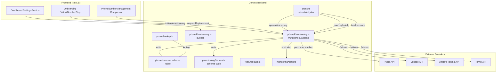
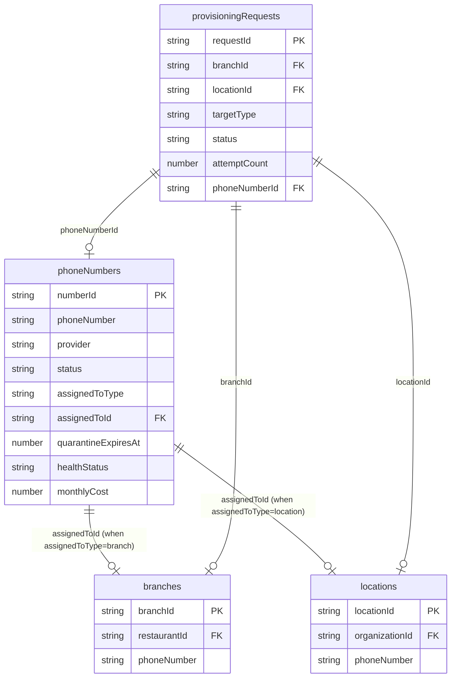

# Design Document: Phone Number Provisioning

## Overview

This feature replaces the shared virtual phone number model (`NEXT_PUBLIC_VIRTUAL_NUMBER` + Business ID routing) with dedicated per-branch phone number provisioning. Each restaurant branch receives its own virtual phone number purchased from a telecom provider (Twilio, Vonage, Africa's Talking, or Termii), enabling direct-dial calling without Business ID entry.

The system manages the full number lifecycle: acquisition from providers with multi-provider failover, assignment to branches, health monitoring, quarantine on release, and pool management for instant assignment. A feature flag (`dedicated_numbers_enabled`) controls gradual rollout while maintaining full backward compatibility with the shared number flow.

Key design drivers:
- Minimize onboarding latency via pre-purchased number pools
- Ensure reliability through multi-provider failover and exponential backoff retries
- Prevent misrouted calls via 30-day quarantine on released numbers
- Maintain backward compatibility during migration

## Architecture

The provisioning system is implemented as a set of Convex mutations, queries, actions, and scheduled functions, with React components for the dashboard and onboarding UI.



### Provider Routing

The system uses a region-based provider routing strategy. Each region has a primary and secondary provider, with remaining providers as tertiary fallbacks:

| Region | Primary | Secondary | Tertiary |
|--------|---------|-----------|----------|
| nigeria | Termii | Africa's Talking | Twilio, Vonage |
| ghana, kenya, south_africa | Africa's Talking | Twilio | Vonage, Termii |
| default (US/EU) | Twilio | Vonage | Africa's Talking, Termii |

### Scheduled Functions

| Job | Interval | Purpose |
|-----|----------|---------|
| processQuarantineExpirations | Every 6 hours | Transition expired quarantine numbers to available or release to provider |
| replenishNumberPool | Every 1 hour | Purchase numbers for regions below minimum pool size |
| runHealthChecks | Every 4 hours | Verify assigned numbers are active at provider |

## Components and Interfaces

### Backend Modules

#### `convex/phoneProvisioning.ts` — Core provisioning logic

**Mutations:**
- `initiateProvisioning(branchId, region, countryCode)` — Creates a provisioning request, checks pool, assigns or purchases
- `assignNumberToBranch(phoneNumberId, branchId)` — Assigns an available number to a branch, updates both records
- `releaseNumber(phoneNumberId)` — Starts release flow: status → releasing → quarantined
- `requestReplacement(branchId)` — Releases current number and initiates new provisioning
- `updateHealthStatus(phoneNumberId, healthStatus)` — Updates health check results

**Actions (for external API calls):**
- `purchaseNumberFromProvider(provider, region, countryCode)` — Calls provider API to buy a number
- `configureWebhook(provider, providerNumberSid, webhookUrl)` — Sets voice webhook at provider
- `releaseNumberAtProvider(provider, providerNumberSid)` — Releases number back to provider
- `checkNumberHealth(provider, providerNumberSid)` — Queries provider for number status

**Queries:**
- `getPhoneNumberByBranch(branchId)` — Returns the assigned phone number record for a branch
- `getProvisioningRequest(requestId)` — Returns provisioning request status
- `getPoolStatus(region?)` — Returns available number counts per region
- `getMonthlyPhoneNumberCosts(groupBy)` — Aggregates costs by provider or region
- `getBranchPhoneNumberCost(branchId)` — Returns per-branch cost for billing
- `getProvisioningRequestsByBranch(branchId)` — Returns provisioning history

**Internal mutations (for scheduled functions):**
- `processQuarantineExpirations()` — Processes expired quarantine numbers
- `replenishNumberPool()` — Checks pool levels and purchases to fill gaps
- `runHealthChecks()` — Iterates assigned numbers and checks health

#### `convex/phoneLookup.ts` — Extended lookup

Add a new query:
- `getEntityByPhoneNumber(phoneNumber)` — Looks up the `phoneNumbers` table first, then resolves to branch or location. This replaces direct branch/location phone number lookups for provisioned numbers.

#### `convex/featureFlags.ts` — New flag

Add `dedicated_numbers_enabled` to the feature flag name validator. This flag controls whether new provisioning requests are accepted.

### Frontend Components

#### `src/components/onboarding/VirtualNumberStep.tsx` (replaces VirtualNumberGenerator)

Updated onboarding step that:
1. Checks if `dedicated_numbers_enabled` flag is active
2. If enabled: calls `initiateProvisioning`, shows loading spinner, displays provisioned number on success
3. If disabled or provisioning fails: falls back to shared number + Business ID display
4. Shows provider attribution ("Powered by Twilio")

#### `src/components/dashboard/PhoneNumberManagement.tsx`

New settings sub-component that:
1. Displays assigned number, provider, status, health, monthly cost
2. Shows health warning badges for degraded/unreachable numbers
3. Provides "Request Replacement" with confirmation dialog
4. Shows "Request Dedicated Number" if branch uses shared number fallback

### TypeScript Interfaces

```typescript
// Phone number status lifecycle
type NumberStatus = "available" | "assigned" | "releasing" | "released" | "quarantined" | "failed";

// Health status
type HealthStatus = "healthy" | "degraded" | "unreachable";

// Number capabilities
type NumberCapability = "voice" | "sms" | "mms" | "fax";

// Assignment target type
type AssignedToType = "branch" | "location";

// Provisioning request status
type ProvisioningRequestStatus = "pending" | "in_progress" | "completed" | "failed";

// Provider names
type TelecomProvider = "twilio" | "vonage" | "africas_talking" | "termii";

// Region identifiers
type ProvisioningRegion = "nigeria" | "ghana" | "kenya" | "south_africa" | "default";
```

## Data Models

### `phoneNumbers` Table

```typescript
phoneNumbers: defineTable({
  numberId: v.string(),                    // Unique ID (e.g., "PN_abc123")
  phoneNumber: v.string(),                 // E.164 format (e.g., "+2348012345678")
  provider: v.string(),                    // "twilio" | "vonage" | "africas_talking" | "termii"
  status: v.union(
    v.literal("available"),
    v.literal("assigned"),
    v.literal("releasing"),
    v.literal("released"),
    v.literal("quarantined"),
    v.literal("failed")
  ),
  capabilities: v.array(v.union(
    v.literal("voice"),
    v.literal("sms"),
    v.literal("mms"),
    v.literal("fax")
  )),
  region: v.string(),                      // "nigeria", "ghana", "default", etc.
  countryCode: v.string(),                 // "NG", "GH", "US", etc.
  createdAt: v.number(),
  // Assignment fields (optional)
  assignedToType: v.optional(v.union(v.literal("branch"), v.literal("location"))),
  assignedToId: v.optional(v.string()),
  assignedAt: v.optional(v.number()),
  releasedAt: v.optional(v.number()),
  // Lifecycle fields (optional)
  quarantineExpiresAt: v.optional(v.number()),
  providerNumberSid: v.optional(v.string()),
  monthlyCost: v.optional(v.number()),
  currency: v.optional(v.string()),
  lastHealthCheckAt: v.optional(v.number()),
  healthStatus: v.optional(v.union(
    v.literal("healthy"),
    v.literal("degraded"),
    v.literal("unreachable")
  )),
})
  .index("by_number_id", ["numberId"])
  .index("by_phone_number", ["phoneNumber"])
  .index("by_status", ["status"])
  .index("by_assigned_to", ["assignedToType", "assignedToId"])
  .index("by_provider", ["provider"])
  .index("by_quarantine_expires", ["quarantineExpiresAt"])
```

### `provisioningRequests` Table

```typescript
provisioningRequests: defineTable({
  requestId: v.string(),                   // Unique ID (e.g., "PR_abc123")
  branchId: v.optional(v.string()),        // Target branch (for restaurant vertical)
  locationId: v.optional(v.string()),      // Target location (for logistics vertical)
  targetType: v.union(v.literal("branch"), v.literal("location")),
  provider: v.string(),                    // Current/last provider attempted
  status: v.union(
    v.literal("pending"),
    v.literal("in_progress"),
    v.literal("completed"),
    v.literal("failed")
  ),
  region: v.string(),
  countryCode: v.string(),
  attemptCount: v.number(),
  maxAttempts: v.number(),                 // Default: 5
  lastError: v.optional(v.string()),
  phoneNumberId: v.optional(v.string()),   // Set on completion
  createdAt: v.number(),
  updatedAt: v.number(),
  completedAt: v.optional(v.number()),
})
  .index("by_request_id", ["requestId"])
  .index("by_branch_id", ["branchId"])
  .index("by_status", ["status"])
  .index("by_created_at", ["createdAt"])
```

### Schema Relationship Diagram




## Correctness Properties

*A property is a characteristic or behavior that should hold true across all valid executions of a system — essentially, a formal statement about what the system should do. Properties serve as the bridge between human-readable specifications and machine-verifiable correctness guarantees.*

### Property 1: Phone number record schema completeness

*For any* phone number record created in the system, it must contain all required fields (numberId, phoneNumber in E.164 format, provider, status, capabilities array, region, countryCode, createdAt) with correct types, and optional fields (assignedToType, assignedToId, assignedAt, releasedAt, quarantineExpiresAt, providerNumberSid, monthlyCost, currency, lastHealthCheckAt, healthStatus) must be accepted when provided.

**Validates: Requirements 1.1, 1.2, 1.3**

### Property 2: Provisioning request record schema completeness

*For any* provisioning request record created in the system, it must contain all required fields (requestId, targetType, provider, status, region, countryCode, attemptCount, maxAttempts, createdAt, updatedAt) with correct types, and either branchId or locationId must be set matching the targetType.

**Validates: Requirements 1.5**

### Property 3: Provider failover ordering

*For any* region and sequence of provider failures, the provisioning service must attempt providers in the correct order: primary provider first, then secondary, then remaining providers in the defined tertiary order, never repeating an already-attempted provider.

**Validates: Requirements 2.1, 2.2, 2.3**

### Property 4: Purchased number data completeness

*For any* successfully purchased phone number, the resulting Phone_Number_Record must contain the provider's number SID, an E.164 formatted phone number, the monthly cost, and the currency, and the capabilities array must include "voice".

**Validates: Requirements 2.4, 2.7, 8.1**

### Property 5: Webhook configuration after purchase

*For any* successfully purchased phone number, the provisioning service must configure the number's voice webhook URL at the provider to point to the platform's `/incoming-call` endpoint.

**Validates: Requirements 2.5**

### Property 6: All-providers-failed triggers failure and alert

*For any* provisioning request where all configured providers fail, the request status must be set to "failed" with the last error message recorded, and a monitoring alert with "critical" severity must be emitted.

**Validates: Requirements 2.6, 6.5**

### Property 7: Assignment invariants

*For any* number assignment to a branch, the phone number record must have status "assigned", assignedToType "branch", assignedToId equal to the branchId, and assignedAt set to the assignment timestamp, AND the branch record's phoneNumber field must be updated with the E.164 number.

**Validates: Requirements 3.3, 3.4, 3.5**

### Property 8: Pool-first assignment strategy

*For any* provisioning request, the system must check the number pool for an available number matching the requested region before attempting to purchase a new number from a provider.

**Validates: Requirements 3.2**

### Property 9: Only available numbers can be assigned

*For any* phone number not in "available" status (including "assigned", "quarantined", "releasing", "released", "failed"), an assignment attempt must be rejected. This prevents double-assignment and quarantine bypass.

**Validates: Requirements 3.7, 4.7**

### Property 10: Failed provisioning falls back to shared number

*For any* provisioning request that fails after all retries, the branch must remain functional using the shared number model with Business ID instructions.

**Validates: Requirements 3.6**

### Property 11: Release state transition chain

*For any* assigned number that is released, the status must transition through "assigned" → "releasing" → "quarantined" in order, with assignment fields cleared and releasedAt set when entering "releasing", and quarantineExpiresAt set to current time plus the quarantine period (default 30 days) when entering "quarantined".

**Validates: Requirements 4.1, 4.2, 4.4, 8.4**

### Property 12: Release webhook reconfiguration

*For any* number entering "releasing" status, the voice webhook at the provider must be reconfigured to point to the "number-disconnected" announcement endpoint.

**Validates: Requirements 4.3**

### Property 13: Pool oldest-first selection

*For any* number assignment from the pool, the selected number must be the one with the earliest createdAt timestamp among all available numbers in the requested region.

**Validates: Requirements 5.5**

### Property 14: Pool replenishment to minimum

*For any* region where the available number count is below the configured minimum pool size, the replenishment function must purchase exactly enough numbers to bring the count up to the minimum.

**Validates: Requirements 5.1, 5.3**

### Property 15: Pool invariant

*For any* number in the pool (status "available"), it must have no assignedToId and no assignedToType set.

**Validates: Requirements 5.4**

### Property 16: Exponential backoff retry delays

*For any* provisioning attempt that fails with a transient error, the retry delay must follow the exponential backoff schedule (5s, 30s, 2m, 10m) based on the attempt number, and the total attempts must not exceed 5 (1 initial + 4 retries).

**Validates: Requirements 6.1, 6.2**

### Property 17: Non-transient errors are not retried

*For any* provisioning attempt that fails with a non-transient error (invalid credentials, account suspended, insufficient funds), the system must not schedule a retry and must immediately mark the request as failed.

**Validates: Requirements 6.4**

### Property 18: Health status correctness

*For any* assigned phone number after a health check, the healthStatus must be "unreachable" if the provider reports the number is unreachable or misconfigured (with a warning alert emitted), "degraded" if the webhook is misconfigured but the number is active, or "healthy" if the number passes all checks. The lastHealthCheckAt field must be updated on every health check regardless of result.

**Validates: Requirements 7.3, 7.4, 7.5, 7.6**

### Property 19: Cost aggregation correctness

*For any* set of phone number records, the total monthly cost query grouped by provider and region must equal the sum of monthlyCost values for each group, and the per-branch cost query must return the monthlyCost of the number assigned to that branch.

**Validates: Requirements 8.2, 8.3**

### Property 20: Existing number prevents re-provisioning

*For any* branch that already has an assigned phone number, the onboarding step must display the existing number without initiating a new provisioning request.

**Validates: Requirements 9.6**

### Property 21: Call routing by number type

*For any* inbound call to a provisioned dedicated number, the phone lookup must resolve the branch directly without Business ID prompting. *For any* inbound call to the shared number, the system must continue to prompt for Business ID and route via the existing restaurantId lookup.

**Validates: Requirements 11.1, 11.2**

### Property 22: Feature flag controls provisioning

*For any* provisioning request, if the `dedicated_numbers_enabled` feature flag is disabled, the request must be rejected and the branch must use the shared number fallback.

**Validates: Requirements 11.6**

### Property 23: Quarantine expiry routing decision

*For any* quarantined number whose quarantineExpiresAt has passed, if the number pool for that region is at or above the configured minimum, the number must be released back to the provider (status → "released"); if the pool is below minimum, the number must be retained with status "available".

**Validates: Requirements 12.1, 12.2**

### Property 24: Audit log field completeness

*For any* provisioning lifecycle event logged, the audit entry must include timestamp, level, action, numberId, phoneNumber, provider, region, and requestId. Assignment events must additionally include branchId and restaurantId. Reassignment events must include both previous and new assignment details. Failure events must include error message, attempt count, and all providers attempted.

**Validates: Requirements 13.2, 13.3, 13.4, 13.5**

## Error Handling

### Provider API Errors

| Error Type | Classification | Handling |
|-----------|---------------|----------|
| Network timeout | Transient | Retry with exponential backoff |
| Rate limit (429) | Transient | Retry with backoff, respect Retry-After header |
| Provider temporary unavailability (503) | Transient | Retry with backoff |
| Invalid credentials (401/403) | Non-transient | Fail immediately, emit critical alert |
| Account suspended | Non-transient | Fail immediately, emit critical alert |
| Insufficient funds | Non-transient | Fail immediately, emit critical alert |
| No number inventory | Transient (provider-level) | Failover to next provider |

### Provisioning Failures

- When all providers fail: mark request as "failed", emit critical monitoring alert, fall back to shared number for the branch
- When pool replenishment fails: log at "error" level, retry on next scheduled run (1 hour), emit warning alert if pool reaches zero
- When health check fails: update healthStatus, emit warning alert, do not automatically reassign (operator decision)

### UI Error States

- Onboarding provisioning timeout (>30s): show shared number fallback with "dedicated number will be assigned shortly" message
- Dashboard number management errors: toast notification with retry option
- Replacement request failure: toast with error details, current number remains active

### Data Consistency

- Use Convex transactions to ensure atomicity of assignment operations (update phoneNumbers + branches in same mutation)
- Prevent race conditions on pool assignment by checking status within the mutation (optimistic concurrency via Convex's serializable transactions)
- Validate E.164 format before storing any phone number

## Testing Strategy

### Unit Tests

Focus on specific examples and edge cases:
- E.164 phone number format validation (valid/invalid examples)
- Provider routing table correctness for each region
- Backoff delay calculation for each attempt number
- Transient vs non-transient error classification
- Quarantine expiry date calculation
- Pool minimum threshold configuration parsing
- Cost aggregation with mixed currencies (edge case)
- Empty pool on-demand purchase flow

### Property-Based Tests

Use `fast-check` as the property-based testing library for TypeScript. Each property test must run a minimum of 100 iterations.

Property tests to implement (referencing design properties above):

1. **Feature: phone-number-provisioning, Property 1: Phone number record schema completeness** — Generate random valid phone number records and verify all required fields are present with correct types.

2. **Feature: phone-number-provisioning, Property 3: Provider failover ordering** — Generate random regions and failure sequences, verify provider attempt order matches routing table.

3. **Feature: phone-number-provisioning, Property 7: Assignment invariants** — Generate random branch IDs and available numbers, perform assignment, verify all record fields are correctly updated.

4. **Feature: phone-number-provisioning, Property 9: Only available numbers can be assigned** — Generate random phone numbers with non-available statuses, verify assignment is rejected.

5. **Feature: phone-number-provisioning, Property 11: Release state transition chain** — Generate random assigned numbers, perform release, verify the full state transition chain and field updates.

6. **Feature: phone-number-provisioning, Property 13: Pool oldest-first selection** — Generate random pools of available numbers with varying createdAt timestamps, verify the oldest is always selected.

7. **Feature: phone-number-provisioning, Property 15: Pool invariant** — Generate random pool states, verify no number with status "available" has assignment fields set.

8. **Feature: phone-number-provisioning, Property 16: Exponential backoff retry delays** — Generate random attempt numbers (1-4), verify the computed delay matches the backoff schedule.

9. **Feature: phone-number-provisioning, Property 17: Non-transient errors are not retried** — Generate random non-transient error types, verify no retry is scheduled.

10. **Feature: phone-number-provisioning, Property 18: Health status correctness** — Generate random health check results, verify the healthStatus is correctly set and lastHealthCheckAt is always updated.

11. **Feature: phone-number-provisioning, Property 19: Cost aggregation correctness** — Generate random sets of phone number records with costs, verify aggregation sums match.

12. **Feature: phone-number-provisioning, Property 23: Quarantine expiry routing decision** — Generate random quarantined numbers and pool sizes, verify the correct routing decision (release to provider vs retain in pool).

### Integration Tests

- End-to-end provisioning flow with mocked provider APIs
- Onboarding flow with provisioning success and failure paths
- Dashboard number management with real Convex backend
- Scheduled function execution (quarantine processing, pool replenishment, health checks)
- Feature flag toggle behavior (enable/disable provisioning)
- Backward compatibility: shared number routing continues to work alongside dedicated numbers
