# Design Document

## Overview

The **Control Plane** repurposes Dinee's tenant-scoped integration admin into a cross-tenant, cross-platform management surface layered *on top of* the completed `multi-platform-voice-integrations` feature. That feature already gives us the single-pair primitives — an in-process `Integration_Registry` of `Platform_Definition`s, a generic `integrations` config store keyed by `(platformId, tenantId)`, a generic `phoneRoutes` store, a service-token-guarded runtime credential path, and a masked admin UI. This design adds the *plural* surfaces (list/detail across tenants and platforms), a **two-tier authorization model** (`platform_admin` vs `partner`), a **browser-consumable platform catalog**, and consolidated **observability** (connection status, credential-test history, audit view, optional metrics) — without changing any existing entry point.

The design is **additive only** (Req 12). It introduces new Convex query/mutation modules, two new tables (`credentialTestHistory`, and an optional derivation for metrics), one optional additive field on `PlatformDefinition`, and new UI routes. It touches **none** of the seven preserved single-pair entry points' signatures, the first-party `/api/v1/...` routes, the operator dashboard, the `NEXT_APP_URL` wrappers, or the Runsheet voice-traffic routing decision.

The central design tension is that the `Integration_Registry` is an **in-process Map populated per V8 isolate** (`registerRunsheetPlatform()` runs in the Next.js server isolate and in the `"use node"` action isolate, but the default Convex query runtime's registry is empty). A browser cannot enumerate it, and a default-runtime Convex query cannot read it. Requirement 1 (Platform Catalog) is solved by projecting the registry to a serializable, secret-free catalog **at the Next.js server-render boundary** — reusing the exact pattern already established in `src/app/client/dashboard/integrations/platform/page.tsx`.

### Goals

1. Enumerate registered platforms as a serializable, secret-free `Platform_Catalog` a browser can consume (Req 1).
2. List and inspect every integration across tenants/platforms with masked-only data and deterministic ordering (Req 2, 3).
3. Enforce one reusable two-tier authorization model on every new read/list/management surface (Req 4, 5).
4. Provide connection status and an append-only credential-test history (Req 8).
5. Provide scoped, paginated audit-log views over the existing `integrationAuditLog` (Req 9).
6. Optionally surface per-platform windowed metrics behind a flag (Req 10).
7. Generalize the single admin component into an `Admin_Console` and a scoped `Partner_Console` (Req 6, 7).
8. Preserve every existing behavior; add only non-overlapping surfaces (Req 11, 12).

### Non-Goals

- Re-designing the base `multi-platform-voice-integrations` primitives (registry, config store, runtime path) — they are reused verbatim.
- Introducing any order-of-record persistence — Dinee remains a non-authoritative voice front end.
- Changing the Runsheet wire contract or the ws-server call path.

## Architecture

The Control Plane is organized as four cooperating layers over the existing base feature:

- **Catalog projection (Next.js server isolate):** a pure `buildPlatformCatalog` over the in-process registry, rendered server-side and handed to the consoles as serializable props.
- **Authorization (Convex, default runtime):** one reusable helper resolving the caller's role + `Authorization_Scope` from the `users` table, applied uniformly.
- **Read/list/management surfaces (Convex, default + node runtimes):** new authorized queries over `integrations`, `credentialTestHistory`, and `integrationAuditLog`; new authorized management wrappers that delegate to the preserved entry points after a scope check.
- **UI (Next.js/React):** `Admin_Console` and `Partner_Console`, both reusing the extracted credential-field renderer and pure logic helpers.

### Component Diagram

```mermaid
graph TB
  subgraph Registry["In-process Registry (per isolate)"]
    IR[Integration_Registry]
    PD[PlatformDefinition<br/>+ supportedConversationTypes?]
    IR --> PD
  end

  subgraph Catalog["Catalog Projection (Next.js server)"]
    BPC[buildPlatformCatalog<br/>pure, secret-free]
    IR --> BPC
  end

  subgraph Authz["Authorization (Convex default runtime)"]
    RA[requireActor ctx→ role+scope]
    RS[resolveScope / isPairInScope<br/>pure]
    RA --> RS
  end

  subgraph Reads["Control-Plane Reads (Convex)"]
    LIST[listIntegrations / listForPartner]
    DET[getIntegrationDetail]
    STAT[getConnectionStatus]
    HIST[getCredentialTestHistory]
    AUD[getAuditLog* scoped]
    MET[getPlatformMetrics optional]
  end

  subgraph Mgmt["Control-Plane Management (delegates)"]
    SAVE[saveIntegrationConfigScoped]
    ROUTE[savePhoneRouteScoped]
    TEST[testIntegrationCredentialScoped]
  end

  subgraph Base["Preserved base entry points (unchanged)"]
    GMC[getMaskedConfig]
    UIC[upsertIntegrationConfig]
    SPR[savePhoneRoute]
    TIC[testIntegrationCredential]
    SCS[setConnectionStatus]
  end

  subgraph Tables["Persistence"]
    INT[(integrations)]
    CTH[(credentialTestHistory NEW)]
    ALOG[(integrationAuditLog)]
    AM[(agentMetrics)]
  end

  subgraph UI["Consoles (React)"]
    AC[Admin_Console]
    PC[Partner_Console]
    CFR[Credential-field renderer + logic helpers reused]
  end

  AC --> BPC
  PC --> BPC
  AC --> LIST & DET & STAT & HIST & AUD & MET
  PC --> LIST & DET & STAT & HIST & AUD
  AC --> SAVE & ROUTE & TEST
  PC --> SAVE & ROUTE & TEST

  LIST & DET & STAT & HIST & AUD & MET --> RA
  SAVE & ROUTE & TEST --> RA
  SAVE --> UIC
  ROUTE --> SPR
  TEST --> TIC
  LIST --> INT
  DET --> INT
  STAT --> INT
  HIST --> CTH
  AUD --> ALOG
  MET --> AM
  TEST --> SCS
  TEST --> CTH
  AC --> CFR
  PC --> CFR
```



### Sequence — Admin list → detail → save

```mermaid
sequenceDiagram
  participant B as Browser (Admin_Console)
  participant SRV as Next.js server (catalog)
  participant CP as Control-Plane Convex
  participant AZ as requireActor
  participant INT as integrations table
  participant BASE as saveIntegrationConfig (base action)

  SRV->>SRV: registerBuiltInPlatforms(); buildPlatformCatalog()
  SRV-->>B: serializable Platform_Catalog (secret-free)
  B->>CP: listIntegrations({ platform?, tenant?, status? })
  CP->>AZ: requireActor(ctx)
  AZ-->>CP: { role: platform_admin, scope: unrestricted }
  CP->>INT: indexed query + AND-filter
  INT-->>CP: rows
  CP-->>B: MaskedIntegrationConfig[] (sorted, last4 only)
  B->>CP: getIntegrationDetail({ platformId, tenantId })
  CP->>AZ: requireActor(ctx) → authorized
  CP->>INT: by_platform_tenant.unique()
  CP-->>B: MaskedIntegrationConfig | { found: false }
  B->>CP: saveIntegrationConfigScoped({ pair, credentials, ... })
  CP->>AZ: requireActor(ctx); isPairInScope? (admin: yes)
  CP->>BASE: delegate (encrypt + upsert + audit)
  BASE-->>CP: { ok: true, created }
  CP-->>B: result (offending field on failure; inputs retained client-side)
```

### Sequence — Partner scoped request

```mermaid
sequenceDiagram
  participant B as Browser (Partner_Console)
  participant CP as Control-Plane Convex
  participant AZ as requireActor
  participant INT as integrations table

  B->>CP: listForPartner({})
  CP->>AZ: requireActor(ctx)
  AZ-->>CP: { role: partner, scope: {(*, tenantId=T)} }
  alt scope resolvable
    CP->>INT: by_tenant_id(T) query
    INT-->>CP: rows for tenant T
    CP->>CP: filterToScope(scope, rows)
    CP-->>B: MaskedIntegrationConfig[] (in-scope only)
  else scope undeterminable
    CP-->>B: authorization error (no data)
  end
  B->>CP: saveIntegrationConfigScoped({ platformId: P, tenantId: X, ... })
  CP->>AZ: isPairInScope(scope, P, X)?
  alt (P,X) in scope
    CP->>INT: delegate to base save
    CP-->>B: ok
  else out of scope
    CP-->>B: authorization error; target unchanged
  end
```

### Design Principles

- **Registry is the single source of truth for the catalog.** Projecting at the server-render boundary (never persisting a copy) means the catalog can never drift from, omit, or invent a platform (Req 1.1). It is secret-free by construction because the projection copies only `platformId`, `displayName`, `credentialFields`, and `supportedConversationTypes`.
- **One authorization helper, applied uniformly.** Every new surface calls `requireActor(ctx)` first; reads filter to scope, management verifies scope before delegating (Req 5). No surface re-implements role logic.
- **Delegate, never duplicate, for mutations.** Scoped management wrappers add an authorization gate and then call the preserved base entry points unchanged, keeping Req 12.2 intact.
- **Masked-only, fail-safe on short secrets.** All read surfaces return `MaskedIntegrationConfig`/last-4 previews. A defensive Control-Plane masking guard reveals zero characters for credentials shorter than 4, correcting a gap in `extractLast4` (see Data Models) to satisfy Req 11.4 / 2.7.
- **Additive tables and paths only.** New tables and Convex functions; new UI routes that do not overlap `/api/v1/...` (Req 12.5).

## Components and Interfaces

### Platform_Catalog projection (Req 1)

`PlatformDefinition` does not currently declare its supported conversation types (Req 1.3 gap). The **minimal additive change** is one optional field; absent → empty list (Req 1.4). This is backward compatible: it is not one of the seven preserved entry points, and an optional field changes no existing behavior.

```typescript
// src/lib/integrations/platform/types.ts (additive field)
export interface PlatformDefinition {
  // ...existing fields unchanged...
  /** Conversation types this platform supports, surfaced in the catalog (Req 1.3, 1.4). */
  supportedConversationTypes?: string[];
}
```

```typescript
// src/lib/integrations/platform/catalog.ts (NEW, pure)

/** A serializable, secret-free catalog entry (Req 1.2, 1.5). */
export interface PlatformCatalogEntry {
  platformId: string;
  displayName: string;
  credentialFields: { name: string; label: string; required: boolean }[];
  /** Empty when the platform declares none (Req 1.4). */
  conversationTypes: string[];
}

export type PlatformCatalog = PlatformCatalogEntry[];

/**
 * Projects a snapshot of registered PlatformDefinitions to a secret-free
 * catalog: exactly one entry per registered platformId, no duplicates, no
 * unregistered platform (Req 1.1). Copies ONLY serializable public metadata —
 * never the adapter factory, the runtime service-token env var, or any
 * credential value (Req 1.5). An empty snapshot yields an empty catalog (Req 1.6).
 */
export function buildPlatformCatalog(defs: PlatformDefinition[]): PlatformCatalog;

/**
 * Server-boundary helper: registers built-in platforms, snapshots the registry,
 * and projects. Throws a typed "catalog unavailable" error if the registry
 * snapshot cannot be obtained, so no partial catalog is returned (Req 1.7).
 */
export function getPlatformCatalog(): PlatformCatalog;
```

To snapshot the registry the projection needs to read all definitions; a small additive accessor is added to the registry (read-only, pure):

```typescript
// src/lib/integrations/platform/registry.ts (additive accessor)
/** Returns all registered definitions (snapshot). Read-only; never mutates. */
export function listRegisteredPlatforms(): PlatformDefinition[];
```

The catalog is consumed by the console **server components** (mirroring the existing `page.tsx`), which pass `PlatformCatalog` as a serializable prop to the client. No Convex round trip and no persisted table is required, so the catalog can never contain secrets or drift from the registry.

> Alternative considered: a persisted `platformCatalog` table seeded by a node-runtime action so a reactive Convex query could enumerate it. Rejected as the primary mechanism because it duplicates the registry (drift risk against Req 1.1) and adds a seeding lifecycle; the server-boundary projection is simpler and strictly correct. The persisted table remains a fallback if a purely-client console (no server render) is ever required.

### Authorization helper (Req 4, 5)

A single reusable module resolves the actor and scope, with pure predicates that are property-testable without a Convex runtime.

```typescript
// convex/integrations/authorization.ts (NEW)

export type ActorRole = "platform_admin" | "partner";

/** A partner's permitted set of (platformId, tenantId) pairs, or unrestricted. */
export type AuthorizationScope =
  | { kind: "unrestricted" }                       // platform_admin (Req 5.1)
  | { kind: "tenant"; tenantId: string }           // partner bound to a tenant (Req 5.2)
  | { kind: "pairs"; pairs: { platformId: string; tenantId: string }[] }; // explicit override

export type ActorResolution =
  | { ok: true; role: ActorRole; scope: AuthorizationScope }
  | { ok: false; reason: "unauthenticated" | "unrecognized_role" | "scope_undeterminable" };

/**
 * Pure: derives the scope from a user record (Req 5.1, 5.2). A platform_admin is
 * unrestricted; a partner is bound to its own tenantId (all platforms under that
 * tenant), unless the user carries an explicit `authorizationScope` override.
 * Returns a resolution failure for an unrecognized role or a partner whose scope
 * cannot be determined (missing tenantId and no override) (Req 4.5, 5.6).
 */
export function resolveActorFromUser(user: {
  role?: string;
  tenantId?: string;
  authorizationScope?: { platformId: string; tenantId: string }[];
} | null): ActorResolution;

/** Pure: membership test for a single pair against a scope (Req 5.2, 5.4, 5.7). */
export function isPairInScope(
  scope: AuthorizationScope,
  platformId: string,
  tenantId: string,
): boolean;

/** Pure: keeps only the summaries whose (platformId, tenantId) is in scope (Req 4.4, 5.3). */
export function filterToScope<T extends { platformId: string; tenantId: string }>(
  scope: AuthorizationScope,
  rows: T[],
): T[];

/**
 * Convex helper: resolves the caller from `ctx.auth.getUserIdentity()` + the
 * `users` table, returning role + scope or a typed failure. Every Control-Plane
 * surface calls this FIRST. Never returns integration data on failure.
 */
export async function requireActor(ctx: QueryCtx | MutationCtx | ActionCtx): Promise<ActorResolution>;
```

**Partner scope derivation.** The `users` table already stores `role` and `tenantId`. A `partner` is bound to its `tenantId`: `Authorization_Scope = { (p, user.tenantId) : any platform p }`, expressed as `{ kind: "tenant" }`. This satisfies the pair-membership semantics of Req 5.2 (a pair is in scope iff its `tenantId` equals the partner's). An optional `authorizationScope` array on the user allows a finer explicit pair set without changing the helper. Adding `"partner"` to the `users.role` union is an additive union member (backward compatible).

### Cross-platform list & detail (Req 2, 3)

New authorized queries in a Control-Plane module. They reuse the existing masked projection shape (`MaskedIntegrationConfig`) and never return ciphertext/plaintext.

```typescript
// convex/integrations/controlPlane.ts (NEW)

export type ConnectionStatus = "connected" | "disconnected" | "error";

export interface IntegrationFilter {
  platform?: string;   // exact, case-sensitive (Req 2.2)
  tenant?: string;     // exact, case-sensitive (Req 2.3)
  status?: ConnectionStatus; // Req 2.4
}

/**
 * Admin-only cross-platform list (Req 2). Non-admin → authorization error, no
 * data (Req 2.9). Malformed/empty filter value → rejected, data unchanged
 * (Req 2.10). Applies ALL supplied filters together (AND-semantics, Req 2.5) by
 * exact case-sensitive equality; no match → empty, not an error (Req 2.8).
 * Returns MaskedIntegrationConfig[] in deterministic (platformId, tenantId)
 * order, identical across repeated identical requests (Req 2.1). Last-4 only,
 * never ciphertext/plaintext (Req 2.6, 2.7, 11).
 */
export const listIntegrations: Query<IntegrationFilter, MaskedIntegrationConfig[]>;

/**
 * Partner-scoped list (Req 4). Returns exactly the integrations whose
 * (platformId, tenantId) is in the partner's scope (Req 4.1, 4.4), masked
 * (Req 4.2). Empty when scope has none (Req 4.3). Scope undeterminable →
 * authorization error, no data (Req 4.5).
 */
export const listForPartner: Query<{}, MaskedIntegrationConfig[]>;

/**
 * Detail for a single pair, authorized for the caller's role/scope (Req 3, 5).
 * Absent record → { found: false } (empty detail, NOT an error) (Req 3.3).
 * Out-of-scope / non-admin → authorization error, no detail (Req 3.5, 5.4).
 * Masked only (Req 3.2, 3.4). Retrieval failure other than "absent" → error,
 * no partial detail (Req 3.6).
 */
export const getIntegrationDetail: Query<
  { platformId: string; tenantId: string },
  { found: true; config: MaskedIntegrationConfig } | { found: false }
>;
```

**Indexing / ordering.** No filter or status-only filter → `by_tenant_id` scan when tenant supplied, else full `.collect()`; platform (± tenant) → `by_platform_tenant`. Status is applied in-memory. Results are sorted by `(platformId, tenantId)` ascending before return, giving a total, request-stable order (Req 2.1). Pure helpers `applyIntegrationFilter(rows, filter)` and `sortIntegrations(rows)` carry the logic for property testing.

**Masking guard.** A pure `toLast4Preview(stored: string)` returns the stored preview only when it is exactly 4 characters, else `""` (fully masked). Because a genuine long credential always yields exactly 4 characters at save time, only short (<4) credentials produce shorter previews — so this reveals zero characters for short secrets (Req 11.4, 2.7) while never truncating legitimate previews. All Control-Plane read surfaces route `credentialsLast4` through this guard.

### Connection status & credential-test history (Req 8)

The base store persists only the *latest* status. This design adds an **append-only history table** and wires the credential-test flow to append.

```typescript
// convex/integrations/credentialTestHistory.ts (NEW)

export type TestOutcome = "success" | "failure";

/** Internal append, invoked from the credential-test record callback (Req 8.2). */
export const appendCredentialTestOutcome: InternalMutation<{
  platformId: string;
  tenantId: string;
  outcome: TestOutcome;
  completedAt: number; // epoch ms; truncated to whole seconds for display (Req 8.2)
}, void>;

export interface CredentialTestRecord {
  platformId: string;   // reference by pair only (Req 8.4)
  tenantId: string;
  outcome: TestOutcome;
  completedAt: number;
}

/**
 * Authorized read (Req 8.3, 8.7). Returns the ≤100 most-recent outcomes for the
 * pair, most-recent-first by completedAt. Out-of-scope → authorization error,
 * no data (Req 8.7). No outcomes → empty, not an error (Req 8.6). Never
 * includes any credential value (Req 8.4).
 */
export const getCredentialTestHistory: Query<
  { platformId: string; tenantId: string },
  CredentialTestRecord[]
>;

/**
 * Authorized current status (Req 8.1, 8.5, 8.7). Returns the integration's
 * status, or { recorded: false } when no integration record exists (Req 8.5).
 */
export const getConnectionStatus: Query<
  { platformId: string; tenantId: string },
  { recorded: true; status: ConnectionStatus } | { recorded: false }
>;
```

**Wiring.** The base `testIntegrationCredential` action already records status via a callback that calls `setConnectionStatus`. That callback is extended to also call `appendCredentialTestOutcome` (`connected → success`, `error → failure`) with a UTC timestamp truncated to the second (Req 8.2). This preserves `testIntegrationCredential`'s signature exactly (same name, params, return type) — the append is an additive side effect (Req 12.2). The pure mapping `statusToOutcome(status)` and the ordering/pagination helper `mostRecentPage(records, limit)` are property-testable.

### Audit log view (Req 9)

New authorized queries over the existing `integrationAuditLog` (indexes `by_business_id` = tenant, `by_integration` = platformId). Entries are already name-only by construction (Req 9.4). Ordering is by `_creationTime` descending (≈ `createdAt`); pages are ≤100 via Convex `.paginate()` / `.take(100)`.

```typescript
export interface AuditEntryView {
  entryId: string;
  tenantId: string;      // businessId
  platformId: string;    // integrationName
  actionType: "create" | "rotate" | "revoke" | "expire" | "connect" | "disconnect";
  actorUserId: string;
  actorRole: string;
  details?: string;      // name-only; never a credential value (Req 9.4)
  createdAt: number;
}

/** Admin, by tenant (Req 9.1). Descending, ≤100/page. Out-of-scope → error. */
export const getAuditLogByTenant: Query<{ tenantId: string; cursor?: string }, Page<AuditEntryView>>;

/** Admin, by platform across tenants (Req 9.2). Descending, ≤100/page. */
export const getAuditLogByPlatform: Query<{ platformId: string; cursor?: string }, Page<AuditEntryView>>;

/**
 * Partner (Req 9.3). Returns only entries within the partner's scope
 * (tenant-bound), descending, ≤100/page. Requesting a tenant/platform outside
 * scope → authorization error, no entries (Req 9.5). Unauthenticated →
 * authentication error, no entries (Req 9.6). No entries in scope → empty
 * result, not an error (Req 9.7).
 */
export const getAuditLogForPartner: Query<{ cursor?: string }, Page<AuditEntryView>>;
```

The role check resolves from identity via `requireActor` (more secure than the existing `callerRole`-parameter functions in `convex/integrationAuditLog.ts`, which are left untouched for backward compatibility).

### Optional per-platform metrics (Req 10) — deferrable

Gated behind an environment flag `CONTROL_PLANE_METRICS_ENABLED` (WHERE clauses of Req 10). When disabled, the query is absent from the console and returns a "metrics disabled" indication. When enabled, it reuses the existing windowed-metrics infrastructure (`agentMetrics` + `computeWindowedRates`), scope-checked via `requireActor`.

```typescript
export interface PlatformHealthMetrics {
  platformId: string;
  tenantId: string;
  submissionAttempts: number;   // Req 10.1
  submissionSuccesses: number;
  submissionFailures: number;
  status: ConnectionStatus;
  windowStart: number;
  windowEnd: number;
}

/**
 * Optional (Req 10). Window is 1h–90d inclusive, default 24h (Req 10.3). Scope
 * enforced (Req 10.2, 10.5). No activity in window → zero counts (Req 10.4).
 * Never includes credential values (Req 10.1).
 */
export const getPlatformMetrics: Query<
  { platformId: string; tenantId: string; windowMs?: number },
  PlatformHealthMetrics
>;
```

**Note on sourcing.** `agentMetrics` currently tracks calls/tools, not submission attempts/successes/failures. Populating the submission counts requires either an additive metrics field or deriving from intake results; because Req 10 is optional/WHERE-gated, this is explicitly **deferrable** and is not on the critical path. It is covered by example/integration tests, not property tests.

### UI — Admin_Console and Partner_Console (Req 6, 7)

The existing `PlatformIntegrationAdmin.tsx` is generalized by **extracting** its cards into shared, reusable pieces and adding list/filter/detail composition. The pure logic in `platformIntegrationAdmin.logic.ts` (`prepareSaveConfig`, `preparePhoneRoute`, `formatMaskedCredential`, `connectionBadge`, `describeSaveError`) is reused verbatim.

```
src/components/dashboard/controlPlane/
  IntegrationListTable.tsx      // masked rows, deterministic order (Req 6.1, 6.2)
  IntegrationFilters.tsx        // platform / tenant / status controls; status ∈ {connected,disconnected,error} (Req 6.3, 6.4)
  IntegrationDetailPanel.tsx    // masked detail (Req 6.5, 3)
  IntegrationConfigForm.tsx     // dynamic credential-field renderer (from catalog) + save (Req 6.6–6.9, 7.3, 7.4)
  MaskedCredentialsCard.tsx     // last-4 only (Req 6.10, 7.4, 11)
  CredentialTestCard.tsx        // test + status + history (Req 8)
  PhoneRouteCard.tsx            // scoped assignment (Req 7.3)
```

- **`Admin_Console`** (`/client/dashboard/control-plane`, new route): server component builds the `Platform_Catalog`; client renders the cross-tenant/platform list with filters, a detail panel, and the config form driven by the selected platform's catalog credential fields. Reads use `listIntegrations` / `getIntegrationDetail`; management uses the scoped wrappers. Empty list → empty state, no error (Req 6.2, 6.4).
- **`Partner_Console`** (`/client/dashboard/partner`, new route): identical composition but reads via `listForPartner` and limits every list, phone-route assignment, and credential field to the partner's scope (Req 7.1, 7.2, 7.5). Out-of-scope submissions are blocked client-side and rejected server-side, leaving the integration unchanged (Req 7.6).

Both consoles display credentials only as last-4 (Req 6.10, 7.4) and are new routes that do not touch the existing `/integrations/platform` page (Req 12.4).

### Scoped management wrappers (Req 5.5, 5.7, 7.3, 7.6)

Management goes through thin authorized wrappers that verify scope, then delegate to the preserved base entry points unchanged.

```typescript
// convex/integrations/controlPlaneManagement.ts (NEW)

/** Verifies (platformId, tenantId) ∈ actor scope BEFORE delegating to the base
 *  saveIntegrationConfig action; out-of-scope → authorization error, integration
 *  unchanged (Req 5.5, 5.7, 7.6). Admin: always in scope (Req 5.1). */
export const saveIntegrationConfigScoped: Action</* same input as base + verified pair */, SaveResult>;

/** Scope-checked wrapper delegating to base savePhoneRoute (Req 7.3, 7.6). */
export const savePhoneRouteScoped: Mutation</* ... */, RouteResult>;

/** Scope-checked wrapper delegating to base testIntegrationCredential (Req 5, 8). */
export const testIntegrationCredentialScoped: Action</* ... */, CredentialTestResult>;
```

## Data Models

### `credentialTestHistory` (NEW, append-only)

```typescript
credentialTestHistory: defineTable({
  platformId: v.string(),              // reference by pair only (Req 8.4)
  tenantId: v.string(),
  outcome: v.union(v.literal("success"), v.literal("failure")), // Req 8.2
  completedAt: v.number(),             // epoch ms; whole-second UTC for display (Req 8.2)
})
  .index("by_platform_tenant", ["platformId", "tenantId"])
  // Enables most-recent-first pagination without an in-memory sort of large sets.
  .index("by_platform_tenant_time", ["platformId", "tenantId", "completedAt"]),
```

Append-only: no update/delete mutations are exposed. Reads take the ≤100 most-recent rows via the time index in descending order (Req 8.3). No credential value is ever stored (Req 8.4, 11).

### `PlatformDefinition.supportedConversationTypes?` (NEW optional field)

Additive optional field (see Components). Absent → catalog emits an empty `conversationTypes` list (Req 1.4). Runsheet's definition may declare `["runsheet_inbound_order", "runsheet_driver_exception"]`.

### `users.role` — additive union member `"partner"`

```typescript
role: v.optional(v.union(
  v.literal("platform_admin"),
  v.literal("restaurant_owner"),
  v.literal("business_owner"),
  v.literal("branch_manager"),
  v.literal("supervisor"),
  v.literal("partner"),            // NEW — additive
)),
// optional explicit scope override for a partner (else derived from tenantId):
authorizationScope: v.optional(v.array(v.object({
  platformId: v.string(), tenantId: v.string(),
}))),
```

Adding a union member and an optional field is backward compatible (existing users validate unchanged).

### Reused unchanged

- `integrations` (indexes `by_platform_tenant`, `by_tenant_id`) — list/detail/status.
- `phoneRoutes` — scoped route assignment.
- `integrationAuditLog` (indexes `by_business_id`, `by_integration`) — audit views; `details` already name-only.
- `agentMetrics` — optional metrics only.

### Masking note (Req 11.4 gap)

`extractLast4` returns the *whole* string when length ≤ 4, so a stored `credentialsLast4` for a <4-char secret would reveal the full value. The Control Plane never exposes `credentialsLast4` directly; it routes every preview through the pure `toLast4Preview` guard, which yields `""` for previews shorter than 4 characters — guaranteeing zero unmasked characters for short secrets (Req 11.4, 2.7) without truncating legitimate 4-character previews.

## Correctness Properties

*A property is a characteristic or behavior that should hold true across all valid executions of a system — essentially, a formal statement about what the system should do. Properties serve as the bridge between human-readable specifications and machine-verifiable correctness guarantees.*

These properties were derived from the acceptance-criteria prework. Redundant masking and authorization criteria were consolidated: every masked read surface folds into one masking property; every read-side role/scope criterion folds into one two-tier authorization property; management-side scope safety is kept distinct because leaving a target unchanged is not implied by a read rule. UI rendering, route-baseline snapshots, entry-point signature preservation, and optional metrics are covered by example/integration/smoke tests (see Testing Strategy), not properties.

### Property 1: Platform catalog completeness

*For any* set of registered `Platform_Definition`s with unique platform ids, `buildPlatformCatalog` produces exactly one catalog entry per registered platform id — no duplicates and no entry for an unregistered platform — and each entry carries the platform id, the display name, the credential-field specs (each with a name, a label, and a `required` flag that is exactly `true` or `false`), and a `conversationTypes` list equal to the platform's declared supported conversation types, or an empty list when none are declared.

**Validates: Requirements 1.1, 1.2, 1.3, 1.4, 1.6**

### Property 2: Platform catalog is secret-free and serializable

*For any* set of registered `Platform_Definition`s, every entry of the produced `Platform_Catalog` contains only serializable string, boolean, and list values and never contains an adapter factory reference, a runtime service-token env var, or any credential value.

**Validates: Requirements 1.5, 11.1, 11.2**

### Property 3: Deterministic cross-platform ordering

*For any* set of stored integrations, the admin integration list returns them in an order that is identical across repeated identical requests (a total order keyed by `(platformId, tenantId)`), independent of the order in which the underlying rows were produced.

**Validates: Requirements 2.1**

### Property 4: Filter AND-semantics with exact case-sensitive matching

*For any* set of stored integrations and *any* combination of platform, tenant, and connection-status filters, the returned set equals exactly the integrations that satisfy all supplied filters together, where platform and tenant match by exact case-sensitive equality and status matches one of `connected`, `disconnected`, or `error`; when no integration satisfies the supplied filters the returned set is empty.

**Validates: Requirements 2.2, 2.3, 2.4, 2.5, 2.8**

### Property 5: Masking non-exposure across every read surface

*For any* stored integration and *any* Control-Plane read surface (list, detail, partner list, connection status, history, audit), the returned representation excludes every decrypted credential value and every credential ciphertext, exposes at most the last 4 characters of each stored credential, and reveals zero characters when the underlying credential has fewer than 4 characters.

**Validates: Requirements 2.6, 2.7, 3.2, 3.4, 4.2, 6.10, 7.4, 11.1, 11.2, 11.3, 11.4, 11.5**

### Property 6: Two-tier read authorization isolation

*For any* actor and *any* set of stored integrations: a `platform_admin` actor can read every integration across all tenants and platforms; a `partner` actor reads exactly the integrations whose `(platformId, tenantId)` pair is within the partner's Authorization_Scope and no others; and an actor with no recognized role, or a partner whose scope cannot be determined, receives an authorization error and no integration data.

**Validates: Requirements 2.9, 3.5, 4.1, 4.3, 4.4, 5.1, 5.2, 5.3, 5.4, 5.6, 8.7, 9.5**

### Property 7: Management scope safety

*For any* `partner` actor and *any* management action (save configuration, assign phone route, test credential) whose target `(platformId, tenantId)` is outside the partner's Authorization_Scope, the Control Plane denies the action, returns an authorization error, and leaves the target integration byte-for-byte unchanged.

**Validates: Requirements 5.5, 5.7, 7.6**

### Property 8: Credential-test history ordering, pagination, and secret-freedom

*For any* sequence of recorded credential-test outcomes for a `(platformId, tenantId)` pair, the history query returns the outcomes ordered most-recent-first by completion timestamp, in a page of at most the 100 most recent, where each returned record references the integration only by platform id and tenant id and contains a `success`/`failure` outcome and a whole-second UTC timestamp — never any credential value.

**Validates: Requirements 8.2, 8.3, 8.4**

### Property 9: Audit-log ordering, pagination, scope, and secret-freedom

*For any* set of audit entries and *any* authorized actor and filter (by tenant, by platform, or partner-scoped), the returned entries are exactly those whose scope is within the actor's Authorization_Scope for the requested filter, ordered by event timestamp descending, in a page of at most 100 entries, with each entry referencing credentials by name only and containing no credential value or secret.

**Validates: Requirements 9.1, 9.2, 9.3, 9.4, 9.7**

### Property 10: Runsheet routing invariance under additive Control Plane

*For any* inbound call input, resolving the route with the Control Plane's read, list, and management surfaces present produces the same routing decision as the pre-Control-Plane baseline produces for that identical input.

**Validates: Requirements 12.3, 12.6**

## Error Handling

- **Authentication/authorization failures.** `requireActor` returns a typed failure (`unauthenticated`, `unrecognized_role`, `scope_undeterminable`). Every surface maps these to an authorization/authentication error and returns **no** integration, status, history, or audit data (Req 2.9, 3.5, 4.5, 5.4, 5.6, 8.7, 9.5, 9.6). Management wrappers additionally guarantee the target is unchanged (Req 5.5, 5.7, 7.6).
- **Absence vs. error.** A missing integration for a pair, a filter that matches nothing, an empty history, or an empty in-scope audit set are all **success with empty/absent results**, never errors (Req 2.8, 3.3, 8.5, 8.6, 9.7).
- **Malformed input.** Empty/whitespace filter values are rejected without touching data (Req 2.10). Invalid config JSON and missing required credential fields are blocked client-side by the reused pure helpers before any submit (Req 6.8), and the base save validates base URL / platform registration before any write (Req 2.3/2.4 of the base feature).
- **Catalog unavailable.** If the registry snapshot cannot be obtained, `getPlatformCatalog` throws a typed "catalog unavailable" error and returns no partial catalog (Req 1.7).
- **Retrieval failures.** A detail retrieval failure other than a non-existent record surfaces an error with no partial detail (Req 3.6).
- **Delegated save failures.** When the base save entry point returns a failure, the console surfaces an error and retains the operator's entered values; secret inputs are cleared only on success (Req 6.9).
- **Additive-conflict guard.** Any attempt to add a Control-Plane surface that would overlap an existing `/api/v1/...` path, alter a preserved entry point, or change the Runsheet routing decision is rejected, preserving existing behavior and surfacing a conflict error (Req 12.5, 12.6).

## Testing Strategy

### Dual approach

Property-based tests verify the universal invariants above; example, integration, and smoke tests cover concrete scenarios, wiring, infrastructure, and non-logic guarantees.

### Property-based tests

- Library: **fast-check** with the existing Vitest setup under `__tests__/properties/` (the repo already runs property suites there, e.g. `integrationConfigStore.property.test.ts`).
- Minimum **100 iterations** per property.
- Each test is tagged with a comment: **Feature: platform-control-plane, Property {n}: {property text}**.
- Each of the 10 properties is implemented as a **single** property-based test, exercising the pure cores: `buildPlatformCatalog` (P1, P2), `sortIntegrations` (P3), `applyIntegrationFilter` (P4), `toLast4Preview` + masked projections (P5), `resolveActorFromUser`/`isPairInScope`/`filterToScope` (P6, P7), `mostRecentPage` + `statusToOutcome` (P8), the audit scope/order/paginate helper (P9), and a baseline-vs-current routing comparator over `resolveRoute` (P10).
- Generators cover edge cases the prework flagged: empty registries, credentials shorter than 4 characters, empty/duplicate filter values, partners with empty scope, and out-of-order/oversized history and audit sequences.

### Example / unit tests

- Catalog-unavailable error path (Req 1.7); malformed-filter rejection (Req 2.10); detail absence and retrieval-failure paths (Req 3.3, 3.6); partner scope-undeterminable error (Req 4.5); unauthenticated audit request (Req 9.6).
- Console rendering and wiring (Req 6, 7): dynamic credential-field rendering from the catalog, required-field blocking (reusing the already-tested `prepareSaveConfig`), empty/filtered-empty states, masked-only display, and out-of-scope submission blocking.

### Integration / smoke tests

- Optional metrics (Req 10): feature-flag gating, default 24h window and 1h–90d bounds, zero counts on no activity, and scope denial — 1–3 representative cases (not property tests; sourcing is deferrable).
- Backward compatibility (Req 12): contract/snapshot tests confirming first-party `/api/v1/...` routes match the captured baseline (Req 12.1); type/compile checks that the seven preserved entry points keep identical signatures (Req 12.2); reachability smoke tests for the operator dashboard, verticals, and `NEXT_APP_URL` wrappers (Req 12.4); and a path-disjointness assertion for the new console routes (Req 12.5).
- Detail latency (Req 3.1) and audit latency (Req 9.1–9.3) verified as single indexed-lookup smoke checks.

### Backward-compatibility guardrail

The base feature already carries `__tests__/properties/backwardCompat.test.ts` and `callPathBaseline.test.ts`; Property 10 and the Req 12 integration tests extend that safety net so the Control Plane's additions cannot alter Runsheet routing or the preserved entry points.
