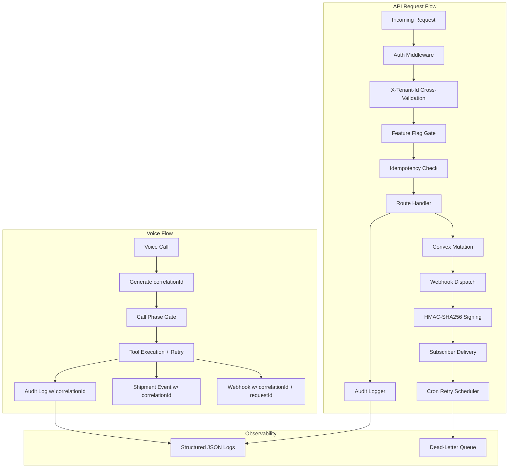
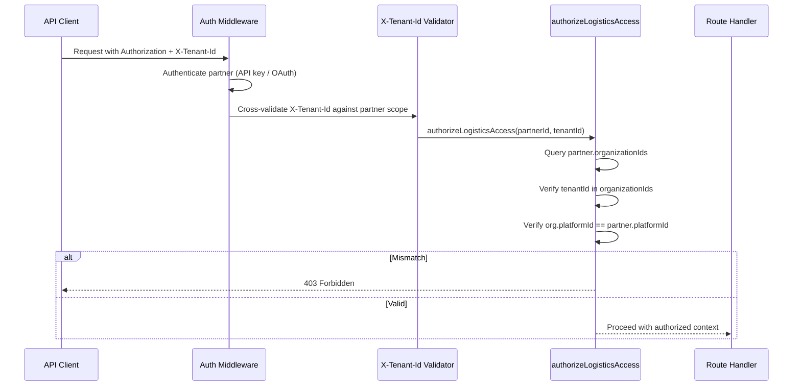
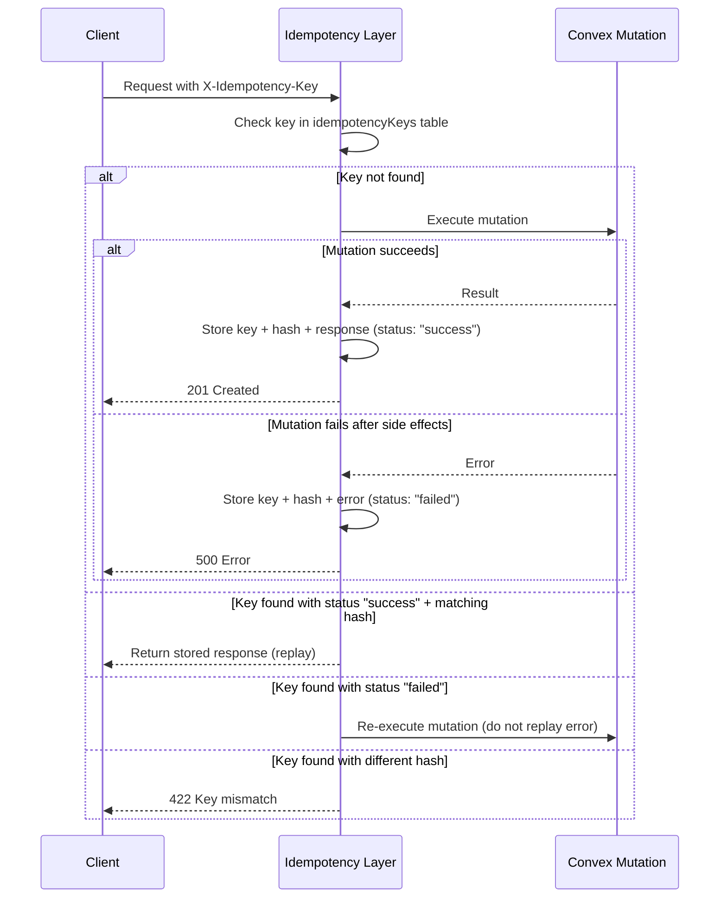
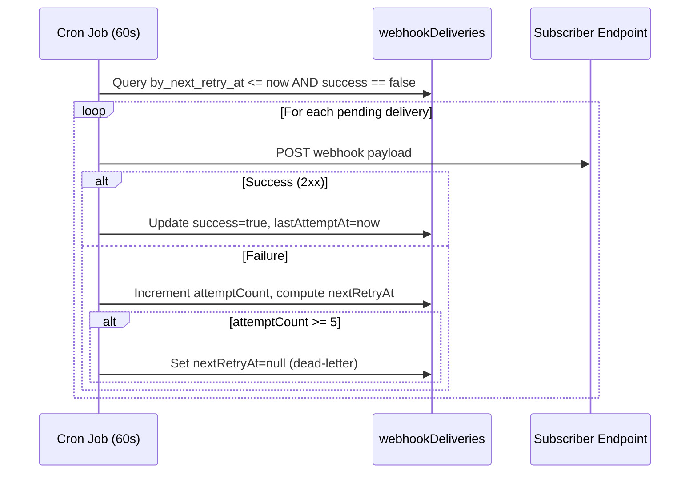

# Design Document: Platform Hardening

## Overview

This design hardens the Dinee platform across six domains — Platform/Core, Data/Schema, Logistics APIs, Voice/Realtime, Webhooks/Integration, and QA/Release — without breaking existing restaurant workflows. The strategy is **surgical reinforcement**: each change targets a specific gap (security, data integrity, observability, or release readiness) identified during the logistics vertical buildout. No existing API contracts, voice agent behavior, or restaurant data flows are modified.

The hardening introduces: tenant isolation cross-validation on logistics routes, mandatory idempotency with failed-state recovery, structured audit logging, a `maskShipmentForPublic` utility with explicit field removal, a corrected call-phase tool matrix for the ws-server, correlation ID propagation with exact Convex field names, a webhook retry cron scheduler, HMAC-SHA256 webhook signing, and a full regression + smoke test suite.

### Key Design Decisions

1. **Cross-validation over blind trust**: `X-Tenant-Id` is validated against the authenticated partner's ownership chain, not accepted at face value (Req 2.7).
2. **Failed idempotency state**: Mutations that fail after partial side effects store a `"failed"` idempotency record; retries re-execute rather than replaying the error (Req 3.8–3.9).
3. **Field removal, not masking**: `maskShipmentForPublic` deletes PII fields entirely rather than redacting them, eliminating any risk of partial exposure (Req 12.7–12.9).
4. **Cumulative tool matrix**: Each call phase inherits tools from prior phases (except `shipment_confirmed` which restricts to read-only), matching the explicit matrix in Req 14.8.
5. **Dual-ID webhook payloads**: Voice-originated webhooks carry both `correlationId` and `requestId`; API-originated webhooks carry `requestId` only (Req 17.11–17.12).
6. **Cron-driven webhook retries**: A Convex cron job polls `webhookDeliveries` every 60 seconds using the `by_next_retry_at` index (Req 20.7–20.8).
7. **Composite index strategy**: `by_org_and_status` on `[organizationId, deliveryStatus]` is preferred for the shipments list endpoint; falls back to `by_organization_id` + post-filter (Req 13.4).

## Architecture

### Hardening Layers Diagram



### Tenant Isolation Cross-Validation Flow



### Idempotency with Failed-State Recovery



### Webhook Retry Cron Flow



## Components and Interfaces

### 1. Tenant Isolation Cross-Validator (`src/lib/logistics/authorization.ts`)

Extends the existing `authorizeLogisticsAccess()` to cross-validate `X-Tenant-Id` against the partner's ownership chain. The existing function already verifies partner → platform → organization; the hardening adds an explicit check that the `X-Tenant-Id` header value matches the `organizationId` resolved from the partner's scope.

```typescript
// Enhanced signature — tenantIdHeader is the raw X-Tenant-Id value
export async function authorizeLogisticsAccess(
  convexClient: ConvexHttpClient,
  partnerId: string,
  organizationId: string,  // from X-Tenant-Id header
  vertical?: Vertical
): Promise<LogisticsAuthorizationResult> {
  // Existing steps 1-4 remain unchanged
  // Step 2 already checks: partnerOrgIds.includes(organizationId)
  // Step 3 already checks: organization.platformId === partner.platformId
  // No new code needed — the existing function IS the cross-validation.
  // Route handlers must pass X-Tenant-Id as organizationId parameter.
}
```

**Requirement mapping**: Req 2.1–2.7. The cross-validation (Req 2.7) is inherently satisfied by the existing ownership chain check — the key is that route handlers MUST pass the `X-Tenant-Id` header value as the `organizationId` parameter, not derive it from the request body.

### 2. Idempotency Layer with Failed-State Recovery (`src/lib/logistics/idempotency.ts`)

Extends the existing idempotency module with a `status` field on stored records.

```typescript
// New status field on idempotencyKeys table
// status: "success" | "failed"

export interface IdempotencyReplay {
  replay: true;
  status: number;
  body: string;
}

export interface IdempotencyFailed {
  failed: true;  // Signal to re-execute
}

export type IdempotencyCheckResult =
  | IdempotencyReplay
  | { mismatch: true }
  | { replay: false }
  | IdempotencyFailed;

export async function checkIdempotency(
  convexClient: ConvexHttpClient,
  key: string,
  partnerId: string,
  requestHash: string
): Promise<IdempotencyCheckResult> {
  const existing = await convexClient.query(
    api.logistics.idempotencyKeys.checkIdempotencyKey,
    { key, partnerId }
  );

  if (!existing) return { replay: false };

  // NEW: If previous attempt failed, allow re-execution
  if (existing.status === "failed") return { failed: true };

  if (existing.requestHash === requestHash) {
    return { replay: true, status: existing.responseStatus, body: existing.responseBody };
  }

  return { mismatch: true };
}

// NEW: Store failed state
export async function storeIdempotencyFailure(
  convexClient: ConvexHttpClient,
  key: string,
  partnerId: string,
  requestHash: string,
  error: string
): Promise<void> {
  await convexClient.mutation(
    api.logistics.idempotencyKeys.storeIdempotencyKey,
    {
      key, partnerId, requestHash,
      responseStatus: 500,
      responseBody: JSON.stringify({ error }),
      status: "failed",
    }
  );
}
```

**Requirement mapping**: Req 3.1–3.9. The `status` field on `idempotencyKeys` distinguishes successful replays from failed attempts that should be re-executed.

### 3. `maskShipmentForPublic` Utility (`src/lib/logistics/masking.ts`)

Replaces the existing `maskPhone`/`maskAddress` helpers with a single function that produces a `PublicTrackingResponse` by field removal.

```typescript
import { Doc } from "../../../convex/_generated/dataModel";

export type ShipmentDoc = Doc<"shipments">;

export interface PublicTrackingResponse {
  trackingCode: string;
  deliveryStatus: string;
  serviceType: string;
  etaMinutes?: number;
  lastEventTimestamp?: number;
}

/**
 * Strips all PII and internal fields from a shipment document.
 * REMOVES (not masks): sender.phone, sender.address, recipient.phone,
 * recipient.address, organizationId, assignedRiderId, paymentMethod,
 * paymentStatus, customerId.
 * RETAINS: trackingCode, deliveryStatus, serviceType, etaMinutes,
 * lastEventTimestamp.
 */
export function maskShipmentForPublic(
  shipment: ShipmentDoc,
  lastEventTimestamp?: number
): PublicTrackingResponse {
  return {
    trackingCode: shipment.trackingCode,
    deliveryStatus: shipment.deliveryStatus,
    serviceType: shipment.serviceType,
    ...(shipment.etaMinutes != null && { etaMinutes: shipment.etaMinutes }),
    ...(lastEventTimestamp != null && { lastEventTimestamp }),
  };
}
```

**Requirement mapping**: Req 12.1–12.2, 12.6–12.9. The function constructs a new object with only allowed fields rather than deleting from a copy, ensuring no PII leaks through missed deletions.

### 4. Call-Phase Tool Matrix (`src/app/ws-server/logistics-call-phase.ts`)

Updates the `ALLOWED_TOOLS` map to match the cumulative matrix from Req 14.8.

```typescript
export type LogisticsCallPhase =
  | "await_org_verification"
  | "org_verified"
  | "shipment_open"
  | "shipment_confirmed";

const ALLOWED_TOOLS: Record<LogisticsCallPhase, Set<string>> = {
  await_org_verification: new Set([
    "get_organization_details",
  ]),
  org_verified: new Set([
    "get_organization_details",
    "create_shipment",
    "quote_delivery",
  ]),
  shipment_open: new Set([
    "get_organization_details",
    "create_shipment",
    "quote_delivery",
    "update_shipment",
    "assign_rider",
    "add_shipment_event",
  ]),
  shipment_confirmed: new Set([
    "get_organization_details",
    "quote_delivery",
    // No mutations — read-only only
  ]),
};
```

**Requirement mapping**: Req 14.1–14.8. Key changes from current code:
- `org_verified` now includes `get_organization_details` (was missing)
- `shipment_open` now includes all prior-phase tools (cumulative)
- `shipment_confirmed` changed from `add_shipment_event` to `get_organization_details` + `quote_delivery` (read-only only)

### 5. Correlation ID Propagation (`src/lib/logistics/correlation.ts`)

Extends the existing `getOrCreateRequestId` with a voice-specific `generateCorrelationId`.

```typescript
import { randomUUID } from "crypto";

/** For API requests: reads X-Request-Id or generates UUID */
export function getOrCreateRequestId(headers: Headers): string {
  return headers.get("X-Request-Id") || randomUUID();
}

/** For voice sessions: generates a unique correlationId */
export function generateCorrelationId(): string {
  return `voice-${randomUUID()}`;
}
```

**Field storage locations** (Req 17.7–17.12):
- `calls` table: `correlationId` field (new, `v.optional(v.string())`)
- `shipmentEvents` table: `correlationId` field (new, `v.optional(v.string())`)
- `transcripts` table: `correlationId` field (new, `v.optional(v.string())`)
- Audit log entries: `correlationId` key in the log context object
- Voice-originated webhook payloads: `{ requestId: correlationId, correlationId: correlationId }`
- API-originated webhook payloads: `{ requestId: requestId }` (no correlationId)

### 6. Voice Tool Retry Wrapper (`src/app/ws-server/logistics-tools.ts`)

Wraps each tool call with retry logic for transient errors.

```typescript
const TRANSIENT_ERROR_PATTERNS = [
  "network", "timeout", "ECONNREFUSED", "mutation conflict",
  "rate limit", "503", "502",
];

function isTransientError(error: unknown): boolean {
  const msg = error instanceof Error ? error.message : String(error);
  return TRANSIENT_ERROR_PATTERNS.some((p) =>
    msg.toLowerCase().includes(p.toLowerCase())
  );
}

async function withRetry<T>(
  toolName: string,
  fn: () => Promise<T>,
  maxRetries: number = 2,
  backoffMs: number[] = [1000, 3000]
): Promise<T> {
  let lastError: unknown;
  for (let attempt = 0; attempt <= maxRetries; attempt++) {
    try {
      return await fn();
    } catch (error) {
      lastError = error;
      if (!isTransientError(error) || attempt === maxRetries) {
        logger.error(`Tool ${toolName} failed after ${attempt + 1} attempts`, {
          toolName, attempt: attempt + 1, error: String(error),
        });
        throw error;
      }
      logger.warn(`Tool ${toolName} retry attempt ${attempt + 1}`, {
        toolName, attempt: attempt + 1, error: String(error),
      });
      await new Promise((r) => setTimeout(r, backoffMs[attempt] ?? 3000));
    }
  }
  throw lastError;
}
```

**Requirement mapping**: Req 16.1–16.6. Validation errors (non-transient) are not retried.

### 7. Webhook Retry Cron Scheduler (`convex/crons.ts`)

Adds a cron job that processes pending webhook retries every 60 seconds.

```typescript
import { cronJobs } from "convex/server";
import { internal } from "./_generated/api";

const crons = cronJobs();

crons.interval(
  "process-webhook-retries",
  { seconds: 60 },
  internal.webhookDeliveries.processRetries
);

export default crons;
```

The `processRetries` internal mutation queries `webhookDeliveries` using the `by_next_retry_at` index:

```typescript
// convex/webhookDeliveries.ts — new internal mutation
export const processRetries = internalMutation({
  handler: async (ctx) => {
    const now = Date.now();
    const pending = await ctx.db
      .query("webhookDeliveries")
      .withIndex("by_next_retry_at", (q) => q.lte("nextRetryAt", now))
      .filter((q) => q.eq(q.field("success"), false))
      .take(50); // batch limit per tick

    for (const delivery of pending) {
      // Attempt delivery, update record
      // If attemptCount >= 5: set nextRetryAt = null (dead-letter)
      // Else: compute next backoff and update nextRetryAt
    }
  },
});
```

**Requirement mapping**: Req 20.7–20.8. Requires adding `by_next_retry_at` index to `webhookDeliveries` table.

### 8. Webhook HMAC-SHA256 Signing (`src/lib/partner-api/webhook-service.ts`)

Adds signature computation to outbound webhook delivery.

```typescript
import { createHmac } from "crypto";

export function signWebhookPayload(
  secret: string,
  timestamp: number,
  body: string
): string {
  const payload = `${timestamp}.${body}`;
  return createHmac("sha256", secret).update(payload).digest("hex");
}
```

Headers added to each delivery:
- `X-Webhook-Signature`: HMAC-SHA256 hex digest
- `X-Webhook-Timestamp`: Unix timestamp of dispatch

**Requirement mapping**: Req 21.1–21.6.

### 9. Audit Logger Enhancement (`src/lib/logger.ts`)

The existing `createLogger` already supports structured JSON output. The hardening adds a `LogContext` type extension for logistics-specific fields.

```typescript
interface LogContext {
  callId?: string;
  requestId?: string;
  correlationId?: string;  // NEW: voice session correlation
  orderId?: string;
  partnerId?: string;
  eventId?: string;
  tenantId?: string;       // NEW: X-Tenant-Id value
  vertical?: string;       // NEW: "restaurant" | "logistics"
  endpoint?: string;       // NEW: request path
  method?: string;         // NEW: HTTP method
  resourceId?: string;     // NEW: shipmentId, riderId, etc.
  [key: string]: unknown;
}
```

**Requirement mapping**: Req 4.1–4.7, 17.10.

## Data Models

### Schema Changes to Existing Tables

#### `idempotencyKeys` — add field:
| Field | Type | Description |
|-------|------|-------------|
| status | `"success" \| "failed"` | Outcome of the mutation (NEW) |

Existing records without `status` are treated as `"success"` for backward compatibility.

#### `calls` — add field:
| Field | Type | Description |
|-------|------|-------------|
| correlationId | `v.optional(v.string())` | Voice session correlation ID (NEW, Req 17.7) |

#### `shipmentEvents` — add field:
| Field | Type | Description |
|-------|------|-------------|
| correlationId | `v.optional(v.string())` | Voice session correlation ID (NEW, Req 17.8) |

#### `transcripts` — add field:
| Field | Type | Description |
|-------|------|-------------|
| correlationId | `v.optional(v.string())` | Voice session correlation ID (NEW, Req 17.9) |

#### `webhookDeliveries` — add index:
| Index | Fields | Description |
|-------|--------|-------------|
| by_next_retry_at | `["nextRetryAt"]` | For cron retry scheduler (NEW, Req 20.8) |

#### `shipments` — add optional composite index:
| Index | Fields | Description |
|-------|--------|-------------|
| by_org_and_status | `["organizationId", "deliveryStatus"]` | Composite index for list endpoint (NEW, Req 13.4) |

### All Fields Added Use `v.optional()`

Per Req 7.1, all new fields on existing tables use `v.optional()` to avoid breaking existing records. Reading code paths provide fallback defaults:
- `idempotencyKeys.status`: defaults to `"success"` if absent
- `calls.correlationId`: defaults to `undefined` (no correlation for legacy calls)
- `shipmentEvents.correlationId`: defaults to `undefined`
- `transcripts.correlationId`: defaults to `undefined`

## Correctness Properties

### Property 1: Idempotency Replay Consistency (Req 3.4)
**Type**: Round-trip  
**Statement**: For any successful logistics write operation, replaying the request with the same `X-Idempotency-Key` and identical request body SHALL return the same HTTP status code and response body as the original request.  
**Test approach**: Generate arbitrary valid shipment creation payloads. Execute once, record response. Execute again with same key + body. Assert status and body match.

### Property 2: Idempotency Key Partner Isolation (Req 3.6)
**Type**: Invariant  
**Statement**: The same idempotency key value used by two different partners SHALL NOT collide — each partner's key space is independent.  
**Test approach**: Generate arbitrary key strings. Store for partnerA. Check for partnerB with same key. Assert `replay: false`.

### Property 3: Failed Idempotency Re-execution (Req 3.8–3.9)
**Type**: Metamorphic  
**Statement**: When a mutation fails and stores a `"failed"` idempotency state, a subsequent retry with the same key SHALL re-execute the mutation (not return the failed state). If the retry succeeds, the stored state SHALL be updated to `"success"`.  
**Test approach**: Force a mutation failure, verify failed state stored. Retry with same key, verify mutation re-executes.

### Property 4: Status Transition Validity (Req 11.1)
**Type**: Model-based  
**Statement**: For all `(currentStatus, nextStatus)` pairs, `validateTransition(current, next)` returns `true` if and only if the pair exists in the valid transition map: `{created→assigned, created→cancelled, assigned→picked_up, assigned→cancelled, picked_up→in_transit, in_transit→delivered, in_transit→failed, failed→created}`.  
**Test approach**: Enumerate all 49 (7×7) status pairs. Assert `validateTransition` matches the reference map exactly.

### Property 5: Terminal State Immutability (Req 11.3)
**Type**: Invariant  
**Statement**: For terminal states `"delivered"` and `"cancelled"`, `validateTransition(terminal, anyStatus)` returns `false` for all possible next statuses.  
**Test approach**: For each terminal state, iterate all 7 possible next statuses. Assert all return false.

### Property 6: PII Field Removal (Req 12.7–12.8)
**Type**: Invariant  
**Statement**: For any `ShipmentDoc`, `maskShipmentForPublic(shipment)` SHALL produce an object that (a) contains no keys from the forbidden set `{sender.phone, sender.address, recipient.phone, recipient.address, organizationId, assignedRiderId, paymentMethod, paymentStatus, customerId}` and (b) contains all keys from the retained set `{trackingCode, deliveryStatus, serviceType}` plus optional `{etaMinutes, lastEventTimestamp}` when present.  
**Test approach**: Generate arbitrary ShipmentDoc objects. Apply `maskShipmentForPublic`. Assert forbidden keys absent, retained keys present.

### Property 7: Call-Phase Tool Gating (Req 14.8)
**Type**: Model-based  
**Statement**: For each logistics call phase, `isLogisticsToolAllowed(phase, tool)` returns `true` if and only if the tool appears in the phase's row of the tool availability matrix.  
**Test approach**: For each of the 4 phases × all tool names, assert `isLogisticsToolAllowed` matches the reference matrix.

### Property 8: Correlation ID Propagation (Req 17.1–17.6)
**Type**: Invariant  
**Statement**: For any voice call session, all downstream records (call record, transcript entries, shipment events, audit logs, webhook payloads) created during that session SHALL share the same `correlationId` value.  
**Test approach**: Simulate a voice session. Collect all created records. Assert all `correlationId` values are identical and non-null.

### Property 9: Webhook Signature Verification Round-Trip (Req 21.4)
**Type**: Round-trip  
**Statement**: For any `(secret, timestamp, body)` triple, `signWebhookPayload(secret, timestamp, body)` produces a signature that can be verified by recomputing `HMAC-SHA256(secret, timestamp + "." + body)` and comparing.  
**Test approach**: Generate arbitrary secrets, timestamps, and JSON bodies. Sign. Recompute independently. Assert match.

### Property 10: Atomic Webhook Deduplication (Req 19.1–19.2)
**Type**: Idempotence  
**Statement**: Calling `atomicInsertWebhookEvent` twice with the same `eventId` SHALL result in exactly one record in the `webhookEvents` table. The second call SHALL return `{ inserted: false }`.  
**Test approach**: Generate arbitrary eventIds. Insert once, assert `inserted: true`. Insert again, assert `inserted: false`. Query table, assert count is 1.

### Property 11: Request ID Propagation in Audit Logs (Req 4.7)
**Type**: Invariant  
**Statement**: For any API request carrying an `X-Request-Id` header, all audit log entries emitted during that request's lifecycle SHALL contain the same `requestId` value.  
**Test approach**: Make requests with known X-Request-Id values. Capture log output. Assert all entries contain the expected requestId.

### Property 12: Validation Error Completeness (Req 9.5)
**Type**: Metamorphic  
**Statement**: For any shipment creation request missing N required fields, the 400 response body SHALL list exactly N validation errors.  
**Test approach**: Generate requests with varying combinations of missing fields. Assert error count matches missing field count.

### Property 13: Webhook Payload Contract Completeness (Req 18.1)
**Type**: Invariant  
**Statement**: For any logistics webhook event dispatched, the outbound payload SHALL contain all required fields: `eventId`, `eventType`, `resourceType`, `resourceId`, `shipmentId`, `timestamp`, `requestId`.  
**Test approach**: Trigger various webhook events. Capture outbound payloads. Assert all required fields present and non-null.

### Property 14: Voice vs API Webhook Payload Distinction (Req 17.11–17.12)
**Type**: Invariant  
**Statement**: Webhook payloads originating from voice actions SHALL contain both `requestId` and `correlationId` fields. Webhook payloads originating from API requests SHALL contain `requestId` only and SHALL NOT contain a `correlationId` field.  
**Test approach**: Trigger webhooks from both voice and API paths. Assert field presence/absence per origin.

## File Changes Summary

### New Files
| File | Purpose |
|------|---------|
| `convex/webhookDeliveries.processRetries` | Internal mutation for cron-driven webhook retry |
| `tests/logistics/idempotency-failed-state.test.ts` | Tests for failed idempotency recovery |
| `tests/logistics/masking.test.ts` | Property tests for maskShipmentForPublic |
| `tests/logistics/call-phase-matrix.test.ts` | Property tests for tool availability matrix |
| `tests/logistics/webhook-signing.test.ts` | Round-trip tests for HMAC signing |
| `tests/regression/restaurant-api.test.ts` | Restaurant API regression suite |
| `tests/regression/logistics-api.test.ts` | Logistics API regression suite |
| `scripts/smoke-staging.ts` | Staging smoke script for shipment lifecycle |
| `docs/runbook-hardening.md` | Production runbook and rollback plan |
| `docs/webhook-verification.md` | Consumer-facing webhook signature verification guide |

### Modified Files
| File | Changes |
|------|---------|
| `convex/schema.ts` | Add `correlationId` to calls, shipmentEvents, transcripts; add `status` to idempotencyKeys; add `by_next_retry_at` index to webhookDeliveries; add `by_org_and_status` index to shipments |
| `convex/crons.ts` | Add webhook retry cron job (60s interval) |
| `convex/webhookDeliveries.ts` | Add `processRetries` internal mutation; add dead-letter query; add stats query |
| `convex/logistics/idempotencyKeys.ts` | Add `status` field support to store/check mutations |
| `src/lib/logistics/authorization.ts` | Documentation update (no code change — existing function already cross-validates) |
| `src/lib/logistics/idempotency.ts` | Add `IdempotencyFailed` type, `storeIdempotencyFailure` function, update `checkIdempotency` |
| `src/lib/logistics/masking.ts` | Replace with `maskShipmentForPublic` function, add `PublicTrackingResponse` type |
| `src/lib/logistics/correlation.ts` | Add `generateCorrelationId` function |
| `src/lib/logistics/webhook-dispatch.ts` | Add correlationId to voice-originated payloads |
| `src/lib/logger.ts` | Extend `LogContext` with correlationId, tenantId, vertical, endpoint, method, resourceId |
| `src/lib/partner-api/webhook-service.ts` | Add `signWebhookPayload` function, add signature headers to delivery |
| `src/app/ws-server/logistics-call-phase.ts` | Update ALLOWED_TOOLS to cumulative matrix per Req 14.8 |
| `src/app/ws-server/logistics-tools.ts` | Add `withRetry` wrapper, propagate correlationId |
| `src/app/ws-server/index.ts` | Generate correlationId on session start, pass to tool calls |
| `src/app/client/api/v1/logistics/shipments/route.ts` | Add idempotency failed-state handling, audit logging |
| `src/app/client/api/v1/logistics/track/[trackingCode]/route.ts` | Use `maskShipmentForPublic` |
